# 嵌入式必懂的 CAN 总线

> 嵌入式的工程师一般都知道CAN总线广泛应用到汽车中，其实船舰电子设备通信也广泛使用CAN，随着国家对海防的越来越重视，对CAN的需求也会越来越大。

## 概述

`CAN（Controller Area Network）`即控制器局域网，是一种能够实现分布式实时控制的串行通信网络。

想到CAN就要想到德国的Bosch公司，因为CAN就是这个公司开发的（和Intel）。

CAN有很多优秀的特点，使得它能够被广泛地应用。比如：传输速度最高到1Mbps，通信距离最远到10km，无损位仲裁机制，多主结构。

近些年来，CAN控制器价格越来越低，很多MCU也集成了CAN控制器。现在每一辆汽车上都装有CAN总线。

一个典型的CAN应用场景：

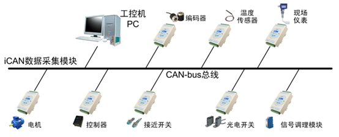

##  CAN总线标准  

CAN总线标准只规定了物理层和数据链路层，需要用户自定义应用层。不同的CAN标准仅物理层不同。

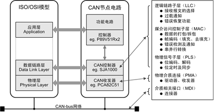


CAN收发器负责逻辑电平和物理信号之间的转换。

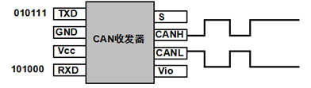

将逻辑信号转换成物理信号（差分电平），或者将物理信号转换成逻辑电平。


CAN标准有两个，即IOS11898和IOS11519，两者差分电平特性不同。

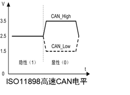

高低电平幅度低，对应的传输速度快；

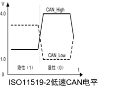

**双绞线共模消除干扰，是因为电平同时变化，电压差不变。**


### 物理层

CAN有三种接口器件：

CAN有三种接口器件：

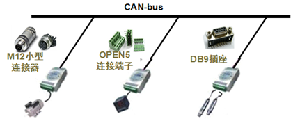

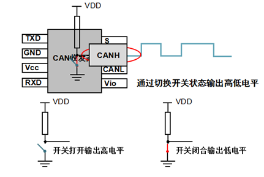

多个节点连接，只要有一个为低电平，总线就为低电平，只有所有节点输出高电平时，才为高电平。所谓"线与"。

CAN总线有5个连续相同位后，就插入一个相反位，产生跳变沿，用于同步。从而消除累积误差。

和485、232一样，CAN的传输速度与距离成反比。

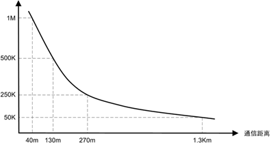


CAN总线，终端电阻的接法：

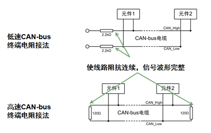

>  为什么是120Ω，因为电缆的特性阻抗为120Ω，为了模拟无限远的传输线。

### 数据链路层

CAN总线传输的是CAN帧，CAN的通信帧分成五种，分别为数据帧、远程帧、错误帧、过载帧和帧间隔。

数据帧用来节点之间收发数据，是使用最多的帧类型；远程帧用来接收节点向发送节点接收数据；错误帧是某节点发现帧错误时用来向其他节点通知的帧；过载帧是接收节点用来向发送节点告知自身接收能力的帧；用于将数据帧、远程帧与前面帧隔离的帧。

数据帧根据仲裁段长度不同分为标准帧（2.0A）和扩展帧（2.0B）

### 帧起始

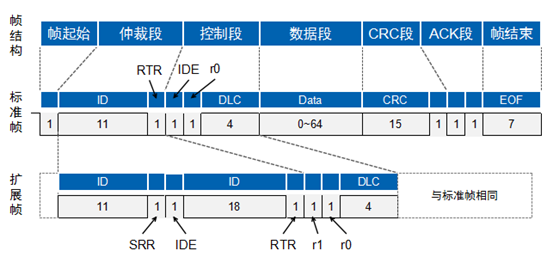

帧起始由一个显性位（低电平）组成，发送节点发送帧起始，其他节点同步于帧起始；

帧结束由7个隐形位（高电平）组成。

### 仲裁段

CAN总线是如何解决多点竞争的问题？

由仲裁段给出答案。

CAN总线控制器在发送数据的同时监控总线电平，如果电平不同，则停止发送并做其他处理。如果该位位于仲裁段，则退出总线竞争；如果位于其他段，则产生错误事件。  

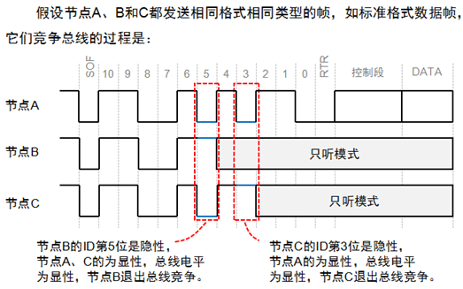

帧ID越小，优先级越高。由于数据帧的RTR位为显性电平，远程帧为隐性电平，所以帧格式和帧ID相同的情况下，数据帧优先于远程帧；由于标准帧的IDE位为显性电平，扩展帧的IDE位为隐形电平，对于前11位ID相同的标准帧和扩展帧，标准帧优先级比扩展帧高。

### 控制段

共6位，标准帧的控制段由扩展帧标志位IDE、保留位r0和数据长度代码DLC组成；扩展帧控制段则由IDE、r1、r0和DLC组成。

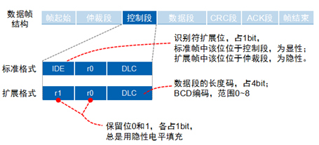


### 数据段

为0-8字节，短帧结构，实时性好，适合汽车和工控领域；

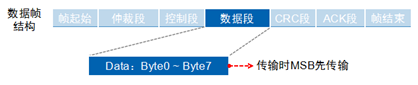


### CRC段

CRC校验段由15位CRC值和CRC界定符组成。

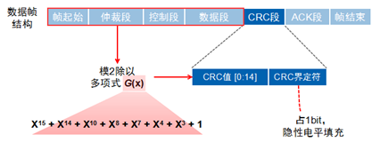

### ACK段

当接收节点接收到的帧起始到CRC段都没错误时，它将在ACK段发送一个显性电平，发送节点发送隐性电平，线与结果为显性电平。


### 远程帧

远程帧分为6个段，也分为标准帧和扩展帧，且RTR位为1（隐性电平）

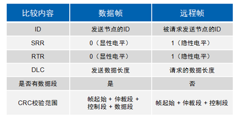

CAN是可靠性很高的总线，但是它也有五种错误：

> **CRC错误**：发送与接收的CRC值不同发生该错误；
>
> **格式错误**：帧格式不合法发生该错误；
>
> **应答错误**：发送节点在ACK阶段没有收到应答信息发生该错误；
>
> **位发送错误**：发送节点在发送信息时发现总线电平与发送电平不符发生该错误；
>
> **位填充错误**：通信线缆上违反通信规则时发生该错误。

当发生这五种错误之一时，发送节点或接受节点将发送错误帧。


为防止某些节点自身出错而一直发送错误帧，干扰其他节点通信，CAN协议规定了节点的3种状态及行为。

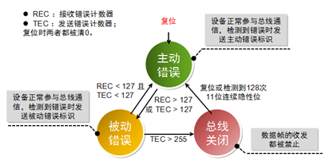

### 过载帧

当某节点没有做好接收的"准备"时，将发送过载帧，以通知发送节点。

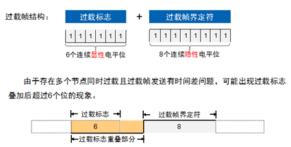


### 帧间隔

用来隔离数据帧、远程帧与他们前面的帧，错误帧和过载帧前面不加帧间隔。

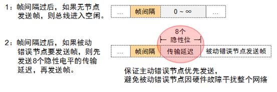

### 构建CAN节点

构建节点，实现相应控制，由底向上分为四个部分：CAN节点电路、CAN控制器驱动、CAN应用层协议、CAN节点应用程序。

虽然不同节点完成的功能不同，但是都有相同的硬件和软件结构。

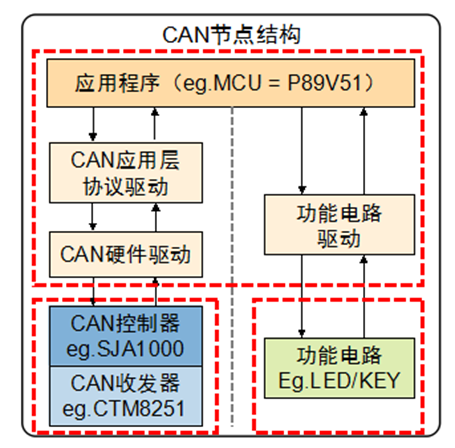


CAN收发器和控制器分别对应CAN的物理层和数据链路层，完成CAN报文的收发；功能电路，完成特定的功能，如信号采集或控制外设等；主控制器与应用软件按照CAN报文格式解析报文，完成相应控制。

CAN硬件驱动是运行在主控制器（如P89V51）上的程序，它主要完成以下工作：基于寄存器的操作，初始化CAN控制器、发送CAN报文、接收CAN报文；

如果直接使用CAN硬件驱动，当更换控制器时，需要修改上层应用程序，移植性差。在应用层和硬件驱动层加入虚拟驱动层，能够屏蔽不同CAN控制器的差异。


 一个CAN节点除了完成通信的功能，还包括一些特定的硬件功能电路，功能电路驱动向下直接控制功能电路，向上为应用层提供控制功能电路函数接口。特定功能包括信号采集、人机显示等。

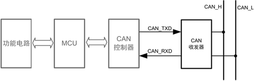


CAN收发器是实现CAN控制器逻辑电平与CAN总线上差分电平的互换。实现CAN收发器的方案有两种，一是使用CAN收发IC（需要加电源隔离和电气隔离），另一种是使用CAN隔离收发模块。推荐使用第二种。


CAN控制器是CAN的核心元件，它实现了CAN协议中数据链路层的全部功能，能够自动完成CAN协议的解析。CAN控制器一般有两种，一种是控制器IC（SJA1000），另一种是集成CAN控制器的MCU（LPC11C00）。


MCU负责实现对功能电路和CAN控制器的控制：在节点启动时，初始化CAN控制器参数；通过CAN控制器读取和发送CAN帧；在CAN控制器发生中断时，处理CAN控制器的中断异常；根据接收到的数据输出控制信号；

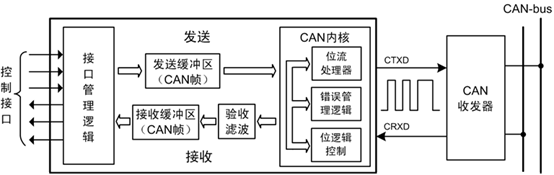

接口管理逻辑：解释MCU指令，寻址CAN控制器中的各功能模块的寄存器单元，向主控制器提供中断信息和状态信息。

发送缓冲区和接收缓冲区能够存储CAN总线网络上的完整信息。

验收滤波是将存储的验证码与CAN报文识别码进行比较，跟验证码匹配的CAN帧才会存储到接收缓冲区。

CAN内核实现了数据链路的全部协议。  

## **CAN协议应用层概述**  

CAN总线只提供可靠的传输服务，所以节点接收报文时，要通过应用层协议来判断是谁发来的数据、数据代表了什么含义。常见的CAN应用层协议有：CANOpen、DeviceNet、J1939、iCAN等。


CAN应用层协议驱动是运行在主控制器（如P89V51）上的程序，它按照应用层协议来对CAN报文进行定义、完成CAN报文的解析与拼装。例如，我们将帧ID用来表示节点地址，当接收到的帧ID与自身节点ID不通过时，就直接丢弃，否则交给上层处理；发送时，将帧ID设置为接收节点的地址。


### CAN收发器

SJA1000的输出模式有很多，使用最多的是正常输出模式，输入模式通常不选择比较器模式，可以增大通信距离，并且减少休眠下的电流。

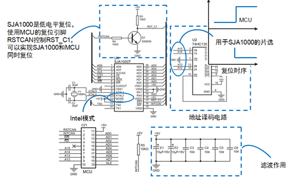


收发器按照通信速度分为高速CAN收发器和容错CAN收发器。


同一网络中要使用相同的CAN收发器。


CAN连接线上会有很多干扰信号，需要在硬件上添加滤波器和抗干扰电路：

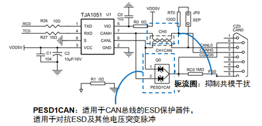


也可以使用CAN隔离收发器（集成滤波器和抗干扰电路）。

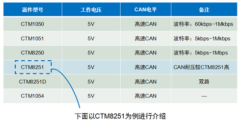


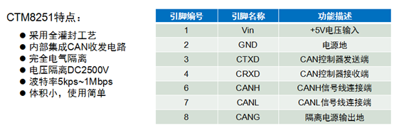


CAN控制器与MCU的连接方式：

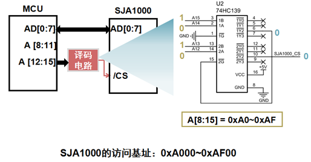

SJA1000可被视为外扩RAM，地址宽度8位，最多支持256个寄存器


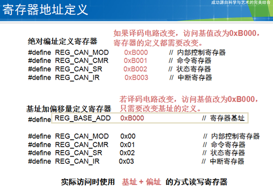


```c
#define REG_BASE_ADDR 0xA000 // 寄存器基址
 
unsigned char *SJA_CS_Point = (unsigned char *) REG_BASE_ADDR ;
 
// 写SJA1000寄存器
void WriteSJAReg(unsigned char RegAddr, unsigned char Value) 
{
    *(SJA_CS_Point + RegAddr) = Value;
    return;
}
 
// 读SJA1000寄存器
unsigned char ReadSJAReg(unsigned char RegAddr) 
{
    return (*(SJA_CS_Point + RegAddr));
}
```

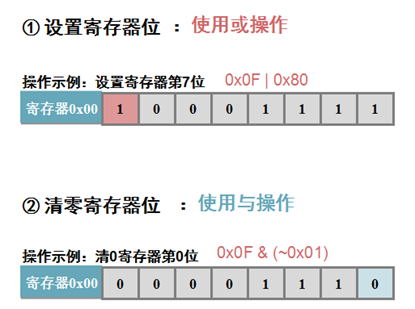

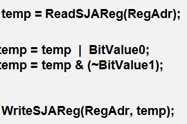

将缓存区的数据连续写入寄存器：

```c
…… 
for (i=0; i<len; i++) 
{
    WriteSJAReg(RegAdr + i, ValueBuf[i]);
}
……
```


将连续多个寄存器连续读入缓存区：

```c
……
for (i=0; i<len; i++) 
{
    ReadSJAReg(RegAdr + i, ValueBuf[i]);
}
……
```


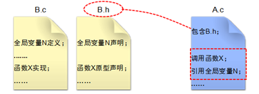


头文件包含方案：

1. 每个程序包含用到的头文件

2. 每个程序包含一个公用头文件，公用头文件包含所有其他头文件

```c
#ifndef __CONFIG_H__ // 防止头文件被重复包含
#define __CONFIG_H__
#include <8051.h>         // 包含80C51寄存器定义头文件
#include "SJA1000REG.h"         // 包含SJA1000寄存器定义头文件
// 定义取字节运算
#define LOW_BYTE(x)  (unsigned char)(x)
#define HIGH_BYTE(x)  (unsigned char)((unsigned int)(x) >> 8)
// 定义振荡器时钟和处理器时钟频率（用户可以根据实际情况作出调整）
#define OSCCLK 11059200UL
// 宏定义MCU的时钟频率
#define CPUCLK (OSCCLK / 12)
#endif // __CONFIG_H__
```


SJA1000上电后处于复位状态，必须初始化后才能工作：

（1）置位模式寄存器Bit0位进入复位模式；

（2）设置时钟分频寄存器选择时钟频率、CAN模式；

（3）设置验收滤波，设定验证码和屏蔽码；

（4）设置总线定时器寄存器0、1设定CAN波特率；

（5）设置输出模式；

（6）清零模式寄存器Bit0位退出复位模式；


### 模式寄存器

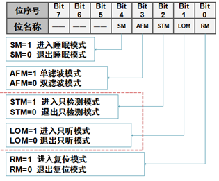


只检测模式：SJA1000发送CAN帧时不检查应答位；


只听模式：此模式下SJA1000不会发送错误帧，用于自动检测波特率；SJA1000以不同的波特率接收CAN帧，当收到CAN帧时，表明当前波特率与总线波特率相同。


### 波特率设置

CAN总线无时钟，使用异步串行传输；波特率是1秒发送的数据位；

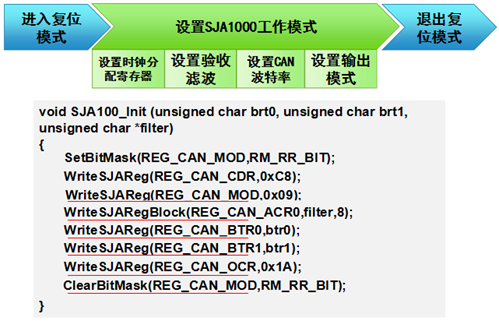


### CAN帧发送：

发送CAN帧的步骤：

1.检测状态寄存器，等待发送缓冲区可用；

2.填充报文到发送缓冲区；

3.启动发送。

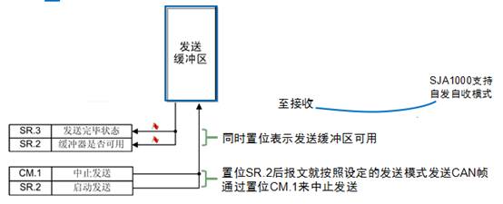


SJA1000具有一个12字节的缓冲区，要发送的报文可以通过寄存器16-28写入，也可通过寄存器96-108写入或读出：

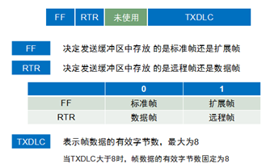

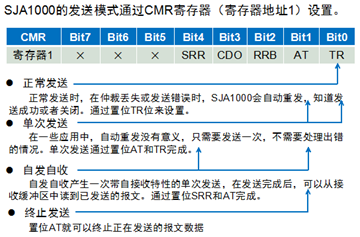

设置发送模式：

```c
char SetSJASendCmd(unsigned char cmd) 
{ 
    unsigned char ret;  
    switch (cmd) 
    {  
        default:  
        case 0:  
            ret = SetBitMask(REG_CAN_CMR, TR_BIT); //正常发送  
            break;     
        case 1:  
            ret = SetBitMask(REG_CAN_CMR, TR_BIT|AT_BIT); //单次发送 
            break;
        case 2: 
            ret = SetBitMask(REG_CAN_CMR, TR_BIT|SRR_BIT);//自收自发  
            break; 
        case 0xff:  
            ret = SetBitMask(REG_CAN_CMR, AT_BIT);//终止发送 
            break; 
    } 
    return ret;
}
```


发送函数：

```c
unsigned char SJA_CAN_Filter[8] = 
{    
    // 定义验收滤波器的参数，接收所有帧       
    0x00, 0x00, 0x00, 0x00,                                                
    // ACR0~ACR3       
    0xff, 0xff, 0xff, 0xff                                                         
    // AMR0~AMR3
};
 
unsigned char STD_SEND_BUFFER[11] = 
{   
    // CAN 发送报文缓冲区       
    0x08,             // 帧信息，标准数据帧，数据长度 = 8       
    0xEA, 0x60,   // 帧ID = 0x753
    0x55, 0x55, 0x55, 0x55, 0xaa, 0xaa, 0xaa, 0xaa  // 帧数据
};
 
void main(void) // 主函数，程序入口
{        
    timerInit();// 初始化
    D1 = 0;        
    SJA1000_RST = 1; // 硬件复位SJA1000       
    timerDelay(50); // 延时500ms       
    SJA1000_RST = 0;       
    SJA1000_Init(0x00, 0x14, SJA_CAN_Filter);   // 初始化SJA1000，设置波特率为1Mbps       
    // 无限循环，main()函数不允许返回      
    for(;;) 
    {           
        SJASendData(STD_SEND_BUFFER, 0x0);           
        timerDelay(100);         // 延时1000ms      
    }    
}
```


为什么帧ID是0x753，这与CAN帧在缓冲区的存储格式有关。

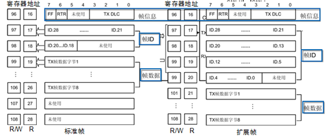


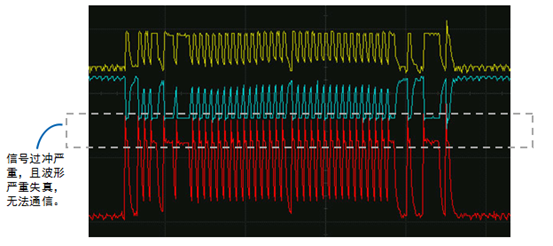


终端电阻非常重要，当波特率较高而且没加终端电阻时，信号过冲非常严重。

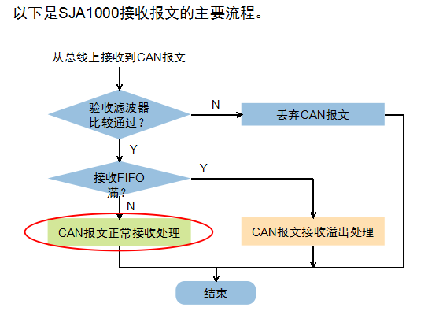

SJA1000有64个字节的接收缓冲区（FIFO），这可以降低对MCU的要求。


MCU可以通过查询或中断的方式确定SJA1000接收到报文后读取报文。


  