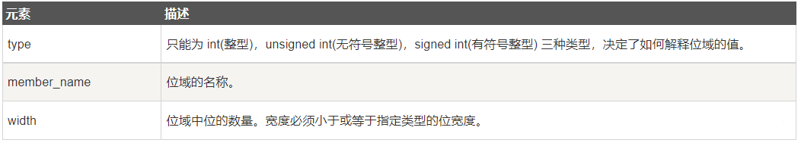
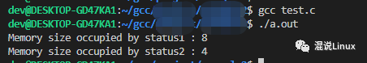
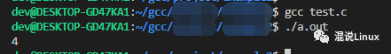
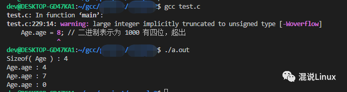

# C语言位域

在做嵌入式开发的时候，我们经常会遇到这样的代码：

```c
struct
{
    unsigned int widthValidated : 1;
    unsigned int heightValidated : 1;
} status;
```

这样定义结构体变量是什么意思呢？


主要原因是：有些信息在存储时，只需占几个或一个二进制位（bit），并不需要占用一个完整的字节。例如，在存放一个开关量时，只有0和1两种状态，用一位二进位即可。为了节省存储空间，并使处理简便，Ｃ语言提供了一种数据结构，称为“**位域**”或“**位段**”。

> **位域**：是把一个字节中的二进位划分为几个不同的区域，并说明每个区域的位数。每个域有一个域名，允许在程序中按域名进行操作。这样就可以把几个不同的对象用一个字节的二进制位域来表示。

位域定义与结构定义相仿，其形式为：

```c
struct 位域结构名 
{
    位域列表
};
```

其中位域列表的形式为：

```c
type [member_name] : width;
```

下面是有关位域中变量元素的描述：



位域的使用和结构体成员的使用相同，其一般形式为：

```
位域变量名.位域名
位域变量名->位域名
```

位域最大的作用就是`节省存储空间`，在本质上就是一种结构类型，不过其成员是按二进位分配的。例如以下案例：

```c
#include <stdio.h>
#include <string.h>
 
/* 定义简单的结构 */
struct
{
  unsigned int widthValidated;
  unsigned int heightValidated;
} status1;
 
/* 定义位域结构 */
struct
{
  unsigned int widthValidated : 1;
  unsigned int heightValidated : 1;
} status2;
 
int main( )
{
   printf( "Memory size occupied by status1 : %ld\n", sizeof(status1));
   printf( "Memory size occupied by status2 : %ld\n", sizeof(status2));
 
   return 0;
}
```

代码被编译和执行时，它会产生下列结果：




结构体status1是由正常的两个unsigned int类型变量组成，占用内存是8字节，结构体status2也是unsigned int类型变量，但是它仅使用了一个unsigned int类型内存的前2bit，实际上还有30bit没使用，所以占用内存是4字节。


对于位域的定义有以下几点说明：

> **1.一个位域存储在同一个字节中，如一个字节所剩空间不够存放另一位域时，则会从下一单元起存放该位域。也可以有意使某位域从下一单元开始。例如：**

```c
struct bs{
    unsigned a:4;
    unsigned  :4;   /* 空域 */
    unsigned b:4;   /* 从下一单元开始存放 */
    unsigned c:4
}
```

在这个位域定义中，a 占第一字节的 4 位，后 4 位填 0 表示不使用，b 从第二字节开始，占用 4 位，c 占用 4 位。

> 2.位域的宽度不能超过它所依附的数据类型的长度，成员变量都是有类型的，这个类型限制了成员变量的最大长度，:后面的数字不能超过这个长度。

> 3.位域可以是无名位域，这时它只用来作填充或调整位置。无名的位域是不能使用的。例如：

```c
struct k{
    int a:1;
    int  :2;    /* 该 2 位不能使用 */
    int b:3;
    int c:2;
};
```


> 4.当相邻成员的类型相同时，如果它们的位宽之和小于类型的 sizeof 大小，那么后面的成员紧邻前一个成员存储，直到不能容纳为止；如果它们的位宽之和大于类型的 sizeof 大小，那么后面的成员将从新的存储单元开始，其偏移量为类型大小的整数倍。例如：

```c
#include <stdio.h>
 
int main(){    struct bs{
        unsigned m: 6;
        unsigned n: 12;
        unsigned p: 4;
    };
    
    printf("%ld\n", sizeof(struct bs));
 
    return 0;
}
```

运行结果：




m、n、p 的类型都是 unsigned int，sizeof 的结果为 4 个字节（Byte），也即 32 个位（Bit）。m、n、p 的位宽之和为 6+12+4 = 22，小于 32，所以它们会挨着存储，中间没有缝隙。


> 5.当相邻成员的类型不同时，不同的编译器有不同的实现方案，GCC 会压缩存储，而 VC/VS 不会。例如：

```c
#include <stdio.h>
 
int main()
{
    struct bs{
        unsigned m: 12;
        unsigned char ch: 4;
        unsigned p: 4;
    };
 
    printf("%ld\n", sizeof(struct bs));
 
    return 0;
}
```

在 GCC 下的运行结果为 4，三个成员挨着存储；在 VC/VS 下的运行结果为 12，三个成员按照各自的类型存储（与不指定位宽时的存储方式相同）。


> 6.如果成员之间穿插着非位域成员，那么不会进行压缩。例如：

```c
struct bs{
    unsigned m: 12;
    unsigned ch;
    unsigned p: 4;
};
```

在各个编译器下 sizeof 的结果都是 12。


注意：位域成员往往不占用完整的字节，有时候也不处于字节的开头位置，因此使用&获取位域成员的地址是没有意义的，C语言也禁止这样做。地址是字节（Byte）的编号，而不是位（bit）的编号。 


通过一个示例，加深对位域的理解和应用：

```c
#include <stdio.h>
#include <string.h>
 
struct
{
  unsigned int age : 3;
} Age;
 
int main( )
{
   Age.age = 4;
   printf( "Sizeof( Age ) : %d\n", sizeof(Age) );
   printf( "Age.age : %d\n", Age.age );
 
   Age.age = 7;
   printf( "Age.age : %d\n", Age.age );
 
   Age.age = 8; // 二进制表示为 1000 有四位，超出
   printf( "Age.age : %d\n", Age.age );
 
   return 0;
}
```


当上面的代码被编译时，它会带有警告，当上面的代码被执行时，它会产生下列结果：




当执行到Age.age = 8;时，二进制表示为：1000 有四位，超出位域，所以会提示警告。