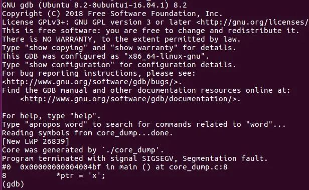

#  C语言段错误调试神器

**core dump** 可以理解为当程序崩溃时，自动将内存信息保存到文件中。这里的 core 就是 memory，dump 就是将内存数据保存到磁盘的过程。


**core dump** 的一个常见原因是段错误（segmentation fault），这是由尝试访问非法内存位置引起的。这可能包括释放后使用、缓冲区溢出和写入空指针。


在bug很难复现的情况下，core dump 非常有用，它可以让你检查可能发生的情况。GDB 可用于读取 core dump 文件并分析程序崩溃原因。

 

## core dump 设置

要想让自己的程序在崩溃时自动生成 core dump 文件，需要进行一些设置。

以 ubuntu 系统为例，Linux 提供了一个名为 ulimit 的程序来设置 core 文件大小和其他参数。

```bash
$ ulimit -a
core file size          (blocks, -c) 0
data seg size           (kbytes, -d) unlimited
scheduling priority             (-e) 0
file size               (blocks, -f) unlimited
pending signals                 (-i) 7823
max locked memory       (kbytes, -l) 64
max memory size         (kbytes, -m) unlimited
open files                      (-n) 1024
pipe size            (512 bytes, -p) 8
POSIX message queues     (bytes, -q) 819200
real-time priority              (-r) 0
stack size              (kbytes, -s) 8192
cpu time               (seconds, -t) unlimited
max user processes              (-u) 7823
virtual memory          (kbytes, -v) unlimited
file locks                      (-x) unlimited
```

上面第一项  core file size  为 0， 表示 core 文件数量最多为 0，使用如下命令将 core 文件数量设置为无限制：

```
ulimit -c unlimited
```

然后使用  ulimit -c  命令，可以看到设置成功：

```bash
$ ulimit -c
unlimited
```

 

## 生成 core dump 并调试

编译代码命令：

```bash
$ gcc -ggdb -o0 <any other flags> -o file_name file_name.c
```

编译的时候需要加 -ggdb -o0 打开调试模式，否则打印栈帧时只能看到被调用函数的地址，而不是具体函数名和行号。


运行程序：

```bash
$ ./<file_name>
Segmentation fault (core dumped)
```

程序崩溃并提示 Segmentation fault，表示因为程序访问了不允许访问的内存地址，(core dumped) 表示在当前目录生成了一个文件 core，用来保存出错信息，这是一个二进制文件，需要使用 gdb 辅助分析文件内容。


使用 GDB 进行定位出错位置：

```bash
$ gdb <binary-file> <core-dump-file>
```

通过这条命令，就可以找到引起段错误的具体行号。


GDB 有助于在程序崩溃时检查栈帧以及变量和寄存器的状态。在这种情况下，诸如 file、where、up、down、print、info locals、info args、info registers 和 list 等命令会很有帮助。


需要记住的是，在调试 core dump 时，程序实际上并没有运行，因此与程序执行相关的命令（例如 step、next 和 continue）不可用。

 

## 实例演示

比如引起段错误的代码如下：

```c
// core_dump.c
#include <stdio.h>
#include <stdlib.h>

int main(void)
{
    char *ptr;
    *ptr = 'x';

    return 0;
}
```

编译运行一气呵成：

```bash
$ gcc -ggdb -o0 core_dump.c -o core_dump

$ ./core_dump
Segmentation fault (core dumped)

$ ls
core core_dump core_dump.c
```

这时会生成一个  core  文件：

```bash
# Load program binary and core file 
$ gdb core_dump core
```



可以看到 GDB 定位到第8八行是引起段错误的原因。


在 gdb 中，可以使用以下命令查看 backtrace（崩溃时的函数调用栈）：

```bash
bt
# or (exact same command)
where

# OR (for even more details, such as seeing all arguments to the functions--
# thanks to Peter Cordes in the comments below)
bt full

# For gdb help and details, see:
help bt
# or
help where
```