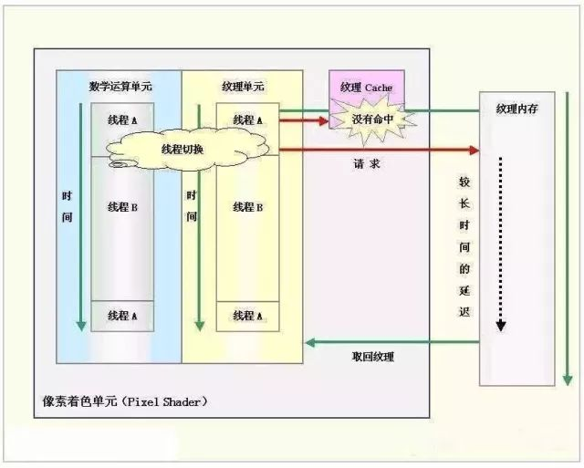

# GPU工作原理

在GPU出现以前，显卡和CPU的关系有点像“主仆”，简单地说这时的显卡就是画笔，根据各种有CPU发出的指令和数据进行着色，材质的填充、渲染、输出等。

较早的娱乐用的3D显卡又称“3D加速卡”，由于大部分坐标处理的工作及光影特效需要由CPU亲自处理，占用了CPU太多的运算时间，从而造成整体画面不能非常流畅地表现出来。

例如，渲染一个复杂的三维场景，需要在一秒内处理几千万个三角形顶点和光栅化几十亿的像素。早期的3D游戏，显卡只是为屏幕上显示像素提供一个缓存，所有的图形处理都是由CPU单独完成。图形渲染适合并行处理，擅长于执行串行工作的CPU实际上难以胜任这项任务。所以，那时在PC上实时生成的三维图像都很粗糙。不过在某种意义上，当时的图形绘制倒是完全可编程的，只是由CPU来担纲此项重任，速度上实在是达不到要求。

随着时间的推移，CPU进行各种光影运算的速度变得越来越无法满足游戏开发商的要求，更多多边形以及特效的应用榨干了几乎所有的CPU性能，矛盾产生了······

## **GPU的诞生**

NVIDIA公司在1999年8月31日发布GeForce 256图形处理芯片时首先提出GPU的概念。

GPU之所以被称为图形处理器，最主要的原因是因为它可以进行几乎全部与计算机图形有关的数据运算，而这些在过去是CPU的专利。

目前，计算机图形学正处于前所未有的发展时期。近年来，GPU技术以令人惊异的速度在发展。渲染速率每6个月就翻一番。性能自99年，多年来翻番了十倍百倍，也就是（2的10次方比2）提高了上千倍！与此同时，不仅性能得到了提高，计算质量和图形编程的灵活性也逐渐得以改善。

以前，PC和计算机工作站只有图形加速器，没有图形处理器（GPU），而图形加速器只能简单的加速图形渲染。而GPU取代了图形加速器之后，我们就应该摒弃图形加速器的旧观念。

## **GPU的结构**

GPU全称是Graphic Processing Unit－－图形处理器，其最大的作用就是进行各种绘制计算机图形所需的运算，包括顶点设置、光影、像素操作等。GPU实际上是一组图形函数的集合，而这些函数由硬件实现。以前，这些工作都是有CPU配合特定软件进行的，GPU从某种意义上讲就是为了在图形处理过程中充当主角而出现的。

一个简单的GPU结构示意图包含一块标准的GPU主要包括2D Engine、3D Engine、VideoProcessing Engine、FSAA Engine、显存管理单元等。其中，3D运算中起决定作用的是3DEngine，这是现代3D显卡的灵魂，也是区别GPU等级的重要标志。3DEngine在各公司的产品中都是宣传攻势的重点照顾对象，名字一个比一个响，像NVIDIA的nFjnjtFX系列、CineFX系列，AMD的SmoothVision系列。一个3DEngine通常包含着T&L单元、VertexProeessingEngine、SetupEngine、PiexlShader等部分。

## **GPU的工作原理** 

### **GPU中数据的处理流程**

现在让我们来看看第二代GPU是如何完整处理一个画面的吧！首先，来自CPU的各种物理参数进入GPU，Vertex shader将对顶点数据进行基本的判断。如果没有需要处理的Vertex 效果，则顶点数据直接进入T&L Unit 进行传统的T&L操作以节约时间提高效率。如果需要处理各种Vertex 效果，则Vertex shader将先对各种Vertex Programs的指令进行运算，一般的Vertex Programs中往往包含了过去转换、剪切、光照运算等所需要实现的效果，故经由Vertex shader处理的效果一般不需要再进行T&L操作。另外，当遇到涉及到曲面镶嵌(把曲面，比如弓形转换成为多边形或三角形)的场合时。CPU可以直接将数据交给Vertex shader进行处理。

另外，在DireetX的Transform过程中，Vertex shader可以完成Z值的剔除，也就是Back Face Culling――阴面隐去。这就意味粉除了视野以外的顶点，视野内坡前面项点遮住的顶点也会被一并剪除，这大大减轻了需要进行操作的顶点数目。

接下来，经由VertexShader处理完成的各种数据将流入SetupEngine，在这里，运算单元将进行三角形的设置工作，这是整个绘图过程中最重要的一个步骤，Setup Engine甚至直接影响着一块GPU的执行效能。三角形的设置过程是由一个个多边形组成的，或者是用更好的三角形代替原来的三角形。在三维图象中可能会有些三角形被它前面的三角形挡住，但是在这个阶段3D芯片还不知道哪些三角形会被挡住，所以三角形建立单元接收到是一个个由3个顶点组成的完整三角形。三角形的每个角(或顶点)都有对应的X轴、Y轴、Z轴坐标值，这些坐标值确定了它们在3D景物中的位置。同时，三角形的设置也确定了像素填充的范围。，至此，VertexShader的工作就完成了。

过去[第一代]，设置好的三角形本来应该带着各自所有的参数进入像素流水线内进行纹理填充和演染，但现在则不同，在填充之前我们还播要进行PiexlShader的操作。其实，PieXIShader并非独立存在的，它位于纹理填充单元之后，数据流入像紊流水线后先进入纹理填充单元进行纹理填充，然后便是Piex!Shader单元，经由PiexlShader单元进行各种处理运算之后再进入像素填充单元进行具体的粉色，再经由雾化等操作后，一个完整的画面就算完成了。值得注意的是，第二代GPU中普遮引入了独立的显示数据管理机制，它们位于VertexShader、SetuPEngine以及像素流水线之间，负资数据更有效率地传输和组合、各种无效值的剔除、数据的压缩以及寄存器的管理等工作，这个单元的出现对整个GPU工作效率的保证起到了至关重要的作用。

**简而言之，GPU的图形（处理）流水线完成如下的工作：（并不一定是按照如下顺序）**

**顶点处理：**这阶段GPU读取描述3D图形外观的顶点数据并根据顶点数据确定3D图形的形状及位置关系，建立起3D图形的骨架。在支持DX系列规格的GPU中，这些工作由硬件实现的Vertex Shader（定点着色器）完成。

**光栅化计算：**显示器实际显示的图像是由像素组成的，我们需要将上面生成的图形上的点和线通过一定的算法转换到相应的像素点。把一个矢量图形转换为一系列像素点的过程就称为光栅化。例如，一条数学表示的斜线段，最终被转化成阶梯状的连续像素点。

**纹理帖图：**顶点单元生成的多边形只构成了3D物体的轮廓，而纹理映射（texture mapping）工作完成对多变形表面的帖图，通俗的说，就是将多边形的表面贴上相应的图片，从而生成“真实”的图形。TMU（Texture mapping unit）即是用来完成此项工作。

**像素处理：**这阶段（在对每个像素进行光栅化处理期间）GPU完成对像素的计算和处理，从而确定每个像素的最终属性。在支持DX8和DX9规格的GPU中，这些工作由硬件实现的Pixel Shader（像素着色器）完成。

**最终输出：**由ROP（光栅化引擎）最终完成像素的输出，1帧渲染完毕后，被送到显存帧缓冲区。

**总结：**GPU的工作通俗的来说就是完成3D图形的生成，将图形映射到相应的像素点上，对每个像素进行计算确定最终颜色并完成输出。

GPU流程示意图

### **CPU与GPU的数据处理关系**

如今的显卡图形，单单从图象的生成来说大概需要下面四个步骤：

1、Homogeneouscoordinates（齐次坐标）

2、Shadingmodels（阴影建模）

3、Z-Buffering（Z-缓冲）

4、Texture-Mapping（材质贴图）

在这些步骤中，显示部分（GPU）只负责完成第三、四步，而前两个步骤主要是依靠 CPU 来完成。而且，这还仅仅只是3D图象的生成，还没有包括图形中复杂的AI运算。场景切换运算等等……无疑，这些元素还需要CPU去完成。

**接下来，让我们简单的看一下CPU和GPU之间的数据是如何交互的。**

首先从硬盘中读取模型， CPU分类后将多边形信息交给GPU，GPU再时时处理成屏幕上可见的多边形，但是没有纹理只有线框。

模型出来后，GPU将模型数据放进显存，显卡同时也为模型贴材质，给模型上颜色。CPU相应从显存中获取多边形的信息。然后CPU计算光照后产生的影子的轮廓。等CPU计算出后，显卡的工作又有了，那就是为影子中填充深的颜色

这一点要注意的是，无论多牛的显卡，光影都是CPU计算的，GPU只有2个工作，1多边形生成。2为多边形上颜色。

 

### **传统GPU指令的执行**

传统的GPU基于SIMD的架构。SIMD即SingleInstruction Multiple Data，单指令多数据。其实这很好理解，传统的VS和PS中的ALU（算术逻辑单元，通常每个VS或PS中都会有一个ALU，但这不是一定的）都能够在一个周期内（即同时）完成对矢量4个通道的运算。比如执行一条4D指令，PS或VS中的ALU对指令对应定点和像素的4个属性数据都进行了相应的计算。这便是SIMD的由来。这种ALU我们暂且称它为4DALU。 

需要注意的是，4D SIMD架构虽然很适合处理4D指令，但遇到1D指令的时候效率便会降为原来的1/4。此时ALU 3/4的资源都被闲置。**为了提高PS VS执行1D 2D 3D指令时的资源利用率，DirectX9时代的GPU通常采用1D+3D或2D+2DALU。这便是Co-issue技术。**这种ALU对4D指令的计算时仍然效能与传统的ALU相同，但当遇到1D 2D 3D指令时效率则会高不少，例如如下指令： 

   ``ADD R0.xyz , R0,R1 //此指令是将R0,R1矢量的x,y,z值相加 结果赋值给R0``
  `` ADD R3.x , R2,R3 //此指令是将R2 R3矢量的w值相加 结果赋值给R3 ``

对于传统的4D ALU，显然需要两个周期才能完成，第一个周期ALU利用率75% ，第二个周期利用率25%。而对于1D+3D的ALU，这两条指令可以融合为一条4D指令，因而只需要一个周期便可以完成，ALU利用率100%。 当然，即使采用co-issue，ALU利用率也不可能总达到100%，这涉及到指令并行的相关性等问题，而且，更直观的，上述两条指令显然不能被2D+2DALU一周期完成，而且同样，两条2D指令也不能被1D+3DALU一周期完成。传统GPU在对非4D指令的处理显然不是很灵活。

### **GPU的多线程及并行计算**

GPU的功能更新很迅速,平均每一年多便有新一代的GPU诞生，运算速度也越来越快。GPU的运算速度如此之快，主要得益于GPU是对图形实时渲染量身定制的，具有两点主要特征：**超长流水线与并行计算。**

**多线程机制**

GPU的执行速度很快，但是当运行从内存中获取纹理数据这样的指令时（由于内存访问是瓶颈，此操作比较缓慢），整个流水线便出现长时间停顿。在CPU内部，使用多级Cache来提高访问内存的速度。GPU中也使用Cache，不过Cache命中率不高，只用Cache解决不了这个问题。所以，为了保持流水线保持忙碌，GPU的设计者使用了多线程机制(multi-threading)。当像素着色器针对某个像素的线程A遇到存取纹理的指令时，GPU会马上切换到另外一个线程B，对另一个像素进行处理。等到纹理从内存中取回时，可再切换到线程A。

 

**例如：**如果装配一台汽车需要，10个时间单元，将它分成10个流水线阶段，每个阶段分配一个时间单元，那么一条装配线每一个时间单元就可以生产一辆汽车。显然流水线模式的生产在理想状况下要比串行方式快了十倍。

 

但是使用这种方法有一个前提，线程A与线程B没有数据依赖性,也就是说两线程之间无需通讯。如果线程B需要线程A提供某些数据，那么即使切换到线程B，线程B仍是无法运行，流水线还是处于空闲状态。不过幸运的是，图形渲染本质上是一个并行任务。

### **并行计算**

无论是CPU送给GPU的顶点数据，还是GPU光栅生成器产生的像素数据都是互不相关的，可以并行地独立处理。而且顶点数据（xyzw），像素数据（RGBA）一般都用四元数表示，适合于并行计算。在GPU中专门设置了SIMD指令来处理向量，一次可同时处理四路数据。SIMD指令使用起来非常简洁。此外，纹理片要么只能读取，要么只能写入，不允许可读可写，从而解决了存贮器访问的读写冲突。GPU这种对内存使用的约束也进一步保证了并行处理的顺利完成。

 

为了进一步提高并行度，可以增加流水线的条数。在GPU中，有多达16组像素着色器流水线，6组顶点着色器流水线。多条流水线可以在单一控制部件的集中控制下运行，也可以独立运行。在单指令多数据流（SIMD）的结构中，GPU通过单指令多数据(SIMD)指令类型来支持数据并行计算。在单指令多数据流的结构中，单一控制部件向每条流水线分派指令，同样的指令被所有处理部件同时执行。例如NVIDIA显卡中包含有14组多处理器(MultiProcessor)，每组处理器有8个处理单元（Processor)，但每组多处理器只包含一个指令单元(InstruetionUnit)。

另外一种控制结构是多指令多数据流（MIMD），每条流水线都能够独立于其他流水线执行不同的程序。显卡的顶点着色器流水线使用MIMD方式控制，像素着色器流水线使用SIMD结构。MIMD能比较有效率地执行分支程序，而SIMD体系结构运行条件语句时会造成很低的资源利用率。不过SIMD需要硬件少，这是一个优势。

 

CPU中大部分晶体管主要用于构建控制电路（象分支预测等）和Cache，只有少部分的晶体管来完成实际的运算工作。而GPU的控制相对简单，而且对Cache的需求小，所以大部分晶体管可以组成各类专用电路、多条流水线，使得GPU的计算速度有了突破性的飞跃，拥有了惊人的处理浮点运算的能力。现在CPU的技术进步正在慢于摩尔定律，而GPU（视频卡上的图形处理器）的运行速度已超过摩尔定律，每6个月其性能加倍。