# Linux PCI驱动框架分析

## 前言

- `Read the fucking source code!`  --By 鲁迅
- `A picture is worth a thousand words.` --By 高尔基

说明：

- Kernel版本：4.14

- ARM64处理器

## 第一部分

## 1. 概述

从本文开始，将会针对PCIe专题来展开，涉及的内容包括：

1. PCI/PCIe总线硬件；
2. Linux PCI驱动核心框架；
3. Linux PCI Host控制器驱动；

不排除会包含PCIe外设驱动模块，一切随缘。

作为专题的第一篇，当然会先从硬件总线入手。进入主题前，先讲点背景知识。在PC时代，随着处理器的发展，经历了几代I/O总线的发展，解决的问题都是CPU主频提升与外部设备访问速度的问题：

1. 第一代总线包含`ISA`、`EISA`、`VESA`和`Micro Channel`等；
2. 第二代总线包含`PCI`、`AGP`、`PCI-X`等；
3. 第三代总线包含`PCIe`、`mPCIe`、`m.2`等；

`PCIe（PCI Express）`是目前PC和嵌入式系统中最常用的高速总线，PCIe在PCI的基础上发展而来，在软件上PCIe与PCI是后向兼容的，PCI的系统软件可以用在PCIe系统中。

  本文会分两部分展开，先介绍PCI总线，然后再介绍PCIe总线，方便在理解上的过渡，开始旅程吧。

## 2. PCI Local Bus

### 2.1 PCI总线组成

- `PCI总线（Peripheral Component Interconnect，外部设备互联）`，由Intel公司提出，其主要功能是连接外部设备；
- `PCI Local Bus`，PCI局部总线，局部总线技术是PC体系结构发展的一次变革，是在`ISA总线`和`CPU总线`之间增加的一级总线或管理层，可将一些高速外设，如图形卡、硬盘控制器等从`ISA总线`上卸下，而通过局部总线直接挂接在CPU总线上，使之与高速`CPU总线`相匹配。PCI总线，指的就是`PCI Local Bus`。

先来看一下PCI Local Bus的系统架构图：  

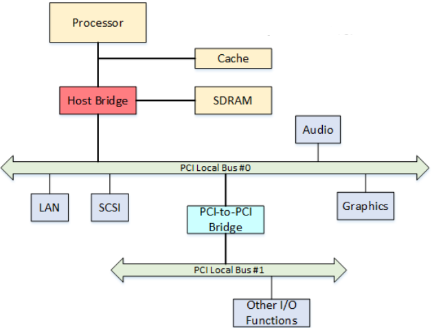

从图中看，与PCI总线相关的模块包括：

1. `Host Bridge`，比如PC中常见的`North Bridge（北桥）。`图中处理器、Cache、内存子系统通过Host Bridge连接到PCI上，Host Bridge管理PCI总线域，是联系处理器和PCI设备的桥梁，完成处理器与PCI设备间的数据交换。其中数据交换，包含`处理器访问PCI设备的地址空间`和`PCI设备使用DMA机制访问主存储器`，在PCI设备用DMA访问存储器时，会存在Cache一致性问题，这个也是Host Bridge设计时需要考虑的；此外，Host Bridge还可选的支持仲裁机制，热插拔等；
2. `PCI Local Bus；`PCI总线，由Host Bridge或者PCI-to-PCI Bridge管理，用来连接各类设备，比如声卡、网卡、IDE接口等。可以通过PCI-to-PCI Bridge来扩展PCI总线，并构成多级总线的总线树，比如图中的`PCI Local Bus #0`和`PCI Local Bus #1`两条PCI总线就构成一颗总线树，同属一个总线域；
3. `PCI-To-PCI Bridge`；`PCI桥`，用于扩展PCI总线，使采用PCI总线进行大规模系统互联成为可能，管理下游总线，并转发上下游总线之间的事务；
4. `PCI Device`；PCI总线中有三类设备：PCI从设备，PCI主设备，桥设备。PCI从设备：被动接收来自Host Bridge或者其他PCI设备的读写请求；PCI主设备：可以通过总线仲裁获得PCI总线的使用权，主动向其他PCI设备或主存储器发起读写请求；桥设备：管理下游的PCI总线，并转发上下游总线之间的总线事务，包括`PCI桥`、`PCI-to-ISA桥`、`PCI-to-Cardbus桥`等。

### 2.2 PCI总线信号定义

PCI总线是一条共享总线，可以挂接多个PCI设备，PCI设备通过一系列信号与PCI总线相连，包括：地址/数据信号、接口控制信号、仲裁信号、中断信号等。如下图：

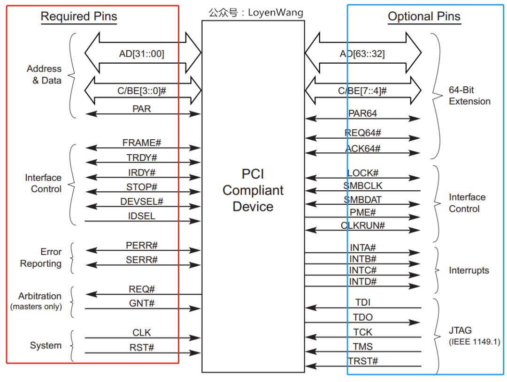

- 左侧红色框里表示的是PCI总线必需的信号，而右侧蓝色框里表示的是可选的信号；

- `AD[31:00]`：地址与数据信号复用，在传送时第一个时钟周期传送地址，下一个时钟周期传送数据；

- `C/BE[3:0]#`：PCI总线命令与字节使能信号复用，在地址周期中表示的是PCI总线命令，在数据周期中用于字节选择，可以进行单字节、字、双字访问；

- `PAR`：奇偶校验信号，确保`AD[31:00]`和`C/BE[3:0]#`传递的正确性；

- `Interface Control`：接口控制信号，主要作用是保证数据的正常传递，并根据PCI主从设备的状态，暂停、终止或者正常完成总线事务：

- - `FRAME#`：表示PCI总线事务的开始与结束；
  - `IRDY#`：信号由PCI主设备驱动，信号有效时表示PCI主设备数据已经ready；
  - `TRDY#`：信号由目标设备驱动，信号有效时表示目标设备数据已经ready；
  - `STOP#`：目标设备请求主设备停止当前总线事务；
  - `DEVSEL#`：PCI总线的目标设备已经准备好；
  - `IDSEL`：PCI总线在配置读写总线事务时，使用该信号选择PCI目标设备；

- `Arbitration`：仲裁信号，由`REQ#`和`GNT#`组成，与PCI总线的仲裁器直接相连，只有PCI主设备需要使用该组信号，每条PCI总线上都有一个总线仲裁器；

- `Error Reporting`：错误信号，包括`PERR#`奇偶校验错误和`SERR`系统错误；

- `System`：系统信号，包括时钟信号和复位信号；

看一下`C/BE[3:0]`都有哪些命令吧：

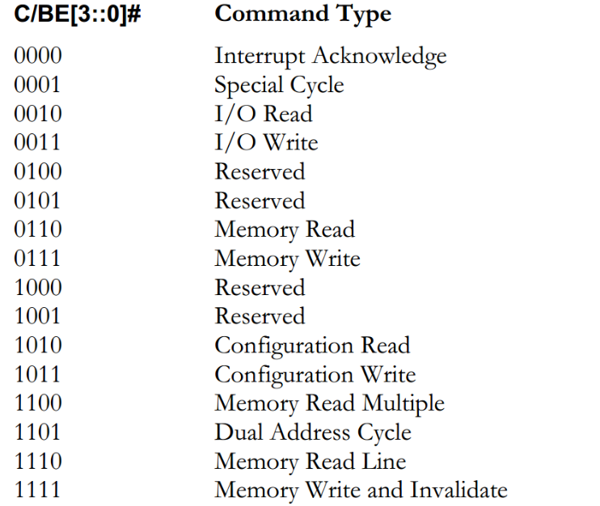

### 2.3 PCI事务模型

PCI使用三种模型用于数据的传输：

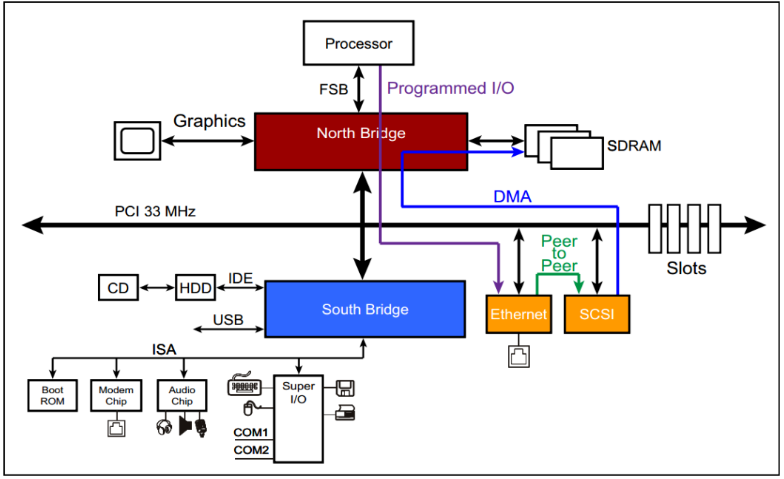

1. `Programmed I/O`：通过IO读写访问PCI设备空间；
2. `DMA`：PIO的方式比较低效，DMA的方式可以直接去访问主存储器而无需CPU干预，效率更高；
3. `Peer-to-peer`：两台PCI设备之间直接传送数据；

### 2.4 PCI总线地址空间映射

PCI体系架构支持三种地址空间：  

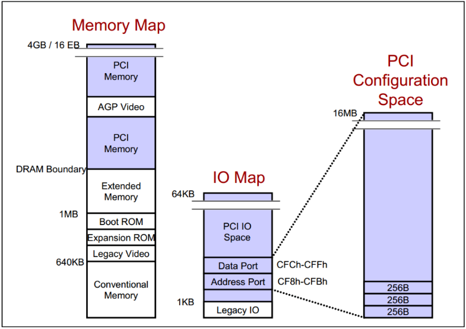

1. `memory空间`：针对32bit寻址，支持4G的地址空间，针对64bit寻址，支持16EB的地址空间；

2. `I/O空间`PCI最大支持4G的IO空间，但受限于x86处理器的IO空间（16bits带宽），很多平台将PCI的IO地址空间限定在64KB；

3. `配置空间`x86 CPU可以直接访问`memory空间`和`I/O空间`，而配置空间则不能直接访问；每个PCI功能最多可以有256字节的配置空间；PCI总线在进行配置的时候，采用ID译码方式，使用设备的ID号，包括`Bus Number`，`Device Number`，`Function Number`和`Register Number`，每个系统支持256条总线，每条总线支持32个设备，每个设备支持8个功能，由于每个功能最多有256字节的配置空间，因此总的配置空间大小为：256B * 8 * 32 * 256 = 16M；

   有必要再进一步介绍一下配置空间：x86 CPU无法直接访问配置空间，通过IO映射的数据端口和地址端口间接访问PCI的配置空间，其中地址端口映射到`0CF8h - 0CFBh`，数据端口映射到`0CFCh - 0CFFh`；

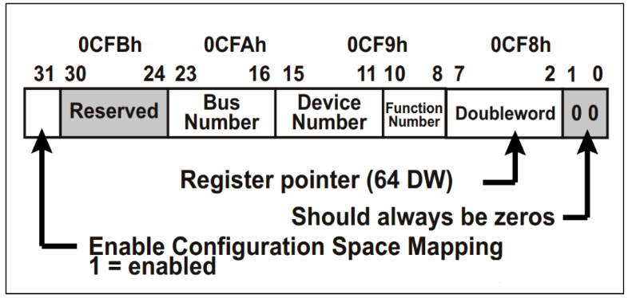

1. - 图为配置地址寄存器构成，PCI的配置过程分为两步：

2. 1. CPU写CF8h端口，其中写的内容如图所示，BUS，Device，Function能标识出特定的设备功能，Doubleword来指定配置空间的具体某个寄存器；
   2. CPU可以IO读写CFCh端口，用于读取步骤1中的指定寄存器内容，或者写入指定寄存器内容。这个过程有点类似于通过I2C去配置外接芯片；

那具体的配置空间寄存器都是什么样的呢？每个功能256Byte，前边64Byte是Header，剩余的192Byte支持可选功能。有种类型的PCI功能：Bridge和Device，两者的Header都不一样。

- Bridge

  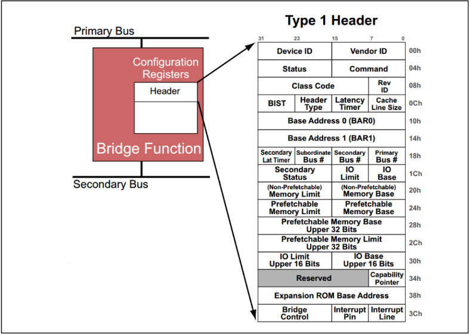

- Device

  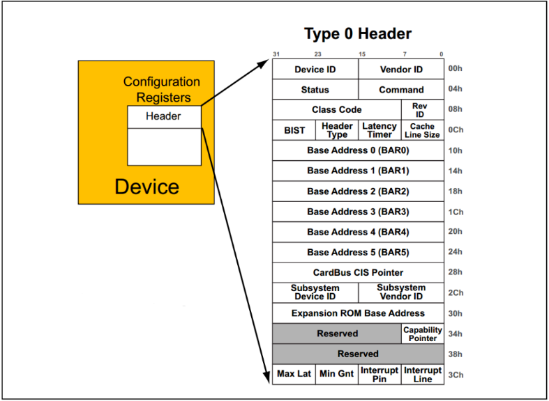

- 配置空间中有个寄存器字段需要说明一下：

   `Base Address Register`也就是 `BAR空间`，当PCI设备的配置空间被初始化后，该设备在PCI总线上就会拥有一个独立的PCI总线地址空间，这个空间就是`BAR空间`，`BAR空间`可以存放IO地址空间，也可以存放存储器地址空间。

- PCI总线取得了很大的成功，但随着CPU的主频不断提高，PCI总线的带宽也捉襟见肘。此外，它本身存在一些架构上的缺陷，面临一系列挑战，包括带宽、流量控制、数据传送质量等；
- PCIe应运而生，能有效解决这些问题，所以PCIe才是我们的主角；

## 3. PCI Express

### 3.1 PCIe体系结构

先看一下PCIe架构的组成图：

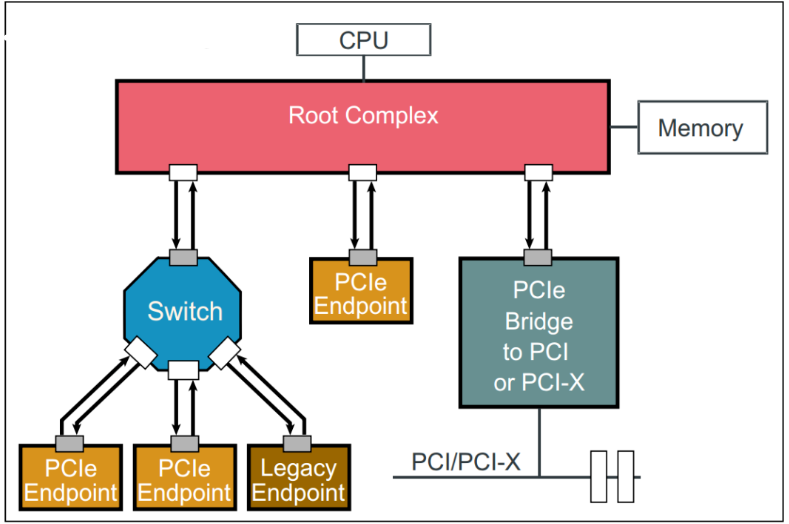

- `Root Complex`：CPU和PCIe总线之间的接口可能会包含几个模块（处理器接口、DRAM接口等），甚至可能还会包含芯片，这个集合就称为`Root Complex`，它作为PCIe架构的根，代表CPU与系统其它部分进行交互。广义来说，`Root Complex`可以认为是CPU和PCIe拓扑之间的接口，`Root Complex`会将CPU的request转换成PCIe的4种不同的请求（Configuration、Memory、I/O、Message）；
- `Switch`：从图中可以看出，`Swtich`提供扇出能力，让更多的PCIe设备连接在PCIe端口上；
- `Bridge`：桥接设备，用于去连接其他的总线，比如PCI总线或PCI-X总线，甚至另外的PCIe总线；
- `PCIe Endpoint`：PCIe设备；
- 图中白色的小方块代表`Downstream`端口，灰色的小方块代表`Upstream`端口；

前文提到过，PCIe在软件上保持了后向兼容性，那么在PCIe的设计上，需要考虑在PCI总线上的软件视角，比如`Root Complex`的实现可能就如下图所示，从而看起来与PCI总线相差无异：

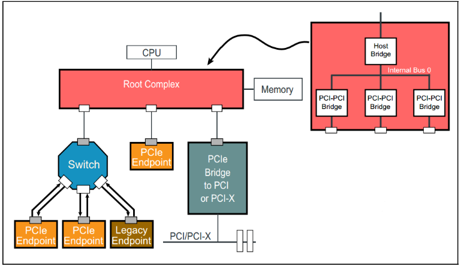

- Root Complex通常会实现一个内部总线结构和多个桥，从而扇出到多个端口上；
- Root Complex的内部实现不需要遵循标准，因此都是厂家specific的；

而`Switch`的实现可能如下图所示：

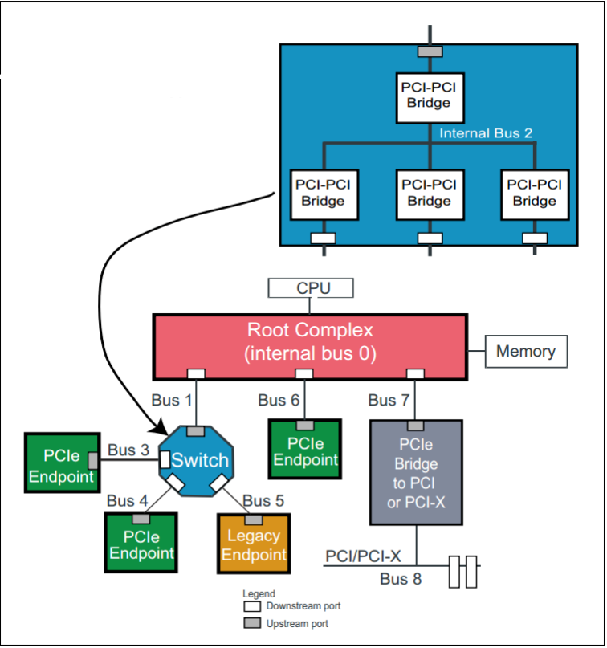

- Switch就是一个扩展设备，所以看起来像是各种桥的连接路由；

### 3.2 PCIe数据传输

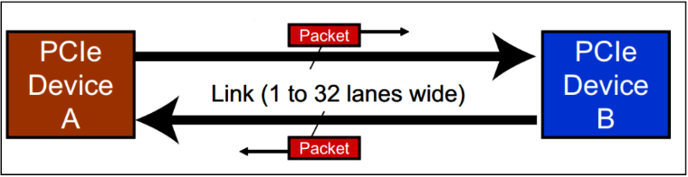


- 与PCI总线不同（PCI设备共享总线），PCIe总线使用端到端的连接方式，互为接收端和发送端，全双工，基于数据包的传输；
- 物理底层采用差分信号（PCI链路采用并行总线，而PCIe链路采用串行总线），一条Lane中有两组差分信号，共四根信号线，而PCIe Link可以由多条Lane组成，可以支持1、2、4、8、12、16、32条；

PCIe规范定义了分层的架构设计，包含三层：

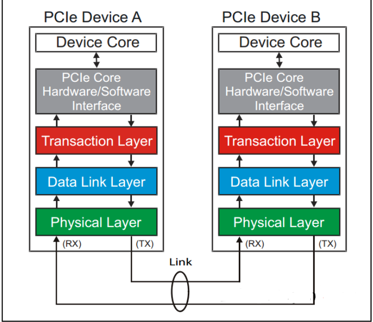

1. Transaction层

2. - 负责TLP包（`Transaction Layer Packet`）的封装与解封装，此外还负责QoS，流控、排序等功能；

3. Data Link层

4. - 负责DLLP包（`Data Link Layer Packet`）的封装与解封装，此外还负责链接错误检测和校正，使用Ack/Nak协议来确保传输可靠；

5. Physical层

6. - 负责`Ordered-Set`包的封装与解封装，物理层处理TLPs、DLLPs、Ordered-Set三种类型的包传输；

数据包的封装与解封装，与网络包的创建与解析很类似，如下图：

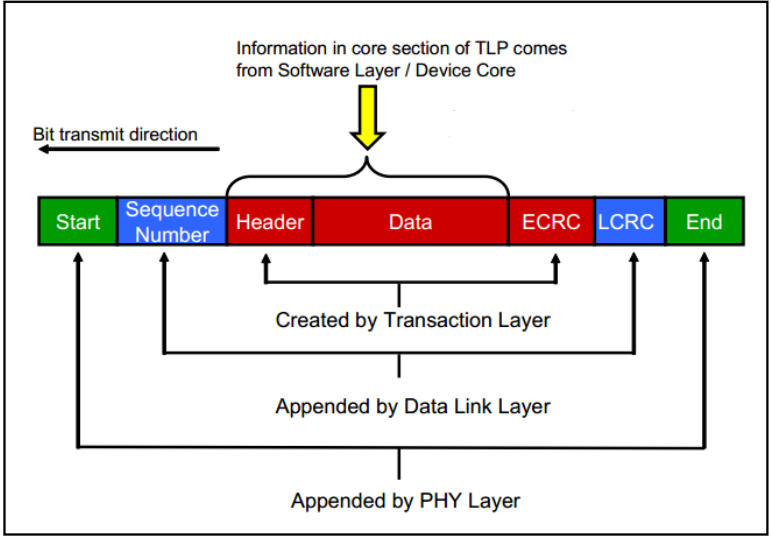


- 封装的时候，在Payload数据前添加各种包头，解析时是一个逆向的过程；

来一个更详细的PCIe分层图：
  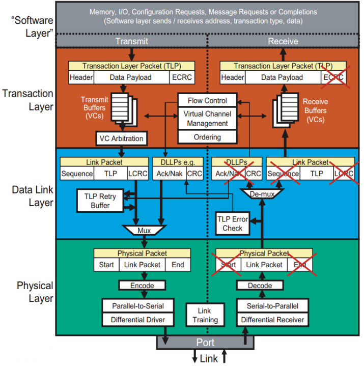

### 3.3 PCIe设备的配置空间

为了兼容PCI软件，PCIe保留了256Byte的配置空间，如下图：

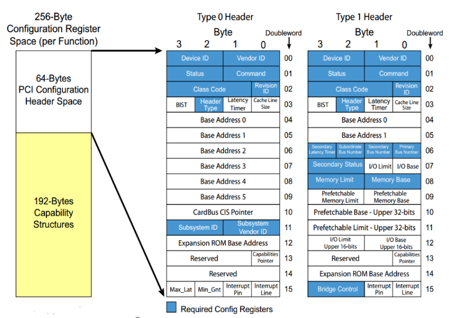


此外，在这个基础上将配置空间扩展到了4KB，还进行了功能的扩展，比如Capability、Power Management、MSI中断等：

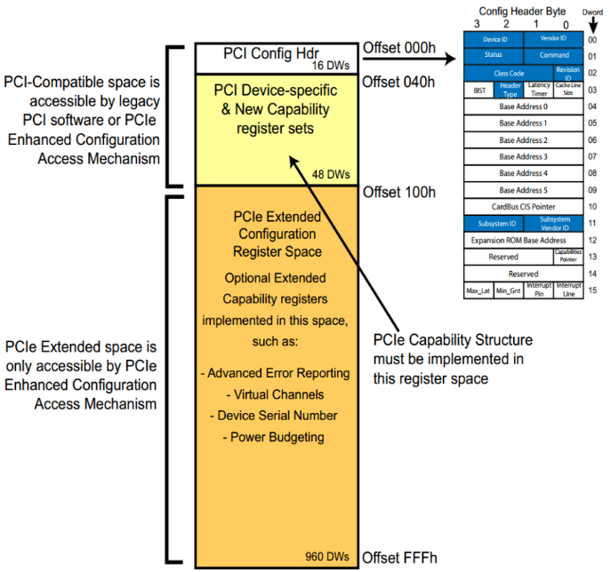


- 扩展后的区域将使用MMIO的方式进行访问；

草草收场吧，对PCI和PCIe有一些轮廓上的认知了，可以开始Source Code的软件分析了，欲知详情、下回分解！


## 第二部分

## 1. 概述

- 本文将分析Linux PCI子系统的框架，主要围绕Linux PCI子系统的初始化以及枚举过程分析；
- 如果对具体的硬件缺乏了解，建议先阅读上篇文章`第一部分`；

话不多说，直接开始。

## 2. 数据结构

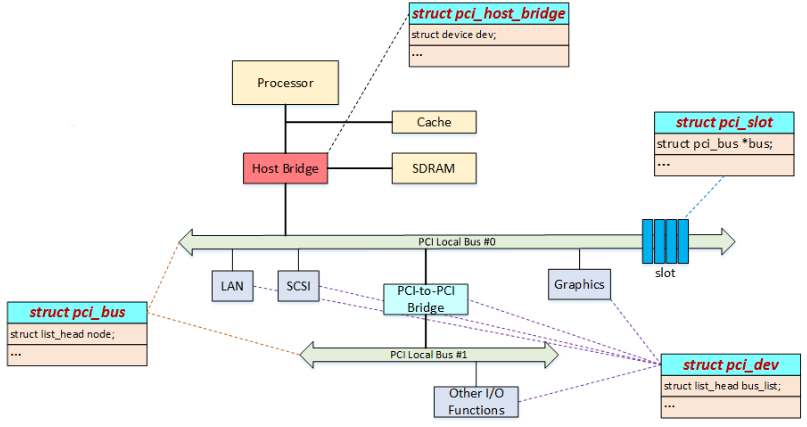

- PCI体系结构的拓扑关系如图所示，而图中的不同数据结构就是用于来描述对应的模块；
- Host Bridge连接CPU和PCI系统，由`struct pci_host_bridge`描述；
- `struct pci_dev`描述PCI设备，以及PCI-to-PCI桥设备；
- `struct pci_bus`用于描述PCI总线，`struct pci_slot`用于描述总线上的物理插槽；

  来一张更详细的结构体组织图：


- 总体来看，数据结构对硬件模块进行了抽象，数据结构之间也能很便捷的构建一个类似PCI子系统物理拓扑的关系图；
- 顶层的结构为`pci_host_bridge`，这个结构一般由Host驱动负责来初始化创建；
- `pci_host_bridge`指向root bus，也就是编号为0的总线，在该总线下，可以挂接各种外设或物理slot，也可以通过PCI桥去扩展总线；

## 3. 流程分析

### 3.1 设备驱动模型

Linux PCI驱动框架，基于Linux设备驱动模型，因此有必要先简要介绍一下，实际上Linux设备驱动模型也是一个大的topic，先挖个坑，有空再来填。来张图吧：

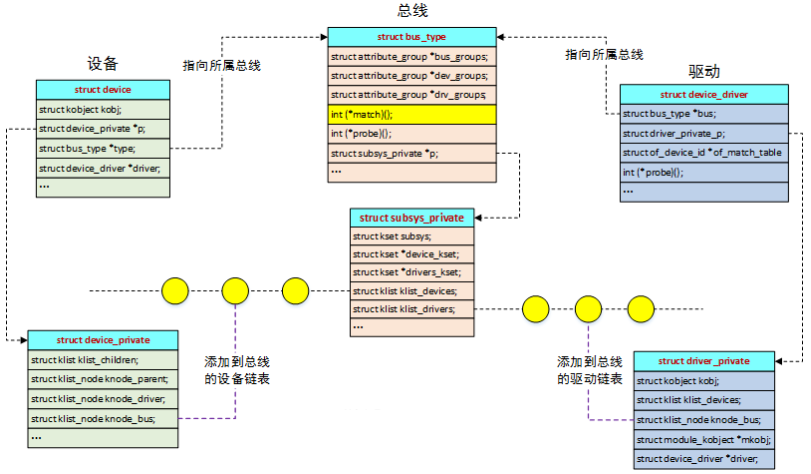

- 简单来说，Linux内核建立了一个统一的设备模型，分别采用总线、设备、驱动三者进行抽象，其中设备与驱动都挂在总线上，当有新的设备注册或者新的驱动注册时，总线会去进行匹配操作（`match`函数），当发现驱动与设备能进行匹配时，就会执行probe函数的操作；
- 从数据结构中可以看出，`bus_type`会维护两个链表，分别用于挂接向其注册的设备和驱动，而`match`函数就负责匹配检测；
- 各类驱动框架也都是基于图中的机制来实现，在这之上进行封装，比如I2C总线框架等；
- 设备驱动模型中，包含了很多`kset/kobject`等内容，建议去看看之前的文章`《linux设备模型之kset/kobj/ktype分析》`
- 好了，点到为止，感觉要跑题了，强行拉回来。

### 3.2 初始化

既然说到了设备驱动模型，那么首先我们要做的事情，就是先在内核里边创建一个PCI总线，用于挂接PCI设备和PCI驱动，我们的实现来到了`pci_driver_init()`函数：


- 内核在PCI框架初始化时会调用`pci_driver_init()`来创建一个PCI总线结构（全局变量`pci_bus_type`），这里描述的PCI总线结构，是指驱动匹配模型中的概念，PCI的设备和驱动都会挂在该PCI总线上；
- 从`pci_bus_type`的函数操作接口也能看出来，`pci_bus_match`用来检查设备与驱动是否匹配，一旦匹配了就会调用`pci_device_probe`函数，下边针对这两个函数稍加介绍；

#### 3.2.1 pci_bus_match

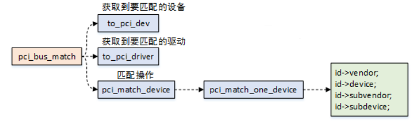
设备或者驱动注册后，触发`pci_bus_match`函数的调用，实际会去比对`vendor`和`device`等信息，这个都是厂家固化的，在驱动中设置成`PCI_ANY_ID`就能支持所有设备；
一旦匹配成功后，就会去触发`pci_device_probe`的执行；

#### 3.2.2 pci_device_probe

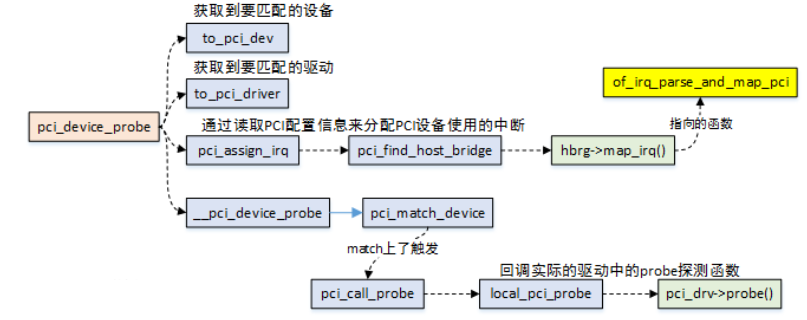

- 实际的过程也是比较简单，无非就是进行匹配，一旦匹配上了，直接调用驱动程序的probe函数，写过驱动的同学应该就比较清楚后边的流程了；

### 3.3 枚举

- 我们还是顺着设备驱动匹配的思路继续开展；
- 3.2节描述的是总线的创建，那么本节中的枚举，显然就是设备的创建了；
- 所谓设备的创建，就是在Linux内核中维护一些数据结构来对硬件设备进行描述，而硬件的描述又跟上文中的数据结构能对应上；

枚举的入口函数：`pci_host_probe`

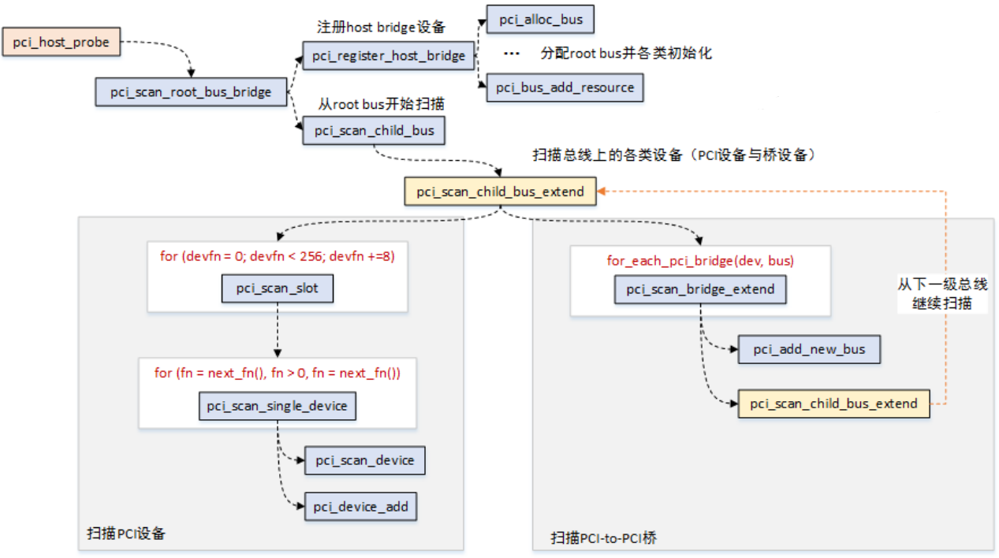

- 设备的扫描从`pci_scan_root_bus_bridge`开始，首先需要先向系统注册一个`host bridge`，在注册的过程中需要创建一个`root bus`，也就是`bus 0`，在`pci_register_host_bridge`函数中，主要是一系列的初始化和注册工作，此外还为总线分配资源，包括地址空间等；

- `pci_scan_child_bus`开始，从`bus 0`向下扫描并添加设备，这个过程由`pci_scan_child_bus_extend`来完成；

- 从`pci_scan_child_bus_extend`的流程可以看出，主要有两大块：

- 1. PCI设备扫描，从循环也能看出来，每条总线支持32个设备，每个设备支持8个功能，扫描完设备后将设备注册进系统，pci_scan_device的过程中会去读取PCI设备的配置空间，获取到BAR的相关信息，细节不表了；
  2. PCI桥设备扫描，PCI桥是用于连接上一级PCI总线和下一级PCI总线的，当发现有下一级总线时，创建子结构，并再次调用`pci_scan_child_bus_extend`的函数来扫描下一级的总线，从这个过程看，就是一个递归过程。

- 从设备的扫描过程看，这是一个典型的DFS（`Depth First Search`）过程，熟悉数据结构与算法的同学应该清楚，这就类似典型的走迷宫的过程；

如果你对上述的流程还不清楚，再来一张图：

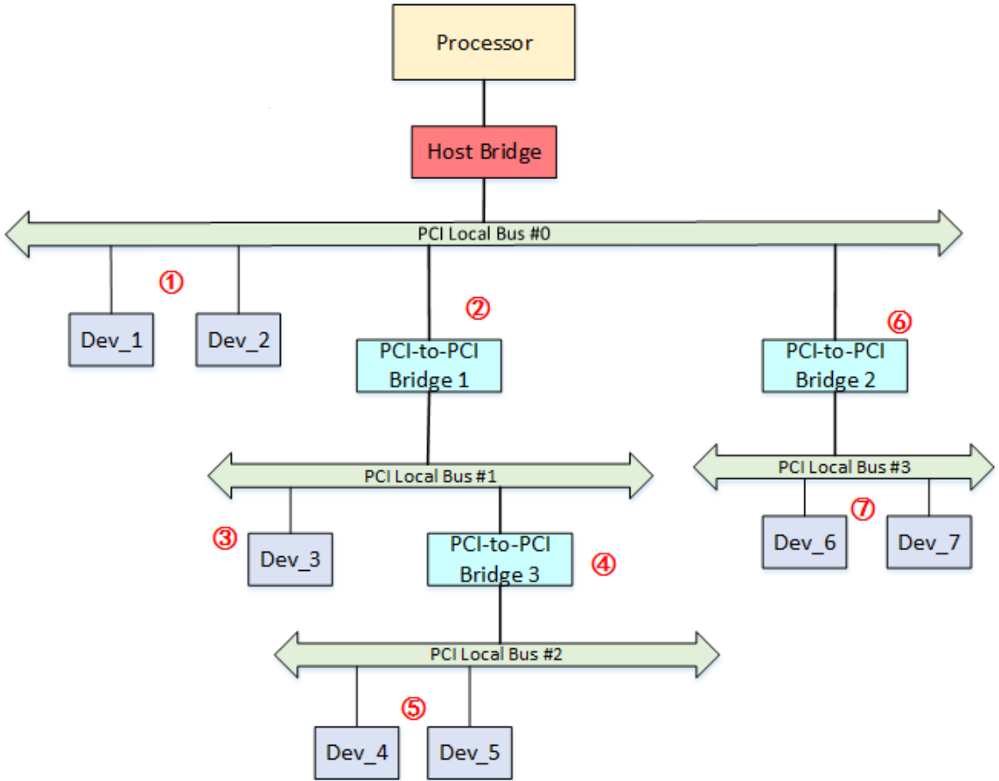
    

- 图中的数字代表的就是扫描的过程，当遍历到PCI桥设备的时候，会一直穷究到底，然后再返回来；
- 当枚举过程结束后，系统中就已经维护了PCI设备的各类信息了，在设备驱动匹配模型中，总线和设备都已经具备了，剩下的就是写个驱动了；

暂且写这么多，细节方面不再赘述了，把握大体的框架即可，无法扼住PCI的咽喉，那就扼住它的骨架吧。


##   第三部分

## 1. 概述

先回顾一下PCIe的架构图：


- 本文将讲PCIe Host的驱动，对应为`Root Complex`部分，相当于PCI的`Host Bridge`部分；
- 本文会选择Xilinx的`nwl-pcie`来进行分析；
- 驱动的编写整体偏简单，往现有的框架上套就可以了，因此不会花太多笔墨，点到为止；

## 2. 流程分析

- 但凡涉及到驱动的分析，都离不开驱动模型的介绍，驱动模型的实现让具体的驱动开发变得更容易；
- 所以，还是回顾一下上篇文章提到的驱动模型：Linux内核建立了一个统一的设备模型，分别采用总线、设备、驱动三者进行抽象，其中设备与驱动都挂在总线上，当有新的设备注册或者新的驱动注册时，总线会去进行匹配操作（`match`函数），当发现驱动与设备能进行匹配时，就会执行probe函数的操作；

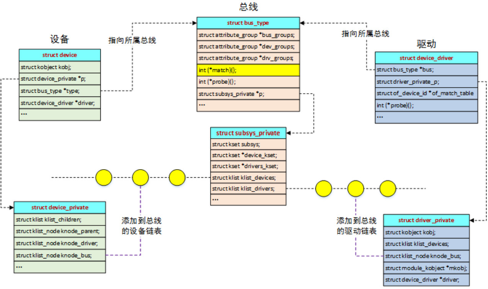

- `第二部分`中提到过PCI设备、PCI总线和PCI驱动的创建，PCI设备和PCI驱动挂接在PCI总线上，这个理解很直观。针对PCIe的控制器来说，同样遵循设备、总线、驱动的匹配模型，不过这里的总线是由虚拟总线`platform`总线来替代，相应的设备和驱动分别为`platform_device`和`platform_driver`；

那么问题来了，`platform_device`是在什么时候创建的呢？那就不得不提到`Device Tree`设备树了。  

### 2.1 Device Tree

- 设备树用于描述硬件的信息，包含节点各类属性，在dts文件中定义，最终会被编译成dtb文件加载到内存中；
- 内核会在启动过程中去解析dtb文件，解析成`device_node`描述的`Device Tree`；
- 根据`device_node`节点，创建`platform_device`结构，并最终注册进系统，这个也就是PCIe Host设备的创建过程；

我们看看PCIe Host的设备树内容：

```C
pcie: pcie@fd0e0000 {
 compatible = "xlnx,nwl-pcie-2.11";
 status = "disabled";
 #address-cells = <3>;
 #size-cells = <2>;
 #interrupt-cells = <1>;
 msi-controller;
 device_type = "pci";
    
 interrupt-parent = <&gic>;
 interrupts = <0 118 4>,
              <0 117 4>,
              <0 116 4>,
              <0 115 4>, /* MSI_1 [63...32] */
              <0 114 4>; /* MSI_0 [31...0] */
 interrupt-names = "misc", "dummy", "intx", "msi1", "msi0";
 msi-parent = <&pcie>;
    
 reg = <0x0 0xfd0e0000 0x0 0x1000>,
       <0x0 0xfd480000 0x0 0x1000>,
       <0x80 0x00000000 0x0 0x1000000>;
 reg-names = "breg", "pcireg", "cfg";
 ranges = <0x02000000 0x00000000 0xe0000000 0x00000000 0xe0000000 0x00000000 0x10000000 /* non-prefetchable memory */
    0x43000000 0x00000006 0x00000000 0x00000006 0x00000000 0x00000002 0x00000000>;/* prefetchable memory */
 bus-range = <0x00 0xff>;
    
 interrupt-map-mask = <0x0 0x0 0x0 0x7>;
 interrupt-map =   <0x0 0x0 0x0 0x1 &pcie_intc 0x1>,
                   <0x0 0x0 0x0 0x2 &pcie_intc 0x2>,
                   <0x0 0x0 0x0 0x3 &pcie_intc 0x3>,
                   <0x0 0x0 0x0 0x4 &pcie_intc 0x4>;
    
 pcie_intc: legacy-interrupt-controller {
  interrupt-controller;
  #address-cells = <0>;
  #interrupt-cells = <1>;
 };
};
```

关键字段描述如下：

- `compatible`：用于匹配PCIe Host驱动；
- `msi-controller`：表示是一个MSI（`Message Signaled Interrupt`）控制器节点，这里需要注意的是，有的SoC中断控制器使用的是GICv2版本，而GICv2并不支持MSI，所以会导致该功能的缺失；
- `device-type`：必须是`"pci"`；
- `interrupts`：包含NWL PCIe控制器的中断号；
- `interrupts-name`：`msi1, msi0`用于MSI中断，`intx`用于旧式中断，与`interrupts`中的中断号对应；
- `reg`：包含用于访问PCIe控制器操作的寄存器物理地址和大小；
- `reg-name`：分别表示`Bridge registers`，`PCIe Controller registers`， `Configuration space region`，与`reg`中的值对应；
- `ranges`：PCIe地址空间转换到CPU的地址空间中的范围；
- `bus-range`：PCIe总线的起始范围；
- `interrupt-map-mask`和`interrupt-map`：标准PCI属性，用于定义PCI接口到中断号的映射；
- `legacy-interrupt-controller`：旧式的中断控制器；

### 2.2 probe流程

- 系统会根据dtb文件创建对应的platform_device并进行注册；
- 当驱动与设备通过`compatible`字段匹配上后，会调用probe函数，也就是`nwl_pcie_probe`；

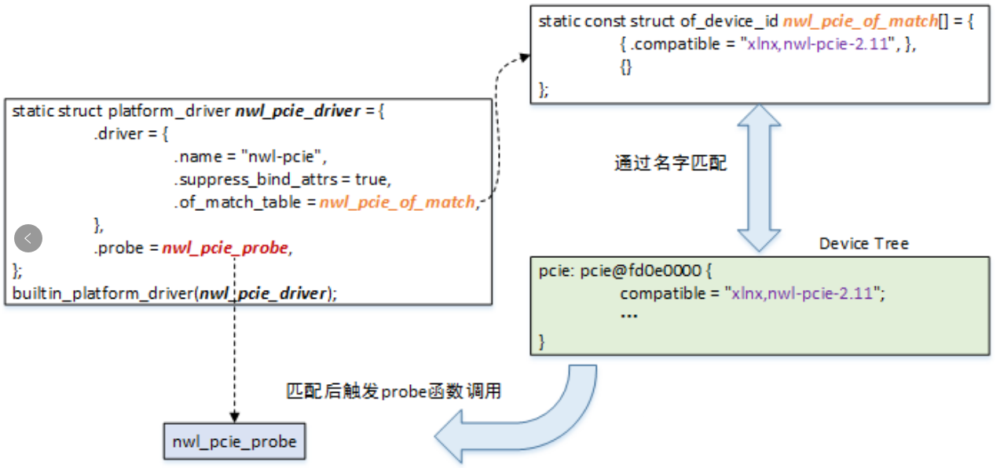


看一下`nwl_pcie_probe`函数：

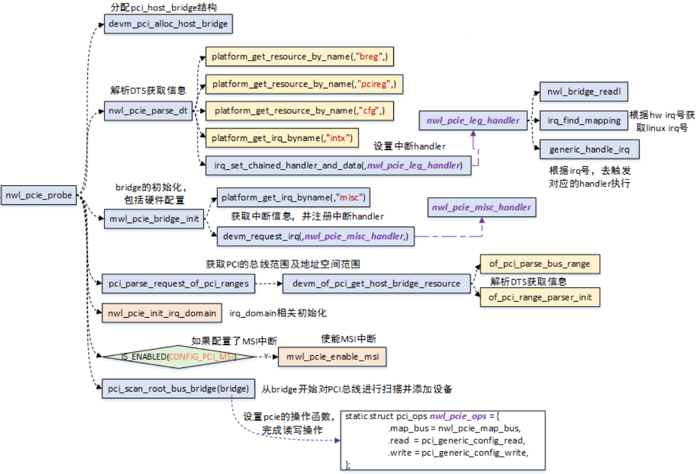

- 通常probe函数都是进行一些初始化操作和注册操作：

- 1. 初始化包括：数据结构的初始化以及设备的初始化等，设备的初始化则需要获取硬件的信息（比如寄存器基地址，长度，中断号等），这些信息都从DTS而来；
  2. 注册操作主要是包含中断处理函数的注册，以及通常的设备文件注册等;


- 针对PCI控制器的驱动，核心的流程是需要分配并初始化一个`pci_host_bridge`结构，最终通过这个`bridge`去枚举PCI总线上的所有设备；
- `devm_pci_alloc_host_bridge`：分配并初始化一个基础的`pci_hsot_bridge`结构；
- `nwl_pcie_parse_dt`：获取DTS中的寄存器信息及中断信息，并通过`irq_set_chained_handler_and_data`设置`intx`中断号对应的中断处理函数，该处理函数用于中断的级联；
- `nwl_pcie_bridge_init`：硬件的Controller一堆设置，这部分需要去查阅Spec，了解硬件工作的细节。此外，通过`devm_request_irq`注册`misc`中断号对应的中断处理函数，该处理函数用于控制器自身状态的处理；
- `pci_parse_request_of_pci_ranges`：用于解析PCI总线的总线范围和总线上的地址范围，也就是CPU能看到的地址区域；
- `nwl_pcie_init_irq_domain`和`mwl_pcie_enable_msi`与中断级联相关，下个小节介绍；
- `pci_scan_root_bus_bridge`：对总线上的设备进行扫描枚举，这个流程在`Linux PCI驱动框架分析（二）`中分析过。`brdige`结构体中的`pci_ops`字段，用于指向PCI的读写操作函数集，当具体扫描到设备要读写配置空间时，调用的就是这个函数，由具体的Controller驱动实现；

## 2.3 中断处理

PCIe控制器，通过PCIe总线连接各种设备，因此它本身充当一个中断控制器，级联到上一层的中断控制器（比如GIC），如下图：

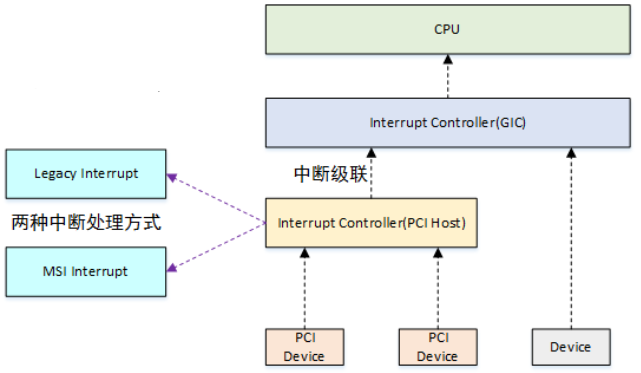

- PCIe总线支持两种中断的处理方式：

- 1. Legacy Interrupt：总线提供`INTA#, INTB#, INTC#, INTD#`四根中断信号，PCI设备借助这四根信号使用电平触发方式提交中断请求；
  2. MSI(`Message Signaled Interrupt`) Interrupt：基于消息机制的中断，也就是往一个指定地址写入特定消息，从而触发一个中断；

针对两种处理方式，`NWL PCIe`驱动中，实现了两个`irq_chip`，也就是两种方式的中断控制器：

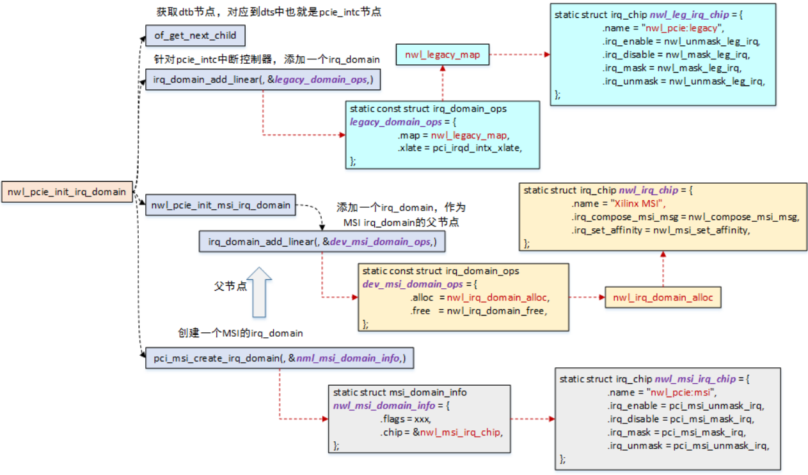

- `irq_domain`对应一个中断控制器（`irq_chip`），`irq_domain`负责将硬件中断号映射到虚拟中断号上；
- 来一张图，具体可以去参考中断子系统相关；

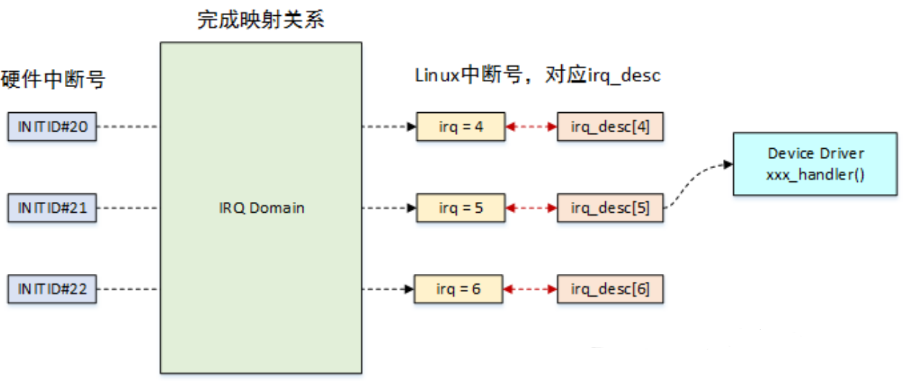
  再来看一下`nwl_pcie_enable_msi`函数：

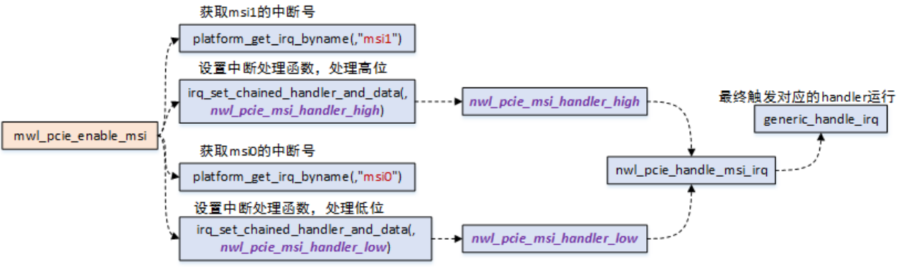

- 在该函数中主要完成的工作就是设置级联的中断处理函数，级联的中断处理函数中最终会去调用具体的设备的中断处理函数；

所以，稍微汇总一下，作为两种不同的中断处理方式，套路都是一样的，都是创建`irq_chip`中断控制器，为该中断控制器添加`irq_domain`，具体设备的中断响应流程如下：

1. 设备连接在PCI总线上，触发中断时，通过PCIe控制器充当的中断控制器路由到上一级控制器，最终路由到CPU；
2. CPU在处理PCIe控制器的中断时，调用它的中断处理函数，也就是上文中提到过的`nwl_pcie_leg_handler`，`nwl_pcie_msi_handler_high`，和`nwl_pcie_leg_handler_low`；
3. 在级联的中断处理函数中，调用`chained_irq_enter`进入中断级联处理；
4. 调用`irq_find_mapping`找到具体的PCIe设备的中断号；
5. 调用`generic_handle_irq`触发具体的PCIe设备的中断处理函数执行；
6. 调用`chained_irq_exit`退出中断级联的处理；

## 2.4 总结

- PCIe控制器驱动，各家的IP实现不一样，驱动的差异可能会很大，单独分析一个驱动毕竟只是个例，应该去掌握背后的通用框架；
- 各类驱动，大体都是硬件初始化配置，资源申请注册，核心是处理与硬件的交互（一般就是中断的处理），如果需要用户来交互的，则还需要注册设备文件，实现一堆`file_operation`操作函数集；
- 好吧，我个人不太喜欢分析某个驱动，草草收场了；

# 参考

`《PCI Express Technology 3.0》`
`《pci local bus specification revision 3.0》`
`《PCIe体系结构导读》`
`《PCI Express系统体系结构标准教材》`


