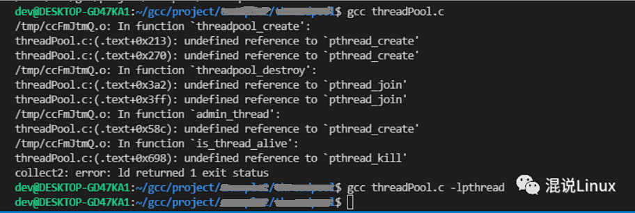

# Makefile、make、cmake

如果你是在Linux下做开发，你就必须知道Makefile是什么东西，如果不知道那就可以说你不是一个合格的Linux开发工程师，因为Makefile是必备的一项技能。

那么，Makefile到底有什么作用呢？

首先，gcc大家应该知道吧，gcc（GNU Compiler Collection，GNU编译器套件）是由GNU开发的编程语言编译器。使用gcc命令编译你会遇到一些麻烦：


1.  对于c语言，使用gcc编译的时候，其实它只会默认帮你链接一些基本的c语言标准库（例如libc.a或者libc.so)，有很多的依赖库（例如非标准库、第三方库等）是需要我们手动链接的，就是在gcc命令后面加上要链接的库，下面列举一些需要手动链接库的麻烦：

   1）如果用到了数学math库的时候，即使写了标准头文件<math.h>，不手动链接的话在编译的时候会发生未定义的错误：


```c
#include <stdio.h>
#include <math.h>
#define PI 3.14159265
int main(){
double angle, result;
angle = 30.0;
result = sin (angle * PI / 180.0);
printf ("result = %f \n", result);
return 0;}
```

   

   

   没有手动链接库编译会报错，手动链接后就不会报错：

   

   

   数学库的文件名就是libm.a，gcc会根据-l后面的基本名称自动添加前缀lib和后缀.a，例如gcc test.c -o test.out -lm，m是基本名称，添加前缀后缀就变成数学库libm.a。

   

   2）当你使用到线程，需要手动添加-lpthread，不然就会报错，添加了就编译成功。

   

   

   3）其实还有好多需要手动添加的库。。。。

   

2. 当你的程序只有一个源文件的时候，直接使用gcc命令编译就行，但是当你有很多个源文件怎么办？在gcc命令那逐个文件敲上去？100个源文件你也敲上去？不仅源文件多，各个文件可能还得依赖不同的库，这样命令会变得很长，显然这是不可行的办法。

   

3. 我们开发一个项目的时候，稍微debug一下，可能就改了一个if条件，修改后都要重新编译一次，一个有整个源码的工程，或者一个内核，里面的源文件的数量几百个或者上千个，完成所有文件的编译是需要大量时间的，编译半天都有可能，就修改了一个小bug而已，花费这么久的时间，明显工作效率会很低。

   

4. 我们在开发的时候其实还会遇到很多问题，比如我们的文件可能在不同的目录下，路径就不一样了。还有很多别的常遇到的问题，这里就不一一列举了。

   

随着上面一系列问题头疼的时候，Makefile就出现了，在Makefile里面你可以设置你想要的编译规则，你想要编译哪些文件，哪些文件不需要编译等等都可以体现在Makefile中，而且支持多线程并发操作，可以减少编译的时间。

然而，还有另一个工具make，make是用来执行Makefile的，make可以说成一个音乐家，Makefile就是一篇乐谱，音乐家根据乐谱的内容奏乐，make就是根据Makefile中写的内容进行编译和链接，make更像是一个批处理的工具，可以批处理源文件，只要执行一条make命令，就可以实现自动编译。


当我们编译整个项目工程的时候，make只会编译我们修改过的文件，没有修改过的就不用重新编译，这样我们debug了一个小bug后重新编译就不用花费大量的编译时间。只要没有添加文件或者删除文件，Makefile的内容都是不需要修改的。所以使用make+Makefile极大的提高了我们的工作效率。

对于一些不是很大的工程，Makefile完全是可以我们手工写的，但是工程非常大的时候，手写Makefile也是一件麻烦的事，而且Makefile又不是万能的，换了一个别的平台，Makefile又得重写。

于是又有人想，我们是不是可以自动生成一个Makefile呢？只需要把所有源文件读入就行，所以后面又出现了另一个工具，可以跨平台项目管理的工具cmake，cmake就可以生成Makefile文件给make去执行，这样就不用跨平台了还得去修改。

cmake它仍然是目标、依赖之类的抽象的东西，在Linux下，它会生成linux下的Makefile，在windows下，假如使用visual studio，它会生成visual studio使用的工程文件，它会为各种编译器定制工程文件，是不是抽象的同时还挺友好的。

这时候一个疑问又产生了，cmake是怎么生成Makefile的？

其实cmake又是根据一个叫CMakeLists.txt的文件生成Makefile的，就是make是用来执行Makefile的，cmake是用来执行CMakeLists.txt的。那CMakeLists.txt又是谁生成的？哈哈！CMakeLists.txt是自己手写的哦。

前段时间看到一句话我觉得说的非常好：“在编程的世界里没有捷径可走，还是要脚踏实地的。” 

我们只能一步一步想办法怎么让我们使用更加方便，不断去改善，社会不也是一点一点进步的嘛！我们现在的生活更加便利快捷，归根结底还是靠人类创造的，CMakeLists.txt也是一样的，也是需要我们自己写出来的，只是写CMakeLists.txt比写Makefile使用更方便，这就是进步！


