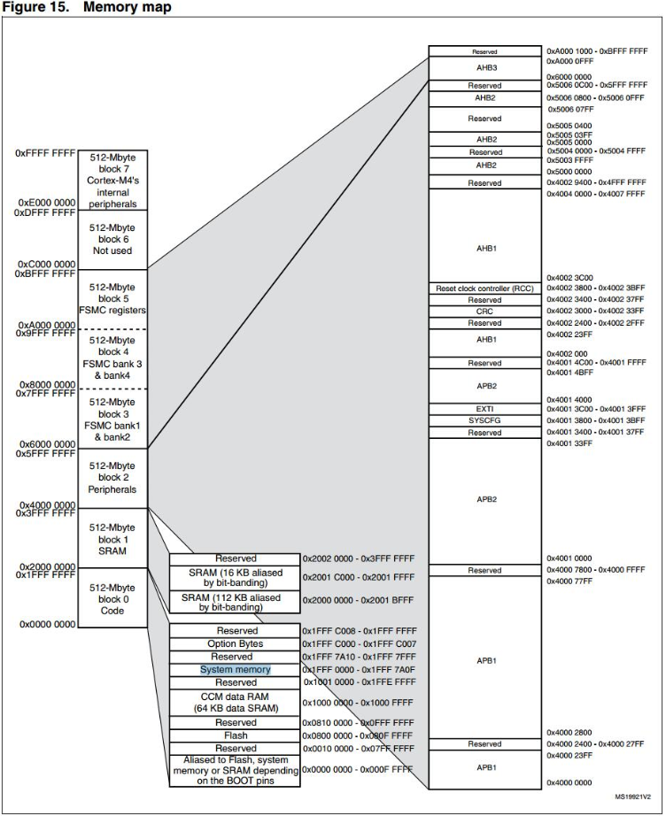
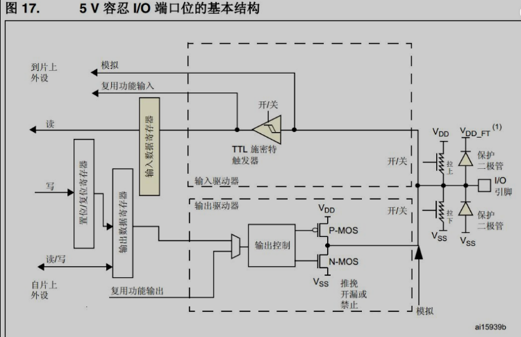
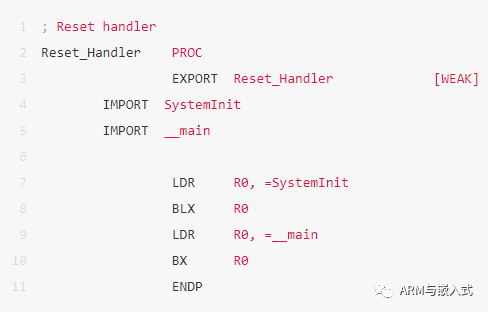
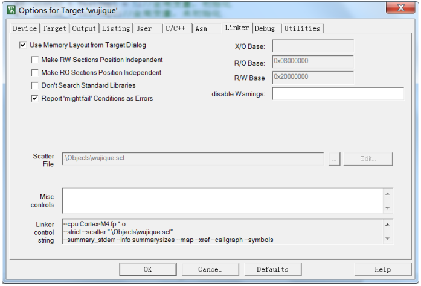
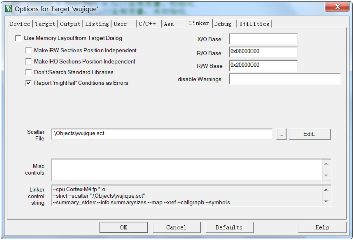
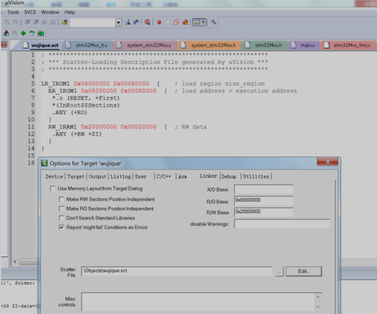

## **软硬件结合**

本文分析STM32单片机到底是如何**软硬件结合**的，分析单片机程序如何编译，运行。

初学者，通常有一个困惑，就是为什么软件能控制硬件？就像当年的51，为什么只要写P1=0X55，就可以在IO口输出高低电平？要理清这个问题，先要认识一个概念：**地址空间**。

#### 寻址空间

什么是地址空间呢？所谓的地址空间，就是PC指针的寻址范围，因此也叫寻址空间。

> 大家应该都知道，我们的电脑有32位系统和64位系统之分，为什么呢？因为32位系统，PC指针就是一个32位的二进制数，也就是0xffffffff，范围只有4G寻址空间。现在内存越来越大，4G根本不够，所以需要扩展，为了能访问超出4G范围的内存，就有了64位系统。STM32是多少位的？是32位的，因此PC指针也是32位，寻址空间也就是4G。

我们来看看STM32的寻址空间是怎么样的。在数据手册《STM32F407_数据手册.pdf》中有一个图，这个图，就是STM32的寻址空间分配。所有的芯片，都会有这个图，名字基本上都是叫Memory map，用一个新芯片，就先看这个图。



- 最左边，8个block，每个block 512M，总共就是4G，也就是芯片的寻址空间。

- block 0 里面有一段叫做FLASH，也就是内部FLASH，我们的程序就是下载到这个地方，起始地址是0X800 0000，大家注意，这个只有1M空间。现在STM32已经有2M flash的芯片了，超出1M的FLASH放在哪里呢？请自行查看对应的芯片手册。
- 3 在block 1 内，有两段SRAM，总共128K，这个空间，也就是我们前面说的内存，存放程序使用的变量。如果需要，也可以把程序放到SRAM中运行。407不是有196K吗？
- 其实407有196K内存，但是有64k并不是普通的SRAM，而是放在block 0 内的CCM。这两段区域不连续，而且，CCM只能内核使用，外设不能使用，例如DMA就不能用CCM内存，否则就死机。
- block 2，是Peripherals，也就是外设空间。我们看右边，主要就是APB1/APB2、AHB1/AHB2，什么东西呢？回头再说。
- block 3、block4、block5，是FSMC的空间，FSMC可以外扩SRAM，NAND FALSH，LCD等外设。

好的，我们分析了寻址空间，我们回过头看看，软件是**如何控制硬件**的。对于这个疑惑，也可以看此文：[代码是如何控制硬件的？](http://mp.weixin.qq.com/s?__biz=MzI1MDg4OTMwMw==&mid=2247496080&idx=2&sn=1d86ec4ef6dfe7d72cf409bd9a21db22&chksm=e9f9e4a8de8e6dbe5a1a198829973e128e6abe8cd75c6c4dc53497367d1580271f2797b6c5b6&scene=21#wechat_redirect)在IO口输出的例程中，我们配置IO口是调用库函数，我们看看库函数是怎么做的。

例如：

```C
GPIO_SetBits(GPIOG, GPIO_Pin_0 | GPIO_Pin_1 | GPIO_Pin_2| GPIO_Pin_3);
```

这个函数其实就是对一个变量赋值，对GPIOx这个结构体的成员BSRRL赋值。

```C
void GPIO_SetBits(GPIO_TypeDef* GPIOx, uint16_t GPIO_Pin)
{ 
/* Check the parameters */ 
assert_param(IS_GPIO_ALL_PERIPH(GPIOx)); assert_param(IS_GPIO_PIN(GPIO_Pin));

GPIOx->BSRRL = GPIO_Pin;
}
```

> assert_param:这个是断言，用于判断输入参数是否符合要求GPIOx是一个输入参数，是一个GPIO_TypeDef结构体指针，所以，要用->获取其成员

GPIOx是我们传入的参数GPIOG，具体是啥？在stm32f4xx.h中有定义。

```C
#define GPIOG               ((GPIO_TypeDef *) GPIOG_BASE)
```

GPIOG_BASE同样在文件中有定义，如下：
```C
#define GPIOG_BASE           (AHB1PERIPH_BASE + 0x1800)
```
AHB1PERIPH_BASE，AHB1地址，有点眉目了吧？在进一步看看
```C
/*!< Peripheral memory map */
#define APB1PERIPH_BASE       PERIPH_BASE
#define APB2PERIPH_BASE       (PERIPH_BASE + 0x00010000)
#define AHB1PERIPH_BASE       (PERIPH_BASE + 0x00020000)
#define AHB2PERIPH_BASE       (PERIPH_BASE + 0x10000000)
```
再找找PERIPH_BASE的定义
```
#define PERIPH_BASE           ((uint32_t)0x40000000)   
```
到这里，我们可以看出，操作IO口G，其实就是操作0X40000000+0X1800这个地址上的一个结构体里面的成员。说白了，就是操作了这个地方的寄存器。实质跟我们操作普通变量一样，就像下面的两句代码，区别就是变量i是SRAM空间地址，0X40000000+0X1800是外设空间地址。
```C
u32 i;
i = 0x55aa55aa;
```
这个外设空间地址的寄存器是IO口硬件的一部分。关于如下图STM32的GPIO文章推荐：STM32中GPIO工作原理详解。如下图，左边的输出数据寄存器，就是我们操作的寄存器（内存、变量），它的地址就是0X40000000+0X1800+0x14.



控制其他外设也类似，就是将数据写到外设寄存器上，跟操作内存一样，就可控制外设了。

> 寄存器，其实应该是内存的统称，外设寄存器应该叫做特殊寄存器。慢慢的，所有人都把外设的叫做寄存器，其他的统称内存或RAM。寄存器为什么能控制硬件外设呢？因为，初略的说，一个寄存器的一个BIT，就是一个开关，开就是1，关就是0。通过这个电子开关去控制电路，从而控制外设硬件。

## **纯软件-包罗万象的小程序**

我们已经完成了串口和IO口的控制，但是我们仅仅知道了怎么用，对其他一无所知。程序怎么跑的？关于程序是怎么在单片机运行的，也可以看此视频：[动画演示单片机是如何跑程序的](http://mp.weixin.qq.com/s?__biz=MzI1MDg4OTMwMw==&mid=2247490630&idx=1&sn=e4a80743ac337fd64b4c61be7469bd5b&chksm=e9fa097ede8d80687bcd942ed927ac374ba3957e43259c6d6e955d5e6c6c0acf1926129aa775&scene=21#wechat_redirect)。代码到底放在那里？内存又是怎么保存的？下面，我们通过一个简单的程序，学习嵌入式软件的基本要素。

### 分析启动代码

- 函数从哪里开始运行？

每个芯片都有复位功能，复位后，芯片的PC指针（一个寄存器，指示程序运行位置，对于多级流水线的芯片，PC可能跟真正执行的指令位置不一致，这里暂且认为一致）会复位到固定值，一般是0x00000000，在STM32中，复位到0X08000004。因此复位后运行的第一条代码就是0X08000004。前面我们不是拷贝了一个**启动代码文件**到工程吗？startup_stm32f40_41xxx.s，这个汇编文件为什么叫启动代码？因为里面的汇编程序，就是复位之后执行的程序。在文件中，有一段数据表，称为**中断向量**，里面保存了各个**中断的执行地址**。**复位，也是一个中断。**

芯片复位时，芯片从中断表中将Reset_Handler这个值（**函数指针**）加载到PC指针，芯片就会执行Reset_Handler函数了。（**一个函数入口就是一个指针**）

```asm
; Vector Table Mapped to Address 0 at Reset
                AREA    RESET, DATA, READONLY
                EXPORT  __Vectors
                EXPORT  __Vectors_End
                EXPORT  __Vectors_Size

__Vectors       DCD     __initial_sp               ; Top of Stack
                DCD     Reset_Handler              ; Reset Handler
                DCD     NMI_Handler                ; NMI Handler
                DCD     HardFault_Handler          ; Hard Fault Handler
                DCD     MemManage_Handler          ; MPU Fault Handler
                DCD     BusFault_Handler           ; Bus Fault Handler
                DCD     UsageFault_Handler         ; Usage Fault Handler
```

Reset_Handler函数，先执行SystemInit函数，这个函数在标准库内，主要是初始芯片时钟。然后跳到__main执行，__main函数是什么函数？

是我们在main.c中定义的main函数吗？后面我们再说这个问题。



芯片是怎么知道开始就执行启动代码的呢？或者说，我们如何把这个启动代码放到复位的位置？这就牵涉到一个一般情况下不关注的文件wujique.sct，这个文件在wujique\prj\Objects目录下，通常把这个文件叫做分散加载文件，编译工具在链接时，根据这个文件放置各个代码段和变量。

在MDK软件Options菜单Linker下有关于这个菜单的设置。



把Use Memory Layout from Target Dialog前面的勾去掉，之前不可设置的框都可以设置了。点击Edit进行编辑。



在代码编辑框出现了分散加载文件内容，当前文件只有基本的内容。

> 其实这个文件功能很强大，通过修改这个文件可以配置程序的很多功能，例如：1 指定FLASH跟RAM的大小于起始位置，当我们把程序分成BOOT、CORE、APP，甚至进行驱动分离的时候，就可以用上了。2 指定函数与变量的位置，例如把函数加载到RAM中运行。



从这个基本的分散加载文件我们可以看出：

- 第6行 ER_IROM1 0x08000000 0x00080000定义了ER_IROM1，也就是我们说的内部FLASH，从0x08000000开始，大小0x00080000。
- 第7行*.o (RESET, +First)从0x08000000开始，先放置一个*.o文件， 并且用(RESET, +First)指定RESET块优先放置，RESET块是什么？请查看启动代码，中断向量就是一个AREA，名字叫RESET，属于READONLY。这样编译后，RESET块将放在0x08000000位置，也就是说，中断向量就放在这个地方。DCD是分配空间，4字节，第一个就是__initial_sp，第二个就是Reset_Handler函数指针。也就是说，最后编译后的程序，将Reset_Handler这个函数的指针（地址），放在0x800000+4的地方。所以芯片在复位的时候，就能找到复位函数Reset_Handler。
- 第8行 *(InRoot$$Sections)什么鬼？GOOGLE啊！回头再说。
- 第9行 .ANY (+RO)意思就是其他的所有RO，顺序往后放。就是说，其他代码，跟着启动代码后面。
- 第11行 RW_IRAM1 0x20000000 0x00020000定义了RAM大小。
- 第12行 .ANY (+RW +ZI)所有的RW ZI，全部放到RAM里面。RW,ZI，也就是变量，这一行指定了变量保存到什么地址。

### 分析用户代码

到此，基本启动过程已经分析完。下一步开始分析用户代码，就从main函数开始。

1 程序跳转到main函数后:RCC_GetClocksFreq获取RCC时钟频率；SysTick_Config配置SysTick，在这里打开了SysTick中断，10毫秒一次。Delay(5);延时50毫秒。

```C
int main(void)
{
  GPIO_InitTypeDef GPIO_InitStructure;

 /*!< At this stage the microcontroller clock setting is already configured,
       this is done through SystemInit() function which is called from startup
       files before to branch to application main.
       To reconfigure the default setting of SystemInit() function,
       refer to system_stm32f4xx.c file */

  /* SysTick end of count event each 10ms */
  RCC_GetClocksFreq(&RCC_Clocks);
  SysTick_Config(RCC_Clocks.HCLK_Frequency / 100);

  /* Add your application code here */
  /* Insert 50 ms delay */
  Delay(5);
}
```

2 初始化IO就不说了，进入while(1)，也就是一个死循环，嵌入式程序，都是一个死循环，否则就跑飞了。

   ```c

/*初始化LED IO口*/
RCC_AHB1PeriphClockCmd(RCC_AHB1Periph_GPIOG, ENABLE);

GPIO_InitStructure.GPIO_Pin = GPIO_Pin_0 | GPIO_Pin_1 | GPIO_Pin_2| GPIO_Pin_3;
GPIO_InitStructure.GPIO_Mode = GPIO_Mode_OUT;

GPIO_InitStructure.GPIO_OType = GPIO_OType_PP;
GPIO_InitStructure.GPIO_Speed = GPIO_Speed_100MHz;
GPIO_InitStructure.GPIO_PuPd = GPIO_PuPd_UP;
GPIO_Init(GPIOG, &GPIO_InitStructure);    

/* Infinite loop */
mcu_uart_open(3);
while (1)
{
  GPIO_ResetBits(GPIOG, GPIO_Pin_0|GPIO_Pin_1|GPIO_Pin_2|GPIO_Pin_3);
  Delay(100);
  GPIO_SetBits(GPIOG, GPIO_Pin_0|GPIO_Pin_1|GPIO_Pin_2|GPIO_Pin_3);
  Delay(100);
  mcu_uart_test();

  TestFun(TestTmp2);
}
   ```

3 在while(1)中调用TestFun函数，这个函数使用两个全局变量，两个局部变量。

  ```c
/* Private functions ---------------------------------------------------------*/
u32 TestTmp1 = 5;//全局变量，初始化为5
u32 TestTmp2;//全局变量，未初始化

const u32 TestTmp3[10] = {6,7,8,9,10,11,12,13,12,13};

u8 TestFun(u32 x)//函数，带一个参数，并返回一个u8值
{
 u8 test_tmp1 = 4;//局部变量，初始化
 u8 test_tmp2;//局部变量，未初始化

 static u8 test_tmp3 = 0;//静态局部变量

 test_tmp3++;

 test_tmp2 = x;

 if(test_tmp2> TestTmp1)
  test_tmp1 = 10;
 else
  test_tmp1 = 5;

 TestTmp2 +=TestTmp3[test_tmp1];

 return test_tmp1;
}
  ```

然后程序就一直在main函数的while循环里面执行。中断呢？对，还有中断。**中断中断，就是中断正常的程序执行流程**。相关文章：[STM32中断系统](http://mp.weixin.qq.com/s?__biz=MzI1MDg4OTMwMw==&mid=2247484632&idx=1&sn=bab848ac23c2fe665fa7d66842c7aa9f&chksm=e9fa11e0de8d98f68a8a61f6be8b392fc980c2ba897756117bec528d67dc6b978b9de5fcfcc8&scene=21#wechat_redirect)。我们查看Delay函数，uwTimingDelay不等于0就死等？谁会将uwTimingDelay改为0？

```c

/**
  * @brief  Inserts a delay time.
  * @param  nTime: specifies the delay time length, in milliseconds.
  * @retval None
  */
void Delay(__IO uint32_t nTime)
{
  uwTimingDelay = nTime;

  while(uwTimingDelay != 0);
}
```

**搜索uwTimingDelay变量**，函数TimingDelay_Decrement会将变量一直减到0。
```c
/**
  * @brief  Decrements the TimingDelay variable.
  * @param  None
  * @retval None
  */
void TimingDelay_Decrement(void)
{
  if (uwTimingDelay != 0x00)
  {
    uwTimingDelay--;
  }
}
```

这个函数在哪里执行？经查找，在SysTick_Handler函数中运行。谁用这个函数？

   ```c
/**
  * @brief  This function handles SysTick Handler.
  * @param  None
  * @retval None
  */
void SysTick_Handler(void)
{
  TimingDelay_Decrement();
}

   ```

经查找，在中断向量表中有这个函数，也即是说这个函数指针保存在中断向量表内。当发生中断时，就会执行这个函数。当然，在进出中断会有保存和恢复现场的操作。这个主要涉及到汇编，暂时不进行分析了。有兴趣自己研究研究。通常，现在我们开发程序不用关心上下文切换了。

```asm
__Vectors       DCD     __initial_sp               ; Top of Stack
                DCD     Reset_Handler              ; Reset Handler
                DCD     NMI_Handler                ; NMI Handler
                DCD     HardFault_Handler          ; Hard Fault Handler
                DCD     MemManage_Handler          ; MPU Fault Handler
                DCD     BusFault_Handler           ; Bus Fault Handler
                DCD     UsageFault_Handler         ; Usage Fault Handler
                DCD     0                          ; Reserved
                DCD     0                          ; Reserved
                DCD     0                          ; Reserved
                DCD     0                          ; Reserved
                DCD     SVC_Handler                ; SVCall Handler
                DCD     DebugMon_Handler           ; Debug Monitor Handler
                DCD     0                          ; Reserved
                DCD     PendSV_Handler             ; PendSV Handler
                DCD     SysTick_Handler            ; SysTick Handler

```

###   余下问题

1 __main函数是什么函数？是我们在main.c中定义的main函数吗？2 分散加载文件中*(InRoot$$Sections)是什么？3 ZI段，也就是初始化为0的数据段，什么时候初始化？谁初始化？

为什么这几个问题前面留着不说？因为这是同一个问题。顺藤摸瓜！

## 通过MAP文件了解代码构成

#### 编译结果

程序编译后，在下方的Build Output窗口会输出信息：

```

*** Using Compiler 'V5.06 update 5 (build 528)', folder: 'C:\Keil_v5\ARM\ARMCC\Bin'
Build target 'wujique'
compiling stm32f4xx_it.c...
...
assembling startup_stm32f40_41xxx.s...
compiling misc.c...
...
compiling mcu_uart.c...
linking...
Program Size: Code=9038 RO-data=990 RW-data=40 ZI-data=6000  
FromELF: creating hex file...
".\Objects\wujique.axf" - 0 Error(s), 0 Warning(s).
Build Time Elapsed:  00:00:32
```

- 编译目标是wujique
- C文件compiling，汇编文件assembling，这个过程叫编译
- 编译结束后，就进行link，链接。
- 最后得到一个编译结果，9038字节code，RO 990，RW 40，ZI 6000。CODE，是代码，很好理解，那RO、RW、ZI都是什么？
- **FromELF，创建hex文件，FromELF是一个好工具，需要自己添加到option中才能用**