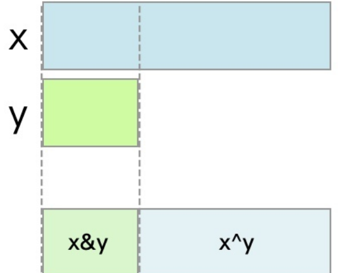
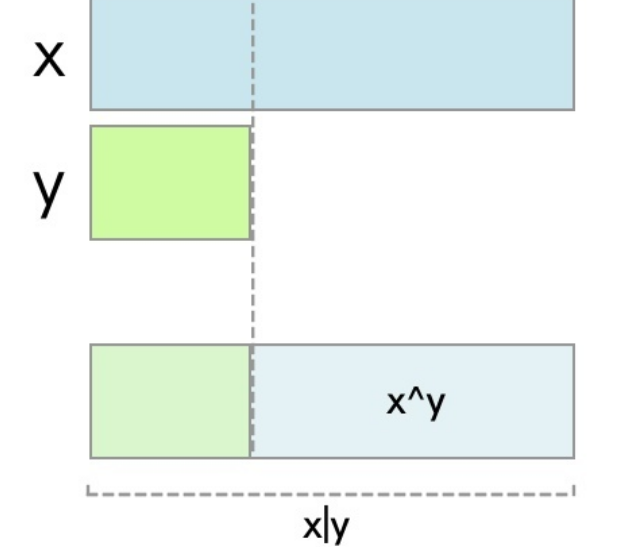

## 1 普通实现1

求两个整数的平均值，最简单的实现方法就是两个数相加再除以二。

int mean(int x, int y) {
return (x + y) / 2;
}

如果mean的参数是INT_MAX呢? 就溢出了.

## 2 普通实现2

我们使用右移运算符。

int mean1(int x, int y) {
return (x + y) >> 1;
}
类似

## 3 普通实现3

那么如果我们不把两个整数直接相加, 而是分别除以2再相加, 是不是就不会溢出了呢?

int mean3(int x, int y) {
return (x >> 1) + (y >> 1);
}
不会溢出了, 但会丢失精度.

## 3 正确实现1

int mean4(int x, int y) {
return x + ( (y - x) >> 1); //+ - 优先级大于移位 但方便理解
}
y大于x的部分, 除以2 分给x.

## 正确实现2

int meanRoundDown(int x, int y) {
return (x & y) + ((x ^ y) >> 1);
}
跟上面的理解一样.

## 正确实现3

int meanRoundUp(int x, int y) {
return (x | y) - ((x ^ y) >> 1);
}

