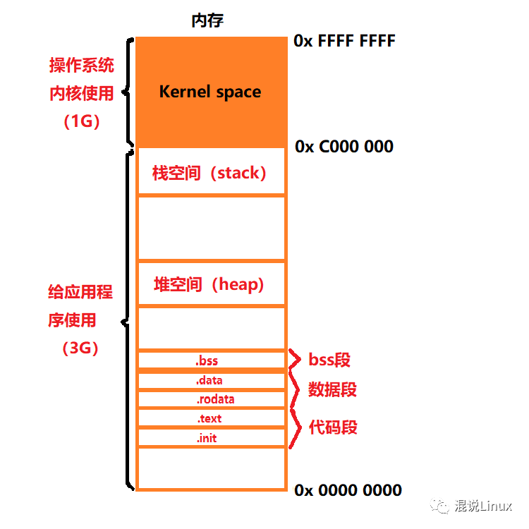
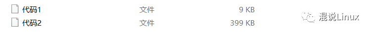

# 你该知道你写的程序的内存布局

**在32位系统总的地址空间大小是2^32 = 4GB**

在windows情况下，默认将高地址的2GB空间分配给内核(当然也可以分配1GB)，而在Linux情况下，默认将高地址的1GB空间分配给内核，`内核空间`以外剩下的空间给用户使用也被称为`用户空间`。



Linux进程地址空间分布

- **栈空间（stack):**
  由上图中可以知道进程地址空间中最顶部的段是栈，代码中调用函数、定义局部变量(但不包含static修饰的变量)或声明的类的实例等等都要使用栈空间，当函数执行完(也就是程序执行超过了这个函数的作用范围的时候)，操作系统会把该函数在栈中存放的数据出栈，也就是函数执行完需要return的时候系统会自己释放内存。但是如果不断的向栈中压入数据，达到最大的栈空间大小的话就会`栈溢出(stack overflow)`，这时候程序运行就会出现`段错误`（Segmentation Fault)。

- **堆空间（heap):**
  堆用于存储那些生存期与函数调用无关的数据，堆分配的接口通常有malloc()、calloc()、realloc()、new等，但是堆空间有一个特点就是申请空间之后如果不主动释放(free()、delete等)，那么这个堆空间会依然存在，所以这种动态申请的内存需要程序员自己分配和释放。

- **bss段**：
  bss(简称:Block Started by Symbol)段(bss segment)是用来保存未被初始化的全局变量或者静态(全局)变量的内容的一块内存区域，假如你写"static int a;" 或者 " int a; " , 则a的内容就保存在bss段中。

- **数据段**：
  data数据段(data segment)和bss段都是用来保存全局变量或静态(全局)变量的内容的一块内存区域，区别在于数据段是保存已经初始化的全局变量或静态(全局)变量，假如你写"static int a = 2; " 或者 "int a = 2; " ,那么a的内容就保存在数据段中了，而且初始值为2。
  rodata则是用来存放常量的一块内存区域。

- **代码段**：
  代码段(code segment/text segment)分为两个部分: text和 init。
  text 用于存放整个程序中的代码。
  init  用于存放系统中用来初始化启动你的程序的一段代码。

**一个程序本质其实都是由bss段、数据段、代码段三个组成的。**

下面来分析一下下面两段代码：

```c
// 代码 1 ：
int arry[100000];
int main()
{
    // ..........
}
```
```c
// 代码 2 ：
int arry[100000] = {1, 2, 3, 4, 5, 6};
int main()
{
    // ..........
}
```

gcc编译生成的可执行文件：



两个代码编译之后发现代码1的可执行文件比代码2的可执行文件小的多，为什么会这样呢？

其实两个代码区别很明显，代码1的全局变量没有初始化，保存在bss段，代码2的全局变量初始化了，保存在data段。而因为bss段不需要占用可执行文件空间，其内容是由操作系统初始化，所以我们平时在定义全局变量的时候可以不用初始化，系统会在程序一开始就将其清零了，而data却不需要占用，其内容是由程序代码给它初始化，所以会造成上面两种代码编译后的可执行文件大小不一样。