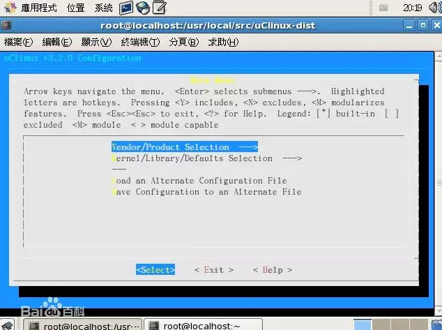
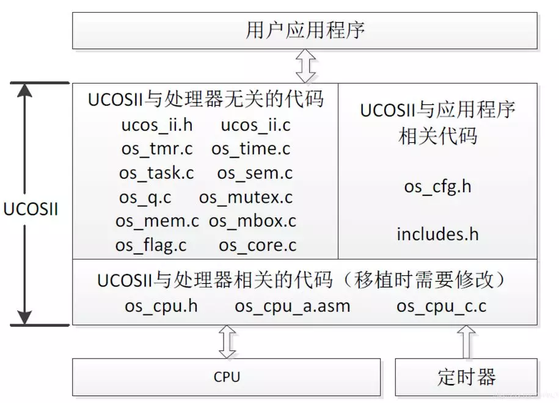
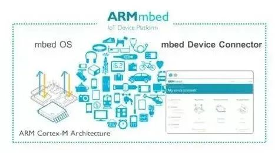
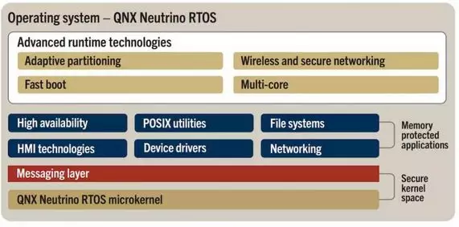
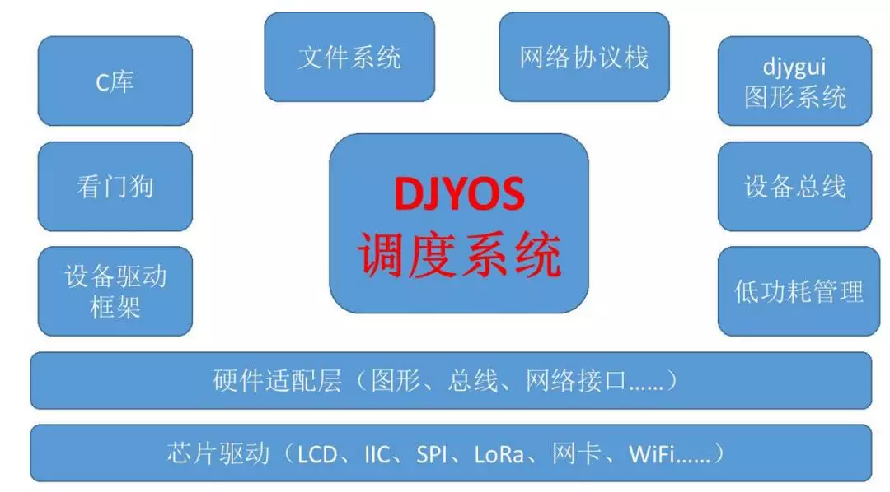
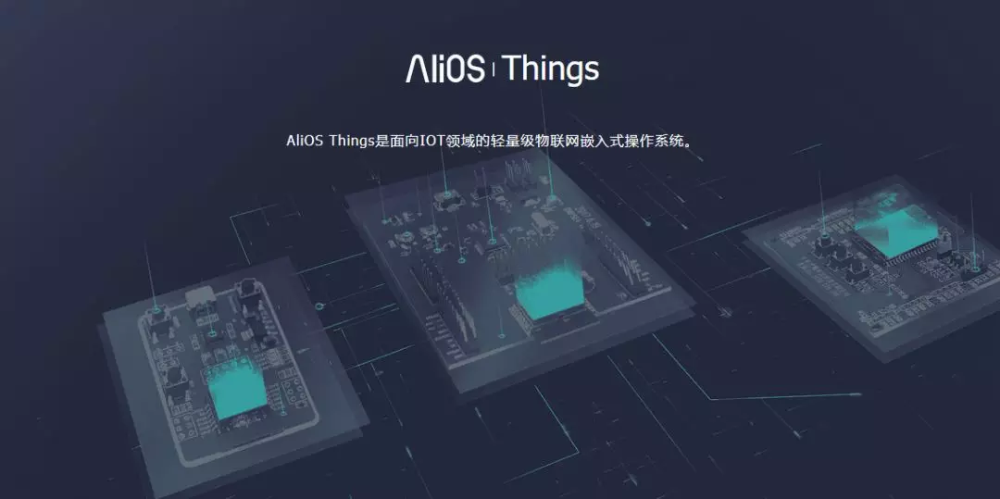
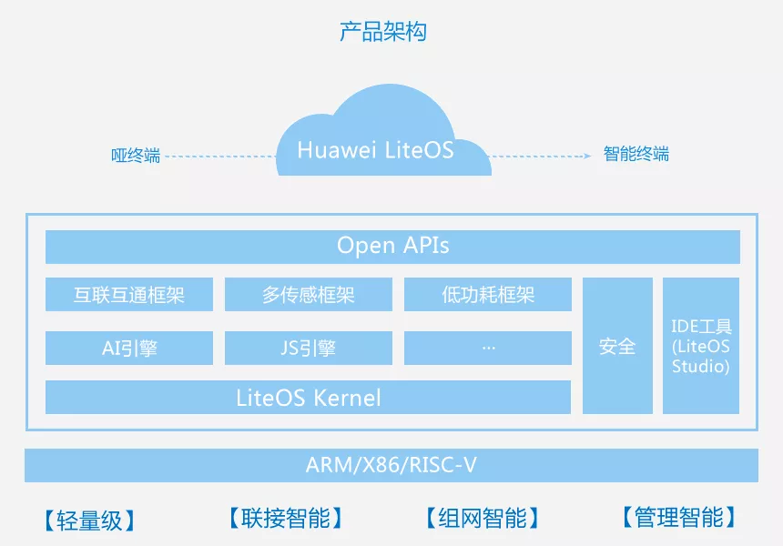

# 单片机跑操作系统，到底有几种选择？

单片机编程时，我们都知道有两种基本操作：裸奔和操作系统。所谓裸奔，就是一个大循环往复执行。

今天要讲的是几个常用的操作系统。

实时操作系统（Real-time operating system，RTOS），又称即时操作系统，它会按照排序运行、管理系统资源，并为开发应用程序提供一致的基础。

与一般的操作系统相比，RTOS最大的特色就是“实时性”，如果有一个任务需要执行，RTOS会马上执行该任务，不会有较长的延时。这种特性保证了各个任务的及时执行。

今天给大家介绍14种主流的RTOS，分别为`μClinux`、`μC/OS-II`、`eCos`、`FreeRTOS`、`mbed OS`、`RTX`、`Vxworks`、`QNX`、`NuttX`；而国产的嵌入式操作系统包括都江堰操作系统(`djyos`)、`Alios Things`、`Huawei LiteOS`、`RT-Thread`、`SylixOS`。

这14种嵌入式操作系统的特点如下。

## μClinux

μClinux是一种优秀的嵌入式Linux版本，其全称为micro-control Linux，从字面意思看是指微控制Linux。

同标准的Linux相比，μClinux的内核非常小，但它仍然继承了Linux操作系统的主要特性，包括良好的稳定性和移植性、强大的网络功能、出色的文件系统支持、标准丰富的API，以及TCP／IP网络协议等。

因为没有MMU内存管理单元，所以其多任务的实现需要一定技巧。

μClinux在结构上继承了标准Linux的多任务实现方式，分为实时进程和普通进程，分别采用先来先服务和时间片轮转调度，仅针对中低档嵌入式CPU特点进行改良，且不支持内核抢占，实时性一般。

综上可知，μClinux最大特点在于针对无MMU处理器设计，这对于没有MMU功能的stm32f103来说是合适的，但移植此系统需要至少512KB的RAM空间，1MB的ROM/FLASH空间，而stmf103拥有256K的FLASH，需要外接存储器，这就增加了硬件设计的成本。

μClinux结构复杂，移植相对困难，内核也较大，其实时性也差一些，若开发的嵌入式产品注重文件系统和与网络应用则μClinux是一个不错的选择。

单片机下载程序、在线Debug时往往会用到JTAG和SWD，常用的设备是J-LINK和ST-LINK，而这都是有版权的，价格较贵。

而DAP-LINK是开源的烧录工具，适用于Cotex-M系列内核的单片机，无版权约束。我实现了这个开源项目，无聊成本27元+4元运费即可到手。

## μC／OS-II

μC／OS-II是在μC/OS的基础上发展起来的，是用C语言编写的一个结构小巧、抢占式的多任务实时内核。μC／OS-II能管理64个任务，并提供任务调度与管理、内存管理、任务间同步与通信、时间管理和中断服务等功能，具有执行效率高、占用空间小、实时性能优良和扩展性强等特点。

在文件系统的支持方面，由于μC/OS-II是面向中小型嵌入式系统的，即使包含全部功能，编译后内核也不到10KB，所以系统本身并没有提供对文件系统的支持。但是，μC/OS-II具有良好的扩展性能，如果需要也可自行加入文件系统的内容。

在对硬件的支持上，μC/OS-II能够支持当前流行的大部分CPU，μC/OS-II由于本身内核就很小，经过裁剪后的代码最小可以为2KB，所需的最小数据RAM空间为4KB，μC/OS-II的移植相对比较简单，只需要修改与处理器相关的代码就可以。

综上可知，μC/OS-II是一个结构简单、功能完备和实时性很强的嵌入式操作系统内核，针对于没有MMU功能的CPU，它是非常合适的。它需要很少的内核代码空间和数据存储空间，拥有良好的实时性，良好的可扩展性能，并且是开源的，网上拥有	很多的资料和实例，所以很适合向stm32f103这款CPU上移植。  
  

## eCos

eCos(embedded Configurable operating system)，即嵌入式可配置操作系统。它是一个源代码开放的可配置、可移植、面向深度嵌入式应用的实时操作系统，其最大的特点就是配置灵活，采用模块化设计，核心部分由小同的组件构成，包括内核、C语言库和底层运行包等。

每个组件可提供大量的配置选项（实时内核也可作为可选配置），使用eCos提供的配置工具可以很方便地配置，并通过不同的配置使得eCos能够满足不同的嵌入式应用要求。

eCos操作系统的可配置性非常强大，用户可以自己加入所需的文件系统。eCos操作系统同样支持当前流行的大部分嵌入式CPU，eCos操作系统可以在16位、32位和64位等不同体系结构之间移植。

eCos由于本身内核就很小，经过裁剪后的代码最小可以为10KB，所需的最小数据RAM空间为10KB。另外，在系统移植方面，eCos操作系统的可移植性很好，要比μC／OS-II和μClinux容易。

综上所述，eCos最大特点是配置灵活，并且支持无MMU的CPU的移植，开源且具有很好的移植性，也比较合适于移植到stm32平台的CPU上。但eCOS的应用还不是太广泛，还没有像μC／OS-II那样普遍，并且资料也没有μC／OS-II多。eCos适合用于一些商业级或工业级对成本敏感的嵌入式系统,例如消费电子领域中的一些应用。

## FreeRTOS

 由于RTOS需占用一定的系统资源（尤其是RAM资源），只有μC／OS-II、embOS、salvo、FreeRTOS等少数实时操作系统能在小RAM单片机上运行。

相对于C／OS-II、embOS等商业操作系统，FreeRTOS操作系统是完全免费的操作系统，具有源码公开、可移植、可裁减、调度策略灵活的特点，可以方便地移植到各种单片机上运行，其最新版本为6.0版。

作为一个轻量级的操作系统，FreeRTOS提供的功能包括：任务管理、时间管理、信号量、消息队列、内存管理、记录功能，可基本满足较小系统的需要。

FreeRTOS内核支持优先级调度算法，每个任务可根据重要程度的不同被赋予一定的优先级，CPU总是让处于就绪态的、优先级最高的任务先运行。

FreeRT0S内核同时支持轮换调度算法，系统允许不同的任务使用相同的优先级，在没有更高优先级任务就绪的情况下，同一优先级的任务共享CPU的使用时间。

相对于常见的μC／OS—II操作系统，FreeRTOS操作系统既有优点，也存在不足。

其不足之处，一方面体现在系统的服务功能上，如FreeRTOS只提供了消息队列和信号量的实现，无法以后进先出的顺序向消息队列发送消息；另一方面，FreeRTOS只是一个操作系统内核，需外扩第三方的GUI（图形用户界面）、TCP／IP协议栈、FS（文件系统）等才能实现一个较复杂的系统，不像μC／OS-II可以和μC／GUI、μC／FS、μC／TCP-IP等无缝结合。

## mbed OS

开源嵌入式操作系统，ARM公司将mbed OS免费提供给所有厂商使用，mbed提供了一个相对更加系统和更加全面智能硬件开发环境。

主要功能：提供用于开发物联网设备的通用操作系统基础，以解决嵌入式设计的碎片化问题。支持所有重要的连接性与设备管理开放标准，以实现面向未来的设计。使安全可升级的边缘设备支持新增处理能力与功能。通过自动电源管理解决复杂的能耗问题。

主要特点：开发速度快，功能强大，安全性高，为了量产化而设计，可离线开发，也可以在网页上编辑。    

## RTX

这是ARM公司的一款嵌入式实时操作系统，使用标准的C结构编写，运用RealView编译器进行编译。不仅仅是一个实时内核，还具备丰富的中间层组件，不但免费，而且代码也是开放的。

主要功能：开始和停止任务（进程），除此之外还支持进程通信，例如任务的同步、共享资源（外设或内存）的管理、任务之间消息的传递。开发者可以使用基本函数去开启实时运行器，去开始和终结任务，以及去传递任务间的控制（轮转调度）。开发者可以赋予任务优先级。

主要特点：支持时间片，抢占式和合作式调度。不限制数量的任务，每个任务都具有254的优先级。不限制数量的信号量，互斥信号量，消息邮箱和软定时器。支持多线程和线程安全操作。使用MDK基于对话框的配置向导，可以很方便的完成MDK的配置。

##   VxWorks

美国WindRiver公司于1983年设计开发的一种嵌入式实时操作系（RTOS），具有硬实时、确定性与稳定性，也具备航空与国防、工业、医疗、汽车、消费电子产品、网络及其他行业要求的可伸缩性与安全性。

主要功能：支持可预测的任务同步机制、支持多任务间的通信、存储器优化管理、操作系统的（中断延迟、任务切换、驱动程序延迟等）行为是可知的和可预测的。实时时钟服务+中断管理服务。

主要特点：具有一个高性能的操作系统内核Wind（实时性好、可裁减）友好的开发调试环境、较好的兼容性、支持多种开发和运行环境。

## QNX

诞生于1980年，是一种商用的遵从POSIX规范的类Unix嵌入式实时操作系统。

主要功能：支持在同一台计算机上同时调度执行多个任务；也可以让多个用户共享一台计算机，这些用户可以通过多个终端向系统提交任务，与QNX进行交互操作。主要特点：核心仅提供4种服务，即进程调度、进程间通信、底层网络通信和中断处理，其进程在独立的地址空间运行。所有其它OS服务，都实现为协作的用户进程，因此QNX核心非常小巧（QNX4.x大约为12Kb）而且运行速度极快。

## NuttX

NuttX是一个实时嵌入式操作系统（Embedded RTOS），第一个版本由Gregory Nutt于2007年在宽松的BSD许可证下发布。

主要功能：可以构建为开放的、平面的嵌入式RTOS，或单独构建为具有系统调用接口的微内核。容易扩展到新的处理器架构、SoC架构或板级架构。实时的、确定性的、支持优先级继承。BSD套接字接口。优先级管理的扩展。可选的具有地址环境的任务（进程）。

主要特点：配置灵活，采用模块化设计，核心部分由小同的组件构成，包括内核、C语言库和底层运行包等。每个组件可提供大量的配置选项(实时内核也可作为可选配置)，使用eCos提供的配置工具可以很方便地配置，并通过不同的配置使得eCos能够满足不同的嵌入式应用要求。

## 都江堰操作系统（djyos）

（注意：都江堰操作系统官网提示，stm32的f4和f7没调通。）

都江堰操作系统，简称djyos，得名于一个伟大的水利工程：都江堰。

与传统操作系统不同，djyos不是以线程而是以事件为调度核心，这种调度算法使程序员摆脱模拟计算机执行过程编写程序的思维方式，而是按人类认知世界的方式编写应用程序，就如同在嵌入式编程中引入了VC似的。

djyos的调度算法，可使程序员摆脱线程和进程的束缚。djyos没有有关线程的api，一个完全不懂线程知识的程序员也可以顺利地在djyos下编写应用程序。

djyos操作系统是以事件为核心进行调度的，这种调度策略使程序员可以按人类认知事物的习惯而不是计算机的习惯来编程。

## Alios Things

据著名媒体嵌入式操作系统RTOS介绍，AliOS Things是AliOS家族旗下、面向IoT领域的、高可伸缩的物联网操作系统

AliOS Things将致力于搭建云端一体化IoT基础设施，具备极致性能、极简开发、云端一体、丰富组件、安全防护等关键能力，并支持终端设备连接到阿里云Link，可广泛应用在智能家居、智慧城市、新出行等领域。

点评：阿里系，背靠阿里资源来势汹汹杀入物联网市场，芯片+模组厂商合作，是非常有力的一个玩家，但这也是其最大的劣势！

##   Huawei LiteOS

嵌入式操作系统RTOS介绍，Huawei LiteOS是华为面向IoT领域，构建的轻量级物联网操作系统，以轻量级低功耗、快速启动、互联互通、安全等关键能力，为开发者提供“一站式”完整软件平台，有效降低开发门槛、缩短开发周期。

点评：华为系，不过其开源程度比较低，其主要用于华为自己的产品，有大树罩着。

## RT-Thread

嵌入式操作系统RTOS介绍，RT-Thread是一个集实时操作系统（RTOS）内核、中间件组件和开发者社区于一体的技术平台，由熊谱翔先生带领并集合开源社区力量开发而成，RT-Thread也是一个组件完整丰富、高度可伸缩、简易开发、低功耗、高安全性的物联网操作系统。

RT-Thread具备一个IoT OS平台所需的所有关键组件，例如GUI、网络协议栈、安全传输、低功耗组件等。经过11年的累积发展，RT-Thread已经拥有一个国内最大的嵌入式开源社区，同时被广泛应用于能源、车载、医疗、消费电子等多个行业，累积装机量超过两千万台，成为国人自主开发、国内最成熟稳定和装机量最大的开源RTOS。

点评：国内最有可能成为Top 1，优势在于丰富的组件，中立立场！赶上了时机，得到诸多芯片厂商的支持，也挺受开发者喜欢的。缺点在于本身的教程文档和freertos等之类的比还是很弱。

## SylixOS

嵌入式操作系统RTOS介绍，SylixOS是一个开源的跨平台的大型实时操作系统（RTOS），SylixOS诞生于2006年，经过十多年的持续开发，SylixOS已成为功能最为全面的国产操作系统之一。

目前已有众多产品和项目应用案例，行业涉及航空航天、军事防务、轨道交通、智能电网、工业自动化等诸多领域。SylixOS完全符合POSIX规范，开源社区丰富的自由软件移植非常方便。

点评：这家也是挺有意思的，2006年就开始了，吃军工饭，最近一两年才露头角。其实力不容小觑！

 当然，RTOS并不仅上面这些

