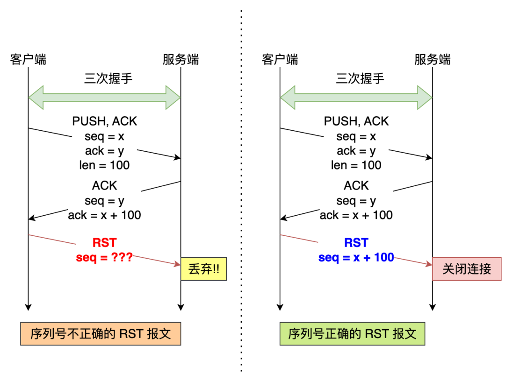
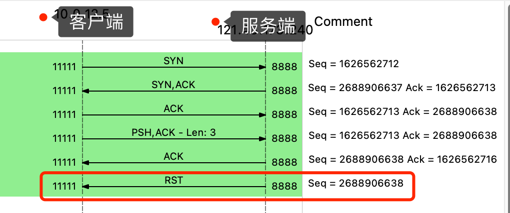
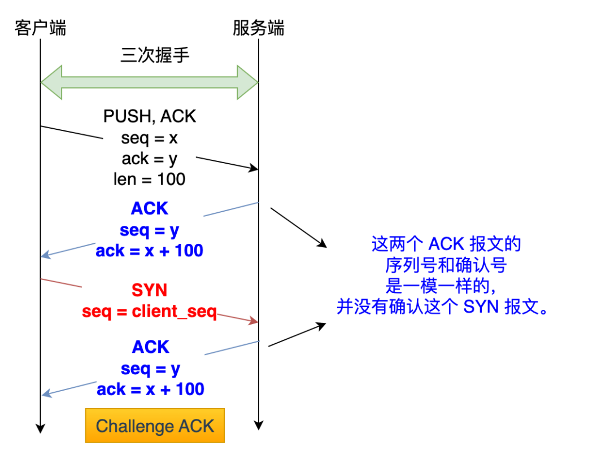
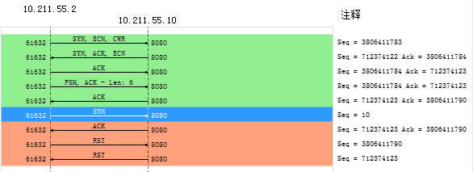

# 原来墙，是这么把我 TCP 连接干掉的！

今天聊一个比较轻松的问题：**如何关闭一个 TCP 连接？**

可能大家第一反应是「杀掉进程」不就行了吗？

是的，这个是最粗暴的方式，杀掉客户端进程和服务端进程影响的范围会有所不同：

- 在客户端杀掉进程的话，就会发送 FIN 报文，来断开这个客户端进程与服务端建立的所有 TCP 连接，这种方式影响范围只有这个客户端进程所建立的连接，而其他客户端或进程不会受影响。
- 而在服务端杀掉进程影响就大了，此时所有的 TCP 连接都会被关闭，服务端无法继续提供访问服务。

所以，**关闭进程的方式并不可取，最好的方式要精细到关闭某一条 TCP 连接**。

有的小伙伴可能会说，**伪造一个四元组相同的 RST 报文不就行了？**

这个思路很好，「伪造 RST 报文来关闭 TCP 连接」的方式其实有个专业术语叫：**TCP 重置攻击**。


我们的墙，在过滤网站的时候，其实就是这么干的。当然，墙除了 TCP 重置连接的方式外，还有很多方式来过滤网站，比如域名劫持、IP封锁、HTTPS 证书过滤等等。

这次我们只重点关注 **TCP 重置技术**。

## TCP 重置技术

伪造 RST 报文说来简单，但是不要忘了还有个「序列号」的问题，你伪造的 RST 报文的序列号一定能被对方接受吗？

如果 RST 报文的序列号不是对方期望收到的序列号，那么这个 RST 报文则会被对方丢弃，就达不到重置 TCP 连接的效果了。

举个例子，下面这个场景，客户端发送了一个长度为 100 的 TCP 数据报文，服务端收到后响应了 ACK 报文，表示收到了这个 TCP 数据报文。**服务端响应的这个 ACK 报文中的确认号（ack = x + 100）就是表明服务端下一次期望收到的序列号是 x + 100**。



所以，要伪造一个有用的 RST 报文**，关键是要拿到对方下一次期望收到的序列号**。

这里介绍两个关闭一个 TCP 连接的工具：**tcpkill** 和 **killcx**。

这两个工具都是通过伪造 RST 报文来关闭指定的 TCP 连接，但是它们拿到正确的序列号的实现方式是不同的。

- tcpkill 工具是在双方进行 TCP 通信时，拿到对方下一次期望收到的序列号，然后将序列号填充到伪造的 RST 报文，并将其发送给对方，达到关闭 TCP 连接的效果。
- killcx 工具是主动发送一个 SYN 报文，对方收到后会回复一个携带了正确序列号和确认号的 ACK 报文，这个 ACK 被称之为 Challenge ACK，这时就可以拿到对方下一次期望收到的序列号，然后将序列号填充到伪造的 RST 报文，并将其发送给对方，达到关闭 TCP 连接的效果。

可以看到， 这两个工具在获取对方下一次期望收到的序列号的方式是不同的。

tcpkill 工具属于被动获取，就是在双方进行 TCP 通信的时候，才能获取到正确的序列号，很显然**这种方式无法关闭非活跃的 TCP 连接**，只能用于关闭活跃的 TCP 连接。因为如果这条 TCP 连接一直没有任何数据传输，则就永远获取不到正确的序列号。

killcx 工具则是属于主动获取，它是主动发送一个 SYN 报文，通过对方回复的 Challenge ACK 来获取正确的序列号，所以这种方式**无论 TCP 连接是否活跃，都可以关闭**。

接下来，我就用这两个工具做个实验，给大家演示一下，它们是如何关闭一个 TCP 连接的。

## tcpkill 工具

在这里， 我用 nc 工具来模拟一个 TCP 服务端，监听 8888 端口。

模拟一个 TCP 服务端

接着，在客户端机子上，用 nc 工具模拟一个 TCP 客户端，连接我们刚才启动的服务端，并且指定了客户端的端口为 11111。

客户端连接服务端

这时候， 服务端就可以看到这条 TCP 连接了。

TCP 连接的四元组信息

注意，我这台服务端的公网 IP 地址是 121.43.173.240，私网 IP 地址是 172.19.11.21，在服务端通过 netstat 命令查看 TCP 连接的时候，则会将服务端的地址显示成私网 IP 地址 。至此，我们前期工作就做好了。

接下来，我们在服务端执行 tcpkill 工具，来关闭这条 TCP 连接，看看会发生什么？

在这里，我指定了要关闭的客户端 IP 为 114.132.166.90 和端口为 11111 的 TCP 连接。

执行 tcpkill

可以看到，tcpkill 工具阻塞中，没有任何输出，而且此时的 TCP 连接还是存在的，并没有被干掉。

TCP 连接还存在

为什么 TCP 连接没用被干掉？

因为在执行 tcpkill 工具后，这条 TCP 连接并没有传输任何数据，而 tcpkill 工具是需要拦截双方的 TCP 通信，才能获取到正确的序列号，从而才能伪装出正确的序列号的 RST 报文。

所以，从这里也说明了，**tcpkill 工具不适合关闭非活跃的 TCP 连接**。

接下来，我们尝试在客户端发送一个数据。

客户端断开了

可以看到，在发送了「hi」数据后，客户端就断开了，并且错误提示连接被对方关闭了。

此时，服务端已经查看不到刚才那条 TCP 连接了。

刚才那条 TCP 连接已经不存在

然后，我们在服务端看看 tcpkill 工具输出的信息。

tcpkill 工具输出的信息

可以看到， **tcpkill 工具给服务端和客户端都发送了伪造的 RST 报文，从而达到关闭一条 TCP 连接的效果**。

到这里我们知道了， 运行 tcpkill 工具后，只有目标连接有新 TCP 包发送/接收的时候，才能关闭一条 TCP 连接。因此，**tcpkill 只适合关闭活跃的 TCP 连接，不适合用来关闭非活跃的 TCP 连接**。

上面的实验过程，我也抓了数据包，流程如下：



最后一个 RST 报文就是 tcpkill 工具伪造的 RST 报文。

## killcx 工具

在前面我提到过，killcx 工具则是属于主动获取，它是主动发送一个 SYN 报文，通过对方回复的 Challenge ACK 来获取正确的序列号，然后将这个正确的序列号填充到伪造的 RST 报文，并将  RST 报文发送给对方，达到关闭连接的效果。

可能有的小伙伴听到发送 SYN 报文觉得很奇怪，SYN 报文不是建立 TCP 连接时才发送的吗？为什么都已经建立好的 TCP 连接，还要发送 SYN 报文？

不着急，我先给大家讲讲「已建立连接的TCP，收到 SYN 会发生什么？」

**处于 Establish 状态的服务端，如果收到了客户端的 SYN 报文，会回复一个携带了正确序列号和确认号的 ACK 报文，这个 ACK 被称之为 Challenge ACK。**



**上图中，服务端针对 SYN 报文响应的 Challenge ACK 报文里的「确认号」，就是服务端下一次期望收到的序列号，Challenge ACK 报文里的「序列号」，就是客户端下一次期望收到的序列号。**

之前我也写过一篇文章，源码分析了 「[已建立连接的TCP，收到 SYN 会发生什么？](https://mp.weixin.qq.com/s?__biz=MzUxODAzNDg4NQ==&mid=2247498170&idx=1&sn=8016a3ae1c7453dfa38062d84af820a9&scene=21#wechat_redirect)」，在这里就不贴源码了。大家记住我上面说的结论就行。

killcx 工具正是通过**伪造一个四元组相同的 SYN 报文，来拿到“合法”的序列号的！**

如果处于 establish 状态的连接，在收到四元组相同的 SYN 报文后，**会回复一个 Challenge ACK，这个 ACK 报文里的「确认号」，正好是下一次想要接收的序列号，说白了，就是可以通过这一步拿到对方下一次预期接收的序列号。**

**然后用这个确认号作为 RST 报文的序列号，发送给对方，此时对方会认为这个 RST 报文里的序列号是合法的，于是就会释放连接！**

killcx 的工具使用方式也很简单，如果在服务端执行 killcx 工具，只需指明客户端的 IP 和端口号，如果在客户端执行 killcx 工具，则就指明服务端的  IP 和端口号。

```
killcx <IP地址>:<端口号>
```

killcx 工具的工作原理，如下图，下图是在客户端执行 killcx 工具。


killcx 工具伪造客户端发送 SYN 报文，服务端收到后就会回复一个携带了正确「序列号和确认号」的 ACK 报文（Challenge ACK），然后就可以利用这个 ACK 报文里面的信息，伪造两个 RST 报文：

- 用 Challenge ACK 里的「确认号」伪造 RST 报文发送给服务端，服务端收到 RST 报文后就会释放连接。
- 用 Challenge ACK 里的「序列号」伪造 RST 报文发送给客户端，客户端收到 RST 也会释放连接。

正是通过这样的方式，成功将一个 TCP 连接关闭了！

这里给大家贴一个使用 killcx 工具关闭连接的抓包图，大家多看看序列号和确认号的变化。



## 总结

要伪造一个能关闭 TCP 连接的 RST 报文，必须同时满足「四元组相同」和「序列号是对方期望的」这两个条件。

今天给大家介绍了两种关闭 TCP 连接的工具：tcpkill 和 killcx 工具。

这两种工具都是通过伪造 RST 报文来关闭 TCP 连接的，但是它们获取「对方下一次期望收到的序列号的方式是不同的，也正因此，造就了这两个工具的应用场景有区别。

- tcpkill 工具只能用来关闭活跃的 TCP 连接，无法关闭非活跃的 TCP 连接，因为 tcpkill 工具是等双方进行 TCP 通信后，才去获取正确的序列号，如果这条 TCP 连接一直没有任何数据传输，则就永远获取不到正确的序列号。
- killcx 工具可以用来关闭活跃和非活跃的 TCP 连接，因为 killcx 工具是主动发送 SYN 报文，这时对方就会回复  Challenge ACK ，然后  killcx 工具就能从这个 ACK 获取到正确的序列号。

怎么样，是不是觉得很巧妙！