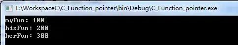

# 复习C语言回调函数

## 一、函数指针

在讲回调函数之前，我们需要了解函数指针。


我们都知道，C语言的灵魂是指针，我们经常使用整型指针，字符串指针，结构体指针等。

```
int *p1;
char *p2;
STRUCT *p3; // STRUCT为我们定义的结构体
```

但是好像我们一般很少使用函数指针，我们一般使用函数都是直接使用函数调用。

下面我们来了解一下函数指针的概念和使用方法。

**1. 概念**

函数指针是指向函数的指针变量。

通常我们说的指针变量是指向一个整型、字符型或数组等变量，而函数指针是指向函数。

函数指针可以像一般函数一样，用于调用函数、传递参数。

函数指针的定义方式为：

> 函数返回值类型   (* 指针变量名) (函数参数列表);

“函数返回值类型”表示该指针变量可以指向具有什么返回值类型的函数；“函数参数列表”表示该指针变量可以指向具有什么参数列表的函数。这个参数列表中只需要写函数的参数类型即可。

我们看到，函数指针的定义就是将“函数声明”中的“函数名”改成“（指针变量名）”。但是这里需要注意的是：“（指针变量名）”两端的括号不能省略，括号改变了运算符的优先级。如果省略了括号，就不是定义函数指针而是一个函数声明了，即声明了一个返回值类型为指针型的函数。

那么怎么判断一个指针变量是指向变量的指针变量还是指向函数的指针变量呢？首先看变量名前面有没有“”，如果有“”说明是指针变量；其次看变量名的后面有没有带有形参类型的圆括号，如果有就是指向函数的指针变量，即函数指针，如果没有就是指向变量的指针变量。

最后需要注意的是，指向函数的指针变量没有 ++ 和 – 运算。

一般为了方便使用，我们会选择：

> typedef  函数返回值类型  (* 指针变量名) (函数参数列表);

比如：

```
typedef int (*Fun1)(int); //声明也可写成int (*Fun1)(int x)，但习惯上一般不这样。
typedef int (*Fun2)(int, int); //参数为两个整型，返回值为整型
typedef void (*Fun3)(void); //无参数和返回值
typedef void* (*Fun4)(void*); //参数和返回值都为void*指针
```

**2. 如何用函数指针调用函数**

给大家举一个例子：

```
int Func(int x);   /*声明一个函数*/
int (*p) (int x);  /*定义一个函数指针*/
p = Func;          /*将Func函数的首地址赋给指针变量p*/
p = &Func;         /*将Func函数的首地址赋给指针变量p*/
```

赋值时函数 Func 不带括号，也不带参数。由于函数名 Func 代表函数的首地址，因此经过赋值以后，指针变量 p 就指向函数 Func() 代码的首地址了。

下面来写一个程序，看了这个程序你们就明白函数指针怎么使用了：

```
#include <stdio.h>
int Max(int, int);  //函数声明
int main(void)
{
    int(*p)(int, int);  //定义一个函数指针
    int a, b, c;
    p = Max;  //把函数Max赋给指针变量p, 使p指向Max函数
    printf("please enter a and b:");
    scanf("%d%d", &a, &b);
    c = (*p)(a, b);  //通过函数指针调用Max函数
    printf("a = %d\nb = %d\nmax = %d\n", a, b, c);
    return 0;
}
int Max(int x, int y)  //定义Max函数
{
    int z;
    if (x > y)
    {
        z = x;
    }
    else
    {
        z = y;
    }
    return z;
}
```

特别注意的是，因为函数名本身就可以表示该函数地址（指针），因此在获取函数指针时，可以直接用函数名，也可以取函数的地址。

```
p = Max可以改成 p = &Max
c = (*p)(a, b) 可以改成 c = p(a, b)
```

**3. 函数指针作为某个函数的参数**

既然函数指针变量是一个变量，当然也可以作为某个函数的参数来使用的。示例：

```
#include <stdio.h>
#include <stdlib.h>

typedef void(*FunType)(int);
//前加一个typedef关键字，这样就定义一个名为FunType函数指针类型，而不是一个FunType变量。
//形式同 typedef int* PINT;
void myFun(int x);
void hisFun(int x);
void herFun(int x);
void callFun(FunType fp,int x);
int main()
{
    callFun(myFun,100);//传入函数指针常量，作为回调函数
    callFun(hisFun,200);
    callFun(herFun,300);

    return 0;
}

void callFun(FunType fp,int x)
{
    fp(x);//通过fp的指针执行传递进来的函数，注意fp所指的函数有一个参数
}

void myFun(int x)
{
    printf("myFun: %d\n",x);
}
void hisFun(int x)
{
    printf("hisFun: %d\n",x);
}
void herFun(int x)
{
    printf("herFun: %d\n",x);
}
```

输出：



**4. 函数指针作为函数返回类型**

有了上面的基础，要写出返回类型为函数指针的函数应该不难了，下面这个例子就是返回类型为函数指针的函数：

```
void (* func5(int, int, float ))(int, int)
{
    ...
}
```

在这里， *func5* 以 *(int, int, float)* 为参数，其返回类型为 *void (\*)(int, int)* 。在C语言中，变量或者函数的声明也是一个大学问，想要了解更多关于声明的话题，可以参考我之前的文章 - C专家编程》读书笔记(1-3章)。这本书的第三章花了整整一章的内容来讲解如何读懂C语言的声明。


**5. 函数指针数组**

在开始讲解回调函数前，最后介绍一下函数指针数组。既然函数指针也是指针，那我们就可以用数组来存放函数指针。下面我们看一个函数指针数组的例子：

```
/* 方法1 */
void (*func_array_1[5])(int, int, float);

/* 方法2 */
typedef void (*p_func_array)(int, int, float);
p_func_array func_array_2[5];
```

上面两种方法都可以用来定义函数指针数组，它们定义了一个元素个数为5，类型是 *  `void (\*)(int, int, float)`  * 的函数指针数组。

**6. 函数指针总结**

> 1. 函数指针常量 ：Max；函数指针变量：p；
> 2. 数名调用如果都得如(*myFun)(10)这样，那书写与读起来都是不方便和不习惯的。所以C语言的设计者们才会设计成又可允许myFun(10)这种形式地调用（这样方便多了，并与数学中的函数形式一样）。
> 3. 在函数指针变量也可以存入一个数组内。数组的声明方法：`int (*fArray[10]) ( int )`;

## 二、回调函数

**1. 什么是回调函数**

我们先来看看百度百科是如何定义回调函数的：

> 回调函数就是一个通过函数指针调用的函数。如果你把函数的指针（地址）作为参数传递给另一个函数，当这个指针被用来调用其所指向的函数时，我们就说这是回调函数。回调函数不是由该函数的实现方直接调用，而是在特定的事件或条件发生时由另外的一方调用的，用于对该事件或条件进行响应。

这段话比较长，也比较绕口。下面我通过一幅图来说明什么是回调：


假设我们要使用一个排序函数来对数组进行排序，那么在主程序(Main program)中，我们先通过库，选择一个库排序函数(Library function)。但排序算法有很多，有冒泡排序，选择排序，快速排序，归并排序。同时，我们也可能需要对特殊的对象进行排序，比如特定的结构体等。库函数会根据我们的需要选择一种排序算法，然后调用实现该算法的函数来完成排序工作。这个被调用的排序函数就是回调函数(Callback function)。

结合这幅图和上面对回调函数的解释，我们可以发现，要实现回调函数，最关键的一点就是要将函数的指针传递给一个函数(上图中是库函数)，然后这个函数就可以通过这个指针来调用回调函数了。注意，回调函数并不是C语言特有的，几乎任何语言都有回调函数。在C语言中，我们通过使用函数指针来实现回调函数。

我的理解是：把一段可执行的代码像参数传递那样传给其他代码，而这段代码会在某个时刻被调用执行，这就叫做回调。

如果代码立即被执行就称为同步回调，如果过后再执行，则称之为异步回调。

回调函数就是一个通过函数指针调用的函数。如果你把函数的指针（地址）作为参数传递给另一个函数，当这个指针被用来调用其所指向的函数时，我们就说这是回调函数。

回调函数不是由该函数的实现方直接调用，而是在特定的事件或条件发生时由另外的一方调用的，用于对该事件或条件进行响应。

**2. 为什么要用回调函数？**

因为可以把调用者与被调用者分开，所以调用者不关心谁是被调用者。它只需知道存在一个具有特定原型和限制条件的被调用函数。

简而言之，回调函数就是允许用户把需要调用的方法的指针作为参数传递给一个函数，以便该函数在处理相似事件的时候可以灵活的使用不同的方法。


```
int Callback()    // /< 回调函数
{
    // TODO
    return 0;
}
int main()     // /<  主函数
{
    // TODO
    Library(Callback);  // /< 库函数通过函数指针进行回调
    // TODO
    return 0;
}
```

回调似乎只是函数间的调用，和普通函数调用没啥区别。

但仔细看，可以发现两者之间的一个关键的不同：在回调中，主程序把回调函数像参数一样传入库函数。

这样一来，只要我们改变传进库函数的参数，就可以实现不同的功能，这样有没有觉得很灵活？并且当库函数很复杂或者不可见的时候利用回调函数就显得十分优秀。

**3. 怎么使用回调函数？**

```
int Callback_1(int a)   // /< 回调函数1
{
    printf("Hello, this is Callback_1: a = %d ", a);
    return 0;
}

int Callback_2(int b)  // /< 回调函数2
{
    printf("Hello, this is Callback_2: b = %d ", b);
    return 0;
}

int Callback_3(int c)   // /< 回调函数3
{
    printf("Hello, this is Callback_3: c = %d ", c);
    return 0;
}

int Handle(int x, int (*Callback)(int))  // /< 注意这里用到的函数指针定义
{
    Callback(x);
}

int main()
{
    Handle(4, Callback_1);
    Handle(5, Callback_2);
    Handle(6, Callback_3);
    return 0;
}
```

如上述代码：可以看到，Handle() 函数里面的参数是一个指针，在  main() 函数里调用 Handle() 函数的时候，给它传入了函数  Callback_1()/Callback_2()/Callback_3() 的函数名，这时候的函数名就是对应函数的指针，也就是说，回调函数其实就是函数指针的一种用法。

**4. 下面是一个四则运算的简单回调函数例子：**

```
#include <stdio.h>
#include <stdlib.h>

/****************************************
 * 函数指针结构体
 ***************************************/
typedef struct _OP {
    float (*p_add)(float, float); 
    float (*p_sub)(float, float); 
    float (*p_mul)(float, float); 
    float (*p_div)(float, float); 
} OP; 

/****************************************
 * 加减乘除函数
 ***************************************/
float ADD(float a, float b) 
{
    return a + b;
}

float SUB(float a, float b) 
{
    return a - b;
}

float MUL(float a, float b) 
{
    return a * b;
}

float DIV(float a, float b) 
{
    return a / b;
}

/****************************************
 * 初始化函数指针
 ***************************************/
void init_op(OP *op)
{
    op->p_add = ADD;
    op->p_sub = SUB;
    op->p_mul = &MUL;
    op->p_div = &DIV;
}

/****************************************
 * 库函数
 ***************************************/
float add_sub_mul_div(float a, float b, float (*op_func)(float, float))
{
    return (*op_func)(a, b);
}

int main(int argc, char *argv[]) 
{
    OP *op = (OP *)malloc(sizeof(OP)); 
    init_op(op);
    
    /* 直接使用函数指针调用函数 */ 
    printf("ADD = %f, SUB = %f, MUL = %f, DIV = %f\n", (op->p_add)(1.3, 2.2), (*op->p_sub)(1.3, 2.2), 
            (op->p_mul)(1.3, 2.2), (*op->p_div)(1.3, 2.2));
     
    /* 调用回调函数 */ 
    printf("ADD = %f, SUB = %f, MUL = %f, DIV = %f\n", 
            add_sub_mul_div(1.3, 2.2, ADD), 
            add_sub_mul_div(1.3, 2.2, SUB), 
            add_sub_mul_div(1.3, 2.2, MUL), 
            add_sub_mul_div(1.3, 2.2, DIV));

    return 0; 
}
```

**5. 回调函数实例（很有用）**

一个 GPRS 模块联网的小项目，使用过的同学大概知道 2G、4G、NB 等模块要想实现无线联网功能都需要经历模块上电初始化、注册网络、查询网络信息质量、连接服务器等步骤，这里的的例子就是，利用一个状态机函数（根据不同状态依次调用不同实现方法的函数），通过回调函数的方式依次调用不同的函数，实现模块联网功能，如下：

```
/*********  工作状态处理  *********/
typedef struct
{
    uint8_t mStatus;
    uint8_t (* Funtion)(void); //函数指针的形式
} M26_WorkStatus_TypeDef;   //M26的工作状态集合调用函数


/**********************************************
** >M26工作状态集合函数
***********************************************/
M26_WorkStatus_TypeDef M26_WorkStatus_Tab[] =
{    
    {GPRS_NETWORK_CLOSE,  M26_PWRKEY_Off  },    //模块关机
    {GPRS_NETWORK_OPEN,  M26_PWRKEY_On  },      //模块开机
    {GPRS_NETWORK_Start,   M26_Work_Init  },    //管脚初始化
    {GPRS_NETWORK_CONF,  M26_NET_Config  },     //AT指令配置
    {GPRS_NETWORK_LINK_CTC,  M26_LINK_CTC  },   //连接调度中心  
    {GPRS_NETWORK_WAIT_CTC, M26_WAIT_CTC  },    //等待调度中心回复 
    {GPRS_NETWORK_LINK_FEM, M26_LINK_FEM  },    //连接前置机
    {GPRS_NETWORK_WAIT_FEM, M26_WAIT_FEM  },    //等待前置机回复
    {GPRS_NETWORK_COMM,  M26_COMM   },          //正常工作    
    {GPRS_NETWORK_WAIT_Sig,  M26_WAIT_Sig  },   //等待信号回复
    {GPRS_NETWORK_GetSignal,  M26_GetSignal  }, //获取信号值
    {GPRS_NETWORK_RESTART,  M26_RESET   },      //模块重启
}
/**********************************************
** >M26模块工作状态机，依次调用里面的12个函数   
***********************************************/
uint8_t M26_WorkStatus_Call(uint8_t Start)
{
    uint8_t i = 0;
    for(i = 0; i < 12; i++)
    {
        if(Start == M26_WorkStatus_Tab[i].mStatus)
        {          
      return M26_WorkStatus_Tab[i].Funtion();
        }
    }
    return 0;
}
```

所以，如果有人想做个 NB 模块联网项目，可以 copy 上面的框架，只需要修改回调函数内部的具体实现，或者增加、减少回调函数，就可以很简洁快速的实现模块联网。