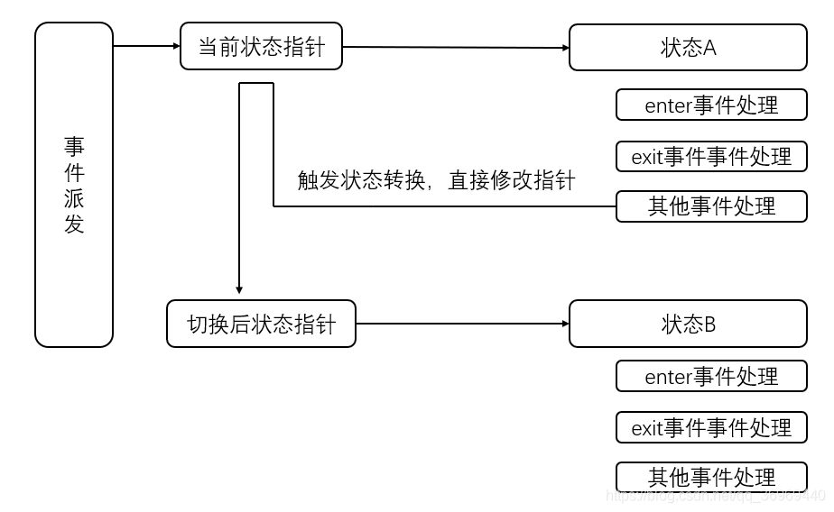

# 嵌入式中的状态机

## **状态机基本术语**

- **现态**：是指当前所处的状态。
- **条件**：又称为“事件”，当一个条件被满足，将会触发一个动作，或者执行一次状态的迁移。
- **动作**：条件满足后执行的动作。动作执行完毕后，可以迁移到新的状态，也可以仍旧保持原状态。动作不是必需的，当条件满足后，也可以不执行任何动作，直接迁移到新状态。
- **次态**：条件满足后要迁往的新状态。“次态”是相对于“现态”而言的，“次态”一旦被激活，就转变成新的“现态”了。


## 传统有限状态机Fsm实现方法


 如图，是一个定时计数器，计数器存在两种状态，一种为设置状态，一种为计时状态。


**设置状态**

- “+” “-” 按键对初始倒计时进行设置
- 当计数值设置完成，点击确认键启动计时 ，即切换到计时状态


**计时状态**

- 按下“+” “-” 会进行密码的输入“+”表示1 ,“-”表示输入0 ，密码共有4位
- 确认键：只有输入的密码等于默认密码，按确认键才能停止计时，否则计时直接到零，并执行相关操作

## 嵌套switch

```c
/***************************************
1.列出所有的状态
***************************************/
typedef enum{
    SETTING,
    TIMING
} STATE_TYPE;

/***************************************
2.列出所有的事件
***************************************/
typedef enum{
    UP_EVT,
    DOWN_EVT,
    ARM_EVT,
    TICK_EVT
} EVENT_TYPE;

/***************************************
3.定义和状态机相关结构
***************************************/
struct  bomb
{
    uint8_t state;
    uint8_t timeout;
    uint8_t code;
    uint8_t defuse_code;
} bomb1;

/***************************************
4.初始化状态机
***************************************/
void bomb1_init(void)
{
    bomb1.state = SETTING;
    bomb1.defuse_code = 6;    //0110 
}

/***************************************
5. 状态机事件派发
***************************************/
void bomb1_fsm_dispatch(EVENT_TYPE evt ,void* param)
{
    switch(bomb1.state)
    {
        case SETTING:
        {
            switch(evt)
            {
                case UP_EVT:    // "+"   按键按下事件
                    if(bomb1.timeout< 60)  
                        ++bomb1.timeout;
                    bsp_display(bomb1.timeout);
                break;
                
                case DOWN_EVT:  // "-"   按键按下事件
                    if(bomb1.timeout > 0)  
                        --bomb1.timeout;
                    bsp_display(bomb1.timeout);
                break;
                
                case ARM_EVT:   // "确认" 按键按下事件
                    bomb1.state = TIMING;
                    bomb1.code  = 0;
                break;
            }
        } 
        break; 
        
        case TIMING:
        {
            switch(evt)
            {
                case UP_EVT:     // "+"   按键按下事件
                    bomb1.code = (bomb1.code <<1) | 0x01;
                break;
                
                case DOWN_EVT:  // "-"   按键按下事件
                    bomb1.code = (bomb1.code <<1); 
                break;
                
                case ARM_EVT:   // "确认" 按键按下事件
                    if(bomb1.code == bomb1.defuse_code)
                    {
                        bomb1.state = SETTING;
                    }
                    else
                    {
                        bsp_display("bomb!")
                    }
                break;
                
                case TICK_EVT:
                    if(bomb1.timeout)
                    {
                        --bomb1.timeout;
                        bsp_display(bomb1.timeout);
                    }
                    if(bomb1.timeout == 0)
                    {
                        bsp_display("bomb!")
                    }
                break;      
            }   
        }
        break;
    }
}
```


- **优点**

- - 简单，代码阅读连贯，容易理解

- **缺点**

- - 当状态或事件增多时，代码状态函数需要经常改动，状态事件处理函数会代码量会不断增加

  - 状态机没有进行封装，移植性差。

  - 没有实现状态的进入和退出的操作。进入和退出在状态机中尤为重要

  - - 进入事件：只会在刚进入时触发一次，主要作用是对状态进行必要的初始化
    - 退出事件：只会在状态切换时触发一次 ，主要的作用是清除状态产生的中间参数，为下次进入提供干净环境

## 状态表

### 二维状态转换表

状态机可以分为状态和事件 ，状态的跃迁都是受事件驱动的，因此可以通过一个二维表格来表示状态的跃迁。  


**(\*)** 仅当( code == defuse_code) 时才发生到setting 的转换。

```c
/*1.列出所有的状态*/
enum
{
    SETTING,
    TIMING,
    MAX_STATE
};

/*2.列出所有的事件*/
enum
{
    UP_EVT,
    DOWN_EVT,
    ARM_EVT,
    TICK_EVT,
    MAX_EVT
};
      
/*3.定义状态表*/
typedef void (*fp_state)(EVT_TYPE evt , void* param);
static  const fp_state  bomb2_table[MAX_STATE][MAX_EVENT] =
{
    {setting_UP, setting_DOWN, setting_ARM, null},
    {setting_UP, setting_DOWN, setting_ARM, timing_TICK}
};
      
struct bomb_t
{
    const fp_state const *state_table;  /* the State-Table */
    uint8_t state;  /* the current active state */
          
    uint8_t timeout;
    uint8_t code;
    uint8_t defuse_code;
};

struct bomb bomb2=
{
    .state_table = bomb2_table;
}

void bomb2_init(void)
{
    bomb2.defuse_code = 6; // 0110
    bomb2.state = SETTING;
}
      
void bomb2_dispatch(EVT_TYPE evt , void* param)
{
    fp_state  s = NULL;
    if(evt > MAX_EVT)
    {
        LOG("EVT type error!");
        return;
    }
    s = bomb2.state_table[bomb2.state * MAX_EVT + evt];
    if(s != NULL)
    {
        s(evt , param);
    }
}

/*列出所有的状态对应的事件处理函数*/
void setting_UP(EVT_TYPE evt, void* param)
{
    if(bomb1.timeout< 60)  
        ++bomb1.timeout;
    bsp_display(bomb1.timeout);
}
```

- **优点**

  - 各个状态面向用户相对独立，增加事件和状态不需要去修改先前已存在的状态事件函数。
  - 可将状态机进行封装，有较好的移植性

函数指针的安全转换 , 利用下面的特性，用户可以扩展带有私有属性的状态机和事件而使用统一的基础状态机接口

typedef void (\*Tran)(struct StateTableTag \*me, Event const \*e);
/
||
void Bomb2_setting_ARM (Bomb2 \*me, Event const \*e);

```c
typedef struct Bomb
{
    struct StateTableTag *me;  //必须为第一个成员
    uint8_t private;
}

```

缺点函数粒度太小是最明显的一个缺点，一个状态和一个事件就会产生一个函数，当状态和事件较多时，处理函数将增加很快，在阅读代码时，逻辑分散。

没有实现进入退出动作。

### ​一维状态转换表


实现原理：


```c
typedef void (*fp_action)(EVT_TYPE evt,void* param);
    
/*转换表基础结构*/
struct tran_evt_t
{
    EVT_TYPE evt;
    uint8_t next_state;
};

/*状态的描述*/
struct  fsm_state_t
{
    fp_action  enter_action;  // 进入动作
    fp_action  exit_action;   // 退出动作
    fp_action  action;           
        
    tran_evt_t* tran;    // 转换表
    uint8_t     tran_nb; // 转换表的大小
    const char* name;
}

/*状态表本体*/
#define  ARRAY(x)   x,sizeof(x)/sizeof(x[0])
const struct fsm_state_t state_table[]=
{
    {setting_enter, setting_exit, setting_action, ARRAY(set_tran_evt), "setting" },
    {timing_enter, timing_exit, timing_action, ARRAY(time_tran_evt), "timing" }
};
    
/*构建一个状态机*/
struct fsm
{
    const struct state_t * state_table; /* the State-Table */
    uint8_t cur_state;     /* the current active state */
        
    uint8_t timeout;
    uint8_t code;
    uint8_t defuse_code;
} bomb3;
    
/*初始化状态机*/
void bomb3_init(void)
{
    bomb3.state_table = state_table;  // 指向状态表
    bomb3.cur_state = setting;
    bomb3.defuse_code = 8;  //1000
}

/*状态机事件派发*/
void  fsm_dispatch(EVT_TYPE evt, void* param)
{
    tran_evt_t* p_tran = NULL;
        
    /*获取当前状态的转换表*/
    p_tran = bomb3.state_table[bomb3.cur_state]->tran;
        
    /*判断所有可能的转换是否与当前触发的事件匹配*/
    for(uint8_t i=0; i<x; i++)
    {
        if(p_tran[i]->evt == evt)  // 事件会触发转换
        {
            if(NULL != bomb3.state_table[bomb3.cur_state].exit_action)
            {
                bomb3.state_table[bomb3.cur_state].exit_action(NULL);  // 执行退出动作
            }
            if(bomb3.state_table[_tran[i]->next_state].enter_action)
            {
                bomb3.state_table[_tran[i]->next_state].enter_action(NULL);  // 执行进入动作
            }
            
            /*更新当前状态*/
            bomb3.cur_state = p_tran[i]->next_state;
        }
        else
        {
            bomb3.state_table[bomb3.cur_state].action(evt, param);
        }
    }
}

/*************************************************************************
setting状态相关
************************************************************************/
void setting_enter(EVT_TYPE evt, void* param)
{
        
}
void setting_exit(EVT_TYPE evt, void* param)
{
        
}
void setting_action(EVT_TYPE evt, void* param)
{
        
}
tran_evt_t set_tran_evt[] =
{
    {ARM , timing},
}
/*timing 状态相关*/
```

- **优点**

- - 各个状态面向用户相对独立，增加事件和状态不需要去修改先前已存在的状态事件函数。
  - 实现了状态的进入和退出
  - 容易根据状态跃迁图来设计 （状态跃迁图列出了每个状态的跃迁可能，也就是这里的转换表）
  - 实现灵活，可实现复杂逻辑，如上一次状态，增加监护条件来减少事件的数量。可实现非完全事件驱动

- **缺点**

- - 函数粒度较小（比二维小且增长慢），可以看到，每一个状态需要至少3个函数，还需要列出所有的转换关系。

## QP嵌入式实时框架

**特点**

- **事件驱动型编程**

- - 好莱坞原则：和传统的顺序式编程方法例如“超级循环”，或传统的RTOS 的任务不同。绝大多数的现代事件驱动型系统根据好莱坞原则被构造，（Don’t call me; I’ll call you.）

- **面向对象**

- - 类和单一继承

  

- **工具**

- - **QM** ：一个通过UML类图来描述状态机的软件，并且可以自动生成C代码


- - **QS软件追踪工具**

    

    

## QEP 实现有限状态机 Fsm

- **实现**

  

```c
/* qevent.h ----------------------------------------------------------------*/
typedef struct QEventTag 
{  
    QSignal sig;     
    uint8_t dynamic_;  
} QEvent;

/* qep.h -------------------------------------------------------------------*/
typedef uint8_t QState;  /* status returned from a state-handler function */
typedef QState (*QStateHandler) (void *me, QEvent const *e); /* argument list */
typedef struct QFsmTag  /* Finite State Machine */
{ 
    QStateHandler state;  /* current active state */
} QFsm;
      
#define QFsm_ctor(me_, initial_) ((me_)->state = (initial_))
void QFsm_init (QFsm *me, QEvent const *e);
void QFsm_dispatch(QFsm *me, QEvent const *e);
      
#define Q_RET_HANDLED ((QState)0)
#define Q_RET_IGNORED ((QState)1)
#define Q_RET_TRAN    ((QState)2)
#define Q_HANDLED()   (Q_RET_HANDLED)
#define Q_IGNORED()   (Q_RET_IGNORED)
      
#define Q_TRAN(target_) (((QFsm *)me)->state = (QStateHandler)   (target_),Q_RET_TRAN)
      
enum QReservedSignals
{
    Q_ENTRY_SIG = 1, 
    Q_EXIT_SIG, 
    Q_INIT_SIG, 
    Q_USER_SIG 
};
      
/* file qfsm_ini.c ---------------------------------------------------------*/
#include "qep_port.h"  /* the port of the QEP event processor */
#include "qassert.h"  /* embedded systems-friendly assertions */
void QFsm_init(QFsm *me, QEvent const *e) 
{
    (*me->state)(me, e);  /* execute the top-most initial transition */
    /* enter the target */
    (void)(*me->state)(me , &QEP_reservedEvt_[Q_ENTRY_SIG]);
}

/* file qfsm_dis.c ---------------------------------------------------------*/
void QFsm_dispatch(QFsm *me, QEvent const *e)
{
    QStateHandler s = me->state;  /* save the current state */
    QState r = (*s)(me, e);  /* call the event handler */
    if (r == Q_RET_TRAN)  /* transition taken? */
    {
        (void)(*s)(me, &QEP_reservedEvt_[Q_EXIT_SIG]); /* exit the source */
        (void)(*me->state)(me, &QEP_reservedEvt_[Q_ENTRY_SIG]);/*enter target*/
    }
}

// 实现上面定时器例子
#include "qep_port.h" /* the port of the QEP event processor */
#include "bsp.h"      /* board support package */
      
enum BombSignals  /* all signals for the Bomb FSM */
{ 
    UP_SIG = Q_USER_SIG,
    DOWN_SIG,
    ARM_SIG,
    TICK_SIG
};

typedef struct TickEvtTag 
{
    QEvent super;      /* derive from the QEvent structure */
    uint8_t fine_time; /* the fine 1/10 s counter */
} TickEvt;
      
typedef struct Bomb4Tag 
{
    QFsm super;      /* derive from QFsm */
    uint8_t timeout; /* number of seconds till explosion */
    uint8_t code;    /* currently entered code to disarm the bomb */
    uint8_t defuse;  /* secret defuse code to disarm the bomb */
} Bomb4;
      
void Bomb4_ctor (Bomb4 *me, uint8_t defuse);
QState Bomb4_initial(Bomb4 *me, QEvent const *e);
QState Bomb4_setting(Bomb4 *me, QEvent const *e);
QState Bomb4_timing (Bomb4 *me, QEvent const *e);
/*--------------------------------------------------------------------------*/
/* the initial value of the timeout */
#define INIT_TIMEOUT 10
/*..........................................................................*/
void Bomb4_ctor(Bomb4 *me, uint8_t defuse) {
    QFsm_ctor_(&me->super, (QStateHandler)&Bomb4_initial);
    me->defuse = defuse;  /* the defuse code is assigned at instantiation */
}
/*..........................................................................*/
QState Bomb4_initial(Bomb4 *me, QEvent const *e) 
{
    (void)e;
    me->timeout = INIT_TIMEOUT;
    return Q_TRAN(&Bomb4_setting);
}
/*..........................................................................*/
QState Bomb4_setting(Bomb4 *me, QEvent const *e) 
{
    switch (e->sig)
    {
        case UP_SIG:
        {
            if (me->timeout < 60) 
            {
                ++me->timeout;
                BSP_display(me->timeout);
            }
            return Q_HANDLED();
        }
        
        case DOWN_SIG: 
        {
            if (me->timeout > 1) 
            {
                --me->timeout;
                BSP_display(me->timeout);
            }
            return Q_HANDLED();
        }

        case ARM_SIG: 
        {
            return Q_TRAN(&Bomb4_timing); /* transition to "timing" */
        }
    }
    return Q_IGNORED();
}
      
/*..........................................................................*/
void Bomb4_timing(Bomb4 *me, QEvent const *e) 
{
    switch (e->sig) 
    {
        case Q_ENTRY_SIG: 
        {
            me->code = 0; /* clear the defuse code */
            return Q_HANDLED();
        }
        
        case UP_SIG: 
        {
            me->code <<= 1;
            me->code |= 1;
            return Q_HANDLED();
        }
        
        case DOWN_SIG: 
        {
            me->code <<= 1;
            return Q_HANDLED();
        }
        
        case ARM_SIG: 
        {
            if (me->code == me->defuse) 
            {
                return Q_TRAN(&Bomb4_setting);
            }
            return Q_HANDLED();
        }
        
        case TICK_SIG: 
        {
            if (((TickEvt const *)e)->fine_time == 0) 
            {
                --me->timeout;
                BSP_display(me->timeout);
                if (me->timeout == 0) 
                {
                    BSP_boom(); /* destroy the bomb */
                }
            }
            return Q_HANDLED();
        }
    }
    return Q_IGNORED();
}
```

- **优点**

- - 采用面向对象的设计方法，很好的移植性
  - 实现了进入退出动作
  - 合适的粒度，且事件的粒度可控
  - 状态切换时通过改变指针，效率高
  - 可扩展成为层次状态机

- **缺点**

- - 对事件的定义以及事件粒度的控制是设计的最大难点，如串口接收到一帧数据，这些变量的更新单独作为某个事件，还是串口收到数据作为一个事件。再或者显示屏，如果使用此种编程方式，如何设计事件。

## QP 实现层次状态机 Hsm简介

 

**初始化：**


初始化层次状态机的实现：在初始化时，用户所选取的状态永远是最底层的状态，如上图，我们在计算器开机后，应该进入的是开始状态，这就涉及到一个问题，由最初top（顶状态）到begin 是有一条状态切换路径的，当我们设置状态为begin如何搜索这条路径成为关键（知道了路径才能正确的进入begin,要执行路径中过渡状态的进入和退出事件）

```c
void QHsm_init(QHsm *me, QEvent const *e) 
{
    Q_ALLEGE((*me->state)(me, e) == Q_RET_TRAN);
    t = (QStateHandler)&QHsm_top; /* HSM starts in the top state */
    do 
    {  /* drill into the target... */
        QStateHandler path[QEP_MAX_NEST_DEPTH_];
        int8_t ip = (int8_t)0; /* transition entry path index */
        path[0] = me->state; /* 这里的状态为begin */
            
        /*通过执行空信号，从底层状态找到顶状态的路径*/
        (void)QEP_TRIG_(me->state, QEP_EMPTY_SIG_);
        while (me->state != t) 
        {
            path[++ip] = me->state;
            (void)QEP_TRIG_(me->state, QEP_EMPTY_SIG_);
        }
        /*切换为begin*/
        me->state = path[0]; /* restore the target of the initial tran. */
        /* 钻到最底层的状态，执行路径中的所有进入事件 */
        Q_ASSERT(ip < (int8_t)QEP_MAX_NEST_DEPTH_);
        do 
        {  /* retrace the entry path in reverse (desired) order... */
            QEP_ENTER_(path[ip]); /* enter path[ip] */
        } 
        while ((--ip) >= (int8_t)0);
            
        t = path[0]; /* current state becomes the new source */
    } 
    while (QEP_TRIG_(t, Q_INIT_SIG) == Q_RET_TRAN);
    me->state = t;
}
```


```c
t = path[0]; /* target of the transition */
if (s == t) 
{  /* (a) check source==target (transition to self) */
    QEP_EXIT_(s) /* exit the source */
    ip = (int8_t)0; /* enter the target */
}
else 
{
    (void)QEP_TRIG_(t, QEP_EMPTY_SIG_); /* superstate of target */
    t = me->state;
    if (s == t) 
    {  /* (b) check source==target->super */
        ip = (int8_t)0; /* enter the target */
    }
    else 
    {
        (void)QEP_TRIG_(s, QEP_EMPTY_SIG_); /* superstate of src */
        /* (c) check source->super==target->super */
        if(me->state == t) 
        {
            QEP_EXIT_(s) /* exit the source */
            ip = (int8_t)0; /* enter the target */
        }
        else 
        {
            /* (d) check source->super==target */
            if (me->state == path[0]) 
            {
                QEP_EXIT_(s) /* exit the source */
            }
            else 
            {  /* (e) check rest of source==target->super->super..
                * and store the entry path along the way */
                 ....
```

## QP实时框架的组成


### 内存管理

使用内存池，对于低性能mcu，内存极为有限，引入内存管理主要是整个架构中，是以事件作为主要的任务通信手段，且事件是带参数的，可能相同类型的事件会多次触发，而事件处理完成后，需要清除事件，无法使用静态的事件，因此是有必要为不同事件创建内存池的。

对于不同块大小的内存池，需要考虑的是每个块的起始地址对齐问题。在进行内存池初始化时，我们是根据blocksize+header大小来进行划分内存池的。假设一个2字节的结构，如果以2来进行划分，假设mcu 4字节对齐，那么将有一半的结构起始地址无法对齐，这时需要为每个块预留空间，保证每个块的对齐。

### 事件队列

- 每一个活动对象维护一个事件队列，事件都是由基础事件派生的，不同类型的事件只需要将其基础事件成员添加到活动对象的队列中即可，最终在取出的时候通过一个强制转换便能获得附加的参数。


### 事件派发

- 直接事件发送

- - QActive_postLIFO()

- 发行订阅事件发送

- - 竖轴表示信号（为事件的基类）
  - 活动对象支持64个优先级，每一个活动对象要求拥有唯一优先级
  - 通过优先级的bit位来表示某个事件被哪些活动对象订阅，并在事件触发后根据优先级为活动对象派发事件。


### 定时事件

- **非有序链表**

  

- **合作式调度器QV**

  

- **可抢占式调度器QK**

## QP nano 的简介

- 完全支持层次式状态嵌套，包括在最多4 层状态嵌套情况下，对任何状态转换拓扑的可保证的进入/ 退出动作

- 支持高达8 个并发执行的，可确定的，线程安全的事件队列的活动对象57

- 支持一个字节宽（ 255 个信号）的信号，和一个可伸缩的参数，它可被配置成0 （没有参数）， 1 ， 2 或4 字节

- 使用先进先出FIFO排队策略的直接事件派发机制

- 每个活动对象有一个一次性时间事件（定时器），它的可配置动态范围是0(没有时间事件) ， 1 ， 2 或4 字节

- 内建的合作式vanilla 内核

- 内建的名为QK-nano 的可抢占型RTC内核

- 带有空闲回调函数的低功耗架构，用来方便的实现节省功耗模式。

- 在代码里为流行的低端CPU架构的C编译器的非标准扩展进行了准备（例如，在代码空间分配常数对象，可重入函数，等等）

- 基于断言的错误处理策略

- 代码风格

  

  

  

  

  


链接：http://t.csdn.cn/VZC0X