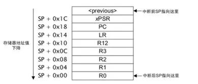
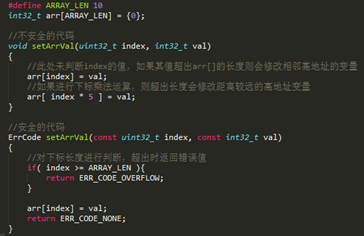
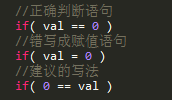
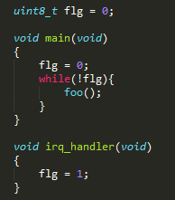
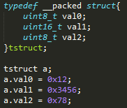

# 嵌入式开发常见问题解决方法

## 一、问题复现

稳定复现问题才能正确的对问题进行定位、解决以及验证。一般来说，越容易复现的问题越容易解决。

**1.1 模拟复现条件**

有的问题存在于特定的条件下，只需要模拟出现问题的条件即可复现。对于依赖外部输入的条件，如果条件比较复杂难以模拟可以考虑程序里预设直接进入对应状态。

**1.2 提高相关任务执行频率**

例如某个任务长时间运行才出现异常则可以提高该任务的执行频率。

**1.3 增大测试样本量**

程序长时间运行后出现异常，问题难以复现，可以搭建测试环境多套设备同时进行测试。

## 二、问题定位

缩小排查范围，确认引入问题的任务、函数、语句。


**2.1 打印LOG**

根据问题的现象，在抱有疑问的代码处增加LOG输出，以此来追踪程序执行流程以及关键变量的值，观察是否与预期相符。


**2.2 在线调试**

在线调试可以起到和打印LOG类似的作用，另外此方法特别适合排查程序崩溃类的BUG，当程序陷入异常中断(HardFault，看门狗中断等)的时候可以直接STOP查看call stack以及内核寄存器的值，快速定位问题点。


**2.3 版本回退**

使用版本管理工具时可以通过不断回退版本并测试验证来定位首次引入该问题的版本，之后可以围绕该版本增改的代码进行排查。


**2.4 二分注释**

“二分注释”即以类似二分查找法的方式注释掉部分代码，以此判断问题是否由注释掉的这部分代码引起。具体方法为将与问题不相干的部分代码注释掉一半，看问题是否解决，未解决则注释另一半，如果解决则继续将注释范围缩小一半，以此类推逐渐缩小问题的范围。


**2.5 保存内核寄存器快照**

Cortex M内核陷入异常中断时会将几个内核寄存器的值压入栈中，如下图：



 

我们可以在陷入异常中断时将栈上的内核寄存器值写入RAM的一段复位后保留默认值的区域内，执行复位操作后再从RAM将该信息读出并分析，通过PC、LR确认当时执行的函数，通过R0-R3分析当时处理的变量是否异常，通过SP分析是否可能出现栈溢出等。

## 三、问题分析处理

结合问题现象以及定位的问题代码位置分析造成问题的原因。

**3.1  程序继续运行**

**3.1.1 数值异常**

**3.1.1.1 软件问题**

**数组越界**

写数组时下标超出数组长度，导致对应地址内容被修改。如下：



此类问题通常需要结合map文件进行分析，通过map文件观察被篡改变量地址附近的数组，查看对该数组的写入操作是否存在如上图所示不安全的代码，将其修改为安全的代码。

**栈溢出**

| 0x20001ff8 | g_val  |
| ---------- | ------ |
| 0x20002000 | 栈底   |
| …………       | 栈空间 |
| 0x20002200 | 栈顶   |

如上图，此类问题也需要结合map文件进行分析。假设栈从高地址往低地址增长，如果发生栈溢出，则g_val的值会被栈上的值覆盖。出现栈溢出时要分析栈的最大使用情况，函数调用层数过多，中断服务函数内进行函数调用，函数内部申明了较大的临时变量等都有可能导致栈溢出。


解决此类问题有以下方法：

```
1. 在设计阶段应该合理分配内存资源，为栈设置合适的大小；

2. 将函数内较大的临时变量加“static”关键字转化为静态变量，或者使用malloc()动态分配，将其放到堆上；

3. 改变函数调用方式，降低调用层数。

```


**判断语句条件写错**



判断语句的条件容易把相等运算符 “==” 写成赋值运算符 “=” 导致被判断的变量值被更改，该类错误编译期不会报错且总是返回真。建议将要判断的变量写到运算符的右边，这样错写为赋值运算符时会在编译期报错。还可以使用一些静态代码检查工具来发现此类问题。

**同步问题**

例如操作队列时，出队操作执行的过程中发生中断(任务切换)，并且在中断(切换后的任务)中执行入队操作则可能破坏队列结构，对于这类情况应该操作时关中断（使用互斥锁同步）。

**优化问题**



如上图程序，本意是等待irq中断之后不再执行foo()函数，但被编译器优化之后，实际运行过程中flg可能被装入寄存器并且每次都判断寄存器内的值而不重新从ram里读取flg的值，导致即使irq中断发生foo()也一直运行，此处需要在flg的申明前加“volatile”关键字，强制每次都从ram里获取flg的值。


**3.1.1.2 硬件问题**

**芯片BUG**

芯片本身存在BUG，在某些特定情况下给单片机返回一个错误的值，需要程序对读回的值进行判断，过滤异常值。


**通信时序错误**


例如电源管理芯片Isl78600，假设现在两片级联，当同时读取两片的电压采样数据时，高端芯片会以固定周期通过菊花链将数据传送到低端芯片，而低端芯片上只有一个缓存区，如果单片机不在规定时间内将低端芯片上的数据读走那么新的数据到来时将会覆盖当前数据，导致数据丢失。此类问题需要仔细分析芯片的数据手册，严格满足芯片通信的时序要求。

**3.1.2 动作异常**

**3.1.2.1 软件问题**

**设计问题**

设计中存在错误或者疏漏，需要重新评审设计文档。


**实现与设计不符**

代码的实现与设计文档不相符需要增加单元测试覆盖所有条件分支，进行代码交叉review。


**状态变量异常**

例如记录状态机当前状态的变量被篡改，分析该类问题的方法同前文数值异常部分。


**3.1.2.2 硬件问题**

**硬件失效**

目标IC失效，接收控制指令后不动作，需要排查硬件。


**通信异常**

与目标IC通信错误，无法正确执行控制命令，需要使用示波器或逻辑分析仪去观察通信时序，分析是否发出的信号不对或者受到外部干扰。


**3.2 程序崩溃**

**3.2.1 停止运行**

**3.2.1.1软件问题**

**HardFault**

以下情况会造成HardFault：

1. 在外设时钟门未使能的情况下操作该外设的寄存器；
2. 跳转函数地址越界，通常发生在函数指针被篡改，排查方法同数值异常；
3. 解引用指针时出现对齐问题：

以小端序为例，如果我们声明了一个强制对齐的结构体如下：




​    

| 地址   | 0x00000000 | 0x00000001 | 0x00000002 | 0x00000003 |
| ------ | ---------- | ---------- | ---------- | ---------- |
| 变量名 | Val0       | Val1_low   | Val1_high  | Val2       |
| 值     | 0x12       | 0x56       | 0x34       | 0x78       |

此时a.val1的地址为0x00000001，如果以uint16_t类型去解引用此地址则会因为对齐问题进入HardFault，如果一定要用指针方式操作该变量则应当使用memcpy()。

**中断服务函数中未清除中断标志**

中断服务函数退出前不正确清除中断标志，当程序执行从中断服务函数内退出后又会立刻进入中断服务函数，表现出程序的“假死”现象。

**NMI中断**

调试时曾遇到SPI的MISO引脚复用NMI功能，当通过SPI连接的外设损坏时MISO被拉高，导致单片机复位后在把NMI引脚配置成SPI功能之前就直接进入NMI中断，程序挂死在NMI中断中。这种情况可以在NMI的中断服务函数内禁用NMI功能来使其退出NMI中断。

**3.2.1.2 硬件问题**

**晶振未起振**

**供电电压不足**

**复位引脚拉低**

**3.2.2 复位**

**3.2.2.1  软件问题**

**看门狗复位**

除了喂狗超时导致的复位以外，还要注意看门狗配置的特殊要求，以Freescale KEA单片机为例，该单片机看门狗在配置时需要执行解锁序列（向其寄存器连续写入两个不同的值），该解锁序列必须在16个总线时钟内完成，超时则会引起看门狗复位。此类问题只能熟读单片机数据手册，注意类似的细节问题。

**3.2.2.2 硬件问题**

**供电电压不稳**

**电源带载能力不足**  

## 四、回归测试

问题解决后需要进行回归测试，一方面确认问题是否不再复现，另一方面要确认修改不会引入其他问题。

## 五、经验总结

总结本次问题产生的原因及解决问题的方法，思考类似问题今后如何防范，对相同平台产品是否值得借鉴，做到举一反三，从失败中吸取经验。


    