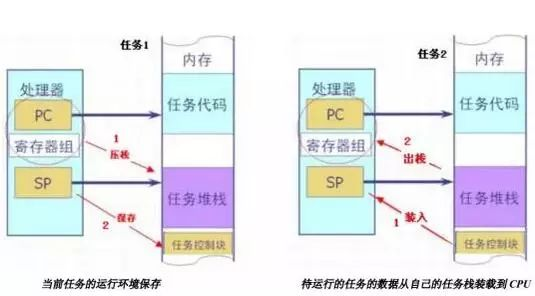

# 嵌入式系统是如何设计的

## **1.多任务机制**

其实在单一CPU 的情况下，是不存在真正的多任务机制的，存在的只有不同的任务轮流使用CPU，所以本质上还是单任务的。但由于CPU执行速度非常快，加上任务切换十分频繁并且切换的很快，所以我们感觉好像有很多任务同时在运行一样。这就是所谓的多任务机制。

实时系统的特征是延时可预测，能够在一个规定的时间内(通常是 ms 级别的)对某些信号做出反应。

## **2.任务的状态**

任务有下面的特性：任务并不是随时都可以运行的，而一个已经运行的任务并不能保证一直占有 CPU 直到运行完。一般有就绪态，运行态，挂起态等。

- 运行态：一个运行态的任务是一个正在使用 CPU 的任务。任何时刻有且只有一个运行着的任务。

- 就绪态：一个就绪态任务是可运行的，等待占有 CPU 的任务释放 CPU。

- 挂起态：某些条件不满足而挂起不能运行的状态。

## **3. 如何转化为就绪态**

``INT32U OSRdyTbl; /* 就绪任务表 */``

上面定义一个 32 位变量，每一位代表一个任务，0 表示挂起状态，1 表示就绪状态。它记录了各任务的就绪与否状态，称它为就绪表。OSRdyTbl 定义为 32 位变量，对应32 个任务。当然，定义为 64 位的话，便最多能支持 64 个任务。这样，可以定义两个宏，实现把任务的状态变为就绪或挂起态。

/* 在就绪表中登记就绪任务 */

``#define OSSetPrioRdy(prio) { OSRdyTbl |= 0x01<<prio;} //把相应位置1``

/* 从就绪表中删除任务 */

``#define OSDelPrioRdy(prio) { OSRdyTbl &= ~(0x01<<prio); }//把相应位清零``

任务之间互相独立，不存在互相调用的关系。所有任务在逻辑上都是平等的。由于任务之间互相看不见，所以他们之间的信息传输就无法当面完成。这就需要各种通信机制如信号量，消息邮箱，队列等来实现。

## **4.什么是抢占式调度？**

调度的概念，通俗的说就是系统在多个任务中选择合适的任务执行。系统如何知道何时该执行哪个任务？可以为每个任务安排一个唯一的优先级别，当同时有多个任务就绪时，优先运行优先级较高的任务。同时，任务的优先级也作为任务的唯一标识号。代码中都是对标识号来完成对任务的操作的。

所谓“抢占式调度”是指：一旦就绪状态中出现优先权更高的任务，便立即剥夺当前任务的运行权，把CPU分配给更高优先级的任务。这样CPU 总是执行处于就绪条件下优先级最高的任务。

## **5.多任务系统的时间管理**

与人一样，多任务系统也需要一个“心跳”来维持其正常运行，这个心跳叫做时钟节拍，通常由定时器产生一个固定周期的中断来充当。

OSTimeDly 函数就是以时钟节拍为基准来延时的（在时钟的中断服务函数中，依次对各个延时任务的延时节拍数减1。若发现某个任务的延时节拍数变为0，则把它从挂起态置为就绪态。）。这个函数完成功能很简单，就是先挂起当起当前任务，设定其延时节拍数，然后进行任务切换，在指定的时钟节拍数到来之后，将当前任务恢复为就绪状态。任务必须通过OSTimeDly或 OSTaskSuspend 让出CPU的使用权（延时或等待事件），使更低优先级任务有机会运行。

## **6.如何实现多任务？**

只有一个CPU，如何在同一时间实现多个独立程序的运行？要实现多任务，条件是每个任务互相独立。人如何才能独立，有自己的私有财产。任务也一样，如果一个任务有自己的CPU，堆栈，程序代码，数据存储区，那这个任务就是一个独立的任务。（CPU是通过多任务机制获得的，其他的需要你分配）

TIPS：

如果一个任务正在运行某个公共函数时（如Printf）， 被另一个高优先级的任务抢占，那么当这个高优先级的任务也调用同一个公共函数时，极有可能破坏原任务的数据。因为两个任务可能共用一套数据。为了防止这种情况发生，常采用两种措施:可重入设计和互斥调用。

可重入函数中所有的变量均为局部变量，局部变量在调用时临时分配空间，所以不同的任务在不同的时刻调用该函数时，它们的同一个局部变量所分配的存储空间并不相同（任务私有栈中），互不干扰。另外，如果可重入函数调用了其他函数，则这些被调用的函数也必须是可重入函数。

实现互斥（独占）访问的方法有关中断，关调度，互斥信号量，计数信号量等。

### **6.1 一个任务如何拥有自己的程序代码**

对于如何实现多任务，首先是程序代码，每个任务的程序代码与函数一样，与51 的裸奔程序一样，每个任务都是一个大循环。然后是数据存储区，由于全局变量是系统共用的，各个任务共享，不是任务私有，所以这里的数据存储区是指任务的私有变量，如何变成私有？局部变量也。编译器是把局部变量保存在栈里的，所以好办，只要任务有个私有的栈就行。

TIPS：

临界资源是一次仅允许一个任务使用的共享资源。每个任务中访问临界资源的那段程序称为临界区。

在多任务系统中，为保障数据的可靠性和完整性，共享资源要互斥（独占）访问，所以全局变量（只读的除外）不能同时有多个任务访问，即一个任务访问的时候不能被其他任务打断。共享资源是一种临界资源。

### **6.2 一个任务如何拥有自己的堆栈、数据存储区**

私有栈的作用是存放局部变量，函数的参数，它是一个线性的空间，所以可以申请一个静态数组，把栈顶指针SP指向栈的数组的首元素（递增栈）或最后一个元素（递减栈）。即可打造一个人工的栈出来。每个任务还要有记录自己栈顶指针的变量，保存在任务控制块（TCB）中。

什么是任务控制块？

系统中的每个任务具有一个任务控制块，任务控制块记录任务执行的环境，这里的任务控制块比较简单，只包含了任务的堆栈指针和任务延时节拍数。任务控制块是任务的身份证。它把任务的程序与数据联系起来，找到它就可以得到任务的所有资源。

### **6.3 一个任务如何拥有自己的CPU**

最后来看看任务是如何“拥有”自己的CPU 的。只有一个 CPU，各个任务共享，轮流使用。如何才能实现？我们先来看看中断的过程，当中断来临时，CPU 把当前程序的运行地址，寄存器等现场数据保存起来（一般保存在栈里），然后跳到中断服务程序执行。待执行完毕，再把先前保存的数据装回CPU 又回到原来的程序执行。这样就实现了两个不同程序的交叉运行。

借鉴这种思想不就能实现多任务了吗！模仿中断的过程就可以实现任务切换运行。任务切换时，把当前任务的现场数据保存在自己的任务栈里面，再把待运行的任务的数据从自己的任务栈装载到CPU中，改变 CPU 的 PC，SP，寄存器等。可以说，任务的切换是任务运行环境的切换。而任务的运行环境保存在任务栈中，也就是说，任务切换的关键是把任务的私有堆栈指针赋予处理器的堆栈指针SP。

创建一个任务。它接收三个参数，分别是任务的入口地址，任务堆栈的首地址和任务的优先级。调用本函数后，系统会根据用户给出的参数初始化任务栈，并把栈顶指针保存到任务控制块中，在任务就绪表标记该任务为就绪状态。最后返回，这样一个任务就创建成功了。

当一个任务将要运行时，便通过取得它的堆栈指针（保存在任务控制块中）将这些寄存器出栈装入CPU 相应的位置即可。

### **6.4 如何实现抢占式调度？**

基于任务优先级的抢占式调度，也就是最高优先级的任务一旦处于就绪状态，则立即抢占正在运行的低优先级任务的处理器资源。为了保证CPU 总是执行处于就绪条件下优先级最高的任务，每当任务状态改变后，即判断当前运行的任务是否是就绪任务中优先级最高的，否则进行任务切换。

任务状态会在什么时候发生改变呢？有下面两种情况：

1、高优先级的任务因为需要某种资源或延时，主动请求挂起，让出处理器，此时将调度就绪状态的低优先级任务获得执行，这种调度称为任务级的切换。如任务执行`OSTimeDly（）`或`OSTaskSuspend（）`把自身挂起就属于这种。

2、高优先级的任务因为时钟节拍到来，或在中断处理结束后，内核发现更高优先级任务获得了执行条件(如延时的时钟到时)则在中断后直接切换到更高优先级任务执行。这种调度也称为中断级的切换。

### **6.5 挂起/恢复任务**

1. 挂起任务

通过 `OSTaskSuspend()`可以主动挂起一个任务。`OSTaskSuspend()`会把任务从任务就绪表中移出，最后重新启动系统调度。这个函数可以挂起任务本身也可以挂起其他任务。

2. 恢复任务（`OSTaskResume()`）

可以让被` OSTaskSuspend `或 `OSTimeDly` 挂起的任务恢复就绪态，然后进行任务调度。