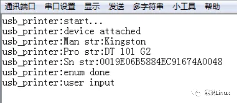

# 没有串口，如何打印单片机调试信息

输出调试信息是嵌入式开发中必不可少的调试利器，嵌入式开发的一个特点是很多时候没有操作系统，或者没有文件系统，常规的打印log到文件的方法基本不适用。

最常用的是通过串口输出uart log，例如51单片机，只要实现串口驱动，通过串口输出就可以了。

**串口这种方法实现简单，大部分嵌入式芯片都有串口功能。但是这样简单的功能有时候却不是那么好用，比如：**

- 一款新拿到的芯片，没有串口驱动时如何打印log？
- 某些应用下对时序要求比较高，串口输出log占用时间太长怎么办？比如usb枚举。
- 某些bug正常运行时会出现，当打开串口log时又不再复现怎么办？
- 一些封装中没有串口，或者串口已经被用作其他用途，要如何输出log？

**本文介绍单片机没有串口时，如何打印调试信息。**


## 1. 输出log信息到SRAM

准确来说这里并不是输出log，而是以一种方式不使用串口就可以看到log。在芯片开发阶段都可以连接仿真器调试，可以使用打断点的方法调试，但是有些操作如果不能被打断就没法使用断点调试了。这时候可以考虑将log打印到SRAM中，整个操作结束后再通过仿真器查看SRAM中的log buffer，这样就实现了间接的log输出。

本文使用的测试平台是stm32f407 discovery，基于usb host实验代码，对于其他嵌入式平台原理也是通用的。

首先定义一个结构体用于打印log，如下：

```c
typedef struct {
   volatile u8     type;
   u8*             buffer;        /* log buffer指针*/
   volatile u32    write_idx;     /* log写入位置*/
   volatile u32    read_idx;      /* log 读取位置*/
}log_dev;
```


定义一段SRAM空间作为log buffer

```c
static u8 log_buffer[LOG_MAX_LEN];
```

log buffer是环形缓冲区，在小的buffer就可以无限打印log，缺点也很明显，如果log没有及时输出就会被新的覆盖。Buffer大小根据SRAM大小分配，这里使用1kB。

为了方便输出参数，使用printf函数来格式化输出，需要做如下配置。


并包含头文件#include <stdio.h>, 在代码中实现函数fputc()。

```
//redirect fputc
int fputc(int ch, FILE *f)
{
    print_ch((u8)ch);
    return ch;
}
```


写入数据到SRAM：

```
/* write log to bufffer or I/O */
void print_ch(u8 ch)
{
    log_dev_ptr->buffer[log_dev_ptr->write_idx++] = ch;
    if(log_dev_ptr->write_idx >= LOG_MAX_LEN){
        log_dev_ptr->write_idx = 0;
    }
}
```


为了方便控制log打印格式，在头文件中再添加自定义的打印函数：

```
#ifdef  DEBUG_LOG_EN
#define DEBUG(...)    printf("usb_printer:"__VA_ARGS__)
#else
#define DEBUG(...)
#endif
```

在需要打印log的地方直接调用DEBUG()即可，最终效果如下，从Memory窗口可以看到打印的log：


在需要打印log的地方直接调用DEBUG()即可，最终效果如下，从Memory窗口可以看到打印的log：


 

## 2. 通过SWO输出log

通过打印log到SRAM的方式可以看到log，但是数据量多的时候可能来不及查看就被覆盖了。为了解决这个问题，可以使用St-link的SWO输出log，这样就不用担心log被覆盖。


在log结构体中添加SWO的操作函数集：

```
typedef struct{
    u8 (*init)(void* arg);
    u8 (*print)(u8 ch);
    u8 (*print_dma)(u8* buffer, u32 len);
}log_func;

typedef struct {
    volatile u8    type;
    u8*            buffer;
    volatile u32   write_idx;
    volatile u32   read_idx;
    //SWO
    log_func*      swo_log_func;
}log_dev;
```


SWO只需要print操作函数，实现如下：

```
u8 swo_print_ch(u8 ch)
{
    ITM_SendChar(ch);
    return 0;
}
```


使用SWO输出log同样先输出到log buffer，然后在系统空闲时再输出，当然也可以直接输出。log延迟输出会影响log的实时性，而直接输出会影响到对时间敏感的代码运行，所以如何取舍取决于需要输出log的情形。在while循环中调用output_ch()函数，就可以实现在系统空闲时输出log。

```
/*output log buffer to I/O*/
void output_ch(void)
{   
    u8 ch;
    volatile u32 tmp_write,tmp_read;
    tmp_write = log_dev_ptr->write_idx;
    tmp_read = log_dev_ptr->read_idx;

    if(tmp_write != tmp_read){
        ch = log_dev_ptr->buffer[tmp_read++];
        //swo
        if(log_dev_ptr->swo_log_func)
            log_dev_ptr->swo_log_func->print(ch);
        if(tmp_read >= LOG_MAX_LEN){
            log_dev_ptr->read_idx = 0;
        }else{
            log_dev_ptr->read_idx = tmp_read;
        }
    }
}
```

**1. 通过IDE输出**

使用IDE中SWO输出功能需要做如下配置（Keil）：


在窗口可以看到输出的log：


**2. 通过STM32 ST-LINK Utility输出**

使用STM32 ST-LINK Utility不需要做特别的设置，直接打开ST-LINK菜单下的Printf via SWO viewer，然后按start：

    

## 3. 通过串口输出log

以上都是在串口log暂时无法使用，或者只是临时用一下的方法，而适合长期使用的还是需要通过串口输出log，毕竟大部分时候没法连接仿真器。


添加串口输出log只需要添加串口的操作函数集即可：

```
typedef struct {
    volatile u8    type;
    u8*            buffer;
    volatile u32   write_idx;
    volatile u32   read_idx;
    volatile u32   dma_read_idx;
    // uart
    log_func*      uart_log_func;
    // SWO
    log_func*      swo_log_func;
}log_dev;
```


实现串口驱动函数：

```
log_func uart_log_func = {
    uart_log_init,
    uart_print_ch,
    0,
};
```


添加串口输出log与通过SWO过程类似，不再多叙述。而下面要讨论的问题是，串口的速率较低，输出数据需要较长时间，严重影响系统运行。虽然可以通过先打印到SRAM再延时输出的办法来减轻影响，但是如果系统中断频繁，或者需要做耗时运算，则可能会丢失log。要解决这个问题，就是要解决CPU与输出数据到串口同时进行的问题，嵌入式工程师立马可以想到DMA正是好的解决途径。


使用DMA搬运log数据到串口输出，同时又不影响CPU运行，这样就可以解决输出串口log耗时影响系统的问题:STM32串口收发数据为什么要使用DMA？串口及DMA初始化函数如下：

```
u8 uart_log_init(void* arg)
{
    DMA_InitTypeDef DMA_InitStructure;
    u32* bound = (u32*)arg;
    // GPIO端口设置
    GPIO_InitTypeDef GPIO_InitStructure;
    USART_InitTypeDef USART_InitStructure;

    RCC_AHB1PeriphClockCmd(RCC_AHB1Periph_GPIOA,ENABLE);  // 使能GPIOA时钟
    RCC_APB1PeriphClockCmd(RCC_APB1Periph_USART2,ENABLE); // 使能USART2时钟
    // 串口2对应引脚复用映射
    GPIO_PinAFConfig(GPIOA,GPIO_PinSource2,GPIO_AF_USART2);
    // USART2端口配置
    GPIO_InitStructure.GPIO_Pin = GPIO_Pin_2;
    GPIO_InitStructure.GPIO_Mode = GPIO_Mode_AF; // 复用功能
    GPIO_InitStructure.GPIO_Speed = GPIO_Speed_50MHz;  // 速度50MHz
    GPIO_InitStructure.GPIO_OType = GPIO_OType_PP;  // 推挽复用输出
    GPIO_InitStructure.GPIO_PuPd = GPIO_PuPd_UP;  // 上拉
    GPIO_Init(GPIOA,&GPIO_InitStructure);
    // USART2初始化设置
    USART_InitStructure.USART_BaudRate = *bound; // 波特率设置
    USART_InitStructure.USART_WordLength = USART_WordLength_8b; // 字长为8位数据格式
    USART_InitStructure.USART_StopBits = USART_StopBits_1; // 一个停止位
    USART_InitStructure.USART_Parity = USART_Parity_No; // 无奇偶校验位
    USART_InitStructure.USART_HardwareFlowControl = USART_HardwareFlowControl_None;//无硬件数据流控制
    USART_InitStructure.USART_Mode = USART_Mode_Tx;  // 收发模式
    USART_Init(USART2, &USART_InitStructure);  // 初始化串口1
#ifdef LOG_UART_DMA_EN  
    USART_DMACmd(USART2,USART_DMAReq_Tx,ENABLE);
#endif  
    USART_Cmd(USART2, ENABLE);  // 使能串口1 
    USART_ClearFlag(USART2, USART_FLAG_TC);
    while (USART_GetFlagStatus(USART2, USART_FLAG_TC) == RESET);
#ifdef LOG_UART_DMA_EN
    RCC_AHB1PeriphClockCmd(RCC_AHB1Periph_DMA1, ENABLE);
    // Config DMA channel, uart2 TX usb DMA1 Stream6 Channel
    DMA_DeInit(DMA1_Stream6);
    DMA_InitStructure.DMA_Channel = DMA_Channel_4;
    DMA_InitStructure.DMA_PeripheralBaseAddr = (uint32_t)(&USART2->DR);
    DMA_InitStructure.DMA_DIR = DMA_DIR_MemoryToPeripheral;
    DMA_InitStructure.DMA_PeripheralInc = DMA_PeripheralInc_Disable;
    DMA_InitStructure.DMA_MemoryInc = DMA_MemoryInc_Enable;
    DMA_InitStructure.DMA_PeripheralDataSize = DMA_PeripheralDataSize_Byte;
    DMA_InitStructure.DMA_MemoryDataSize = DMA_PeripheralDataSize_Byte;
    DMA_InitStructure.DMA_Mode = DMA_Mode_Normal;
    DMA_InitStructure.DMA_Priority = DMA_Priority_High;
    DMA_InitStructure.DMA_FIFOMode = DMA_FIFOMode_Disable; 
    DMA_InitStructure.DMA_MemoryBurst = DMA_MemoryBurst_Single;
    DMA_InitStructure.DMA_PeripheralBurst = DMA_PeripheralBurst_Single;
    DMA_Init(DMA1_Stream6, &DMA_InitStructure);
    RCC_AHB1PeriphClockCmd(RCC_AHB1Periph_DMA1, ENABLE);
#endif
    return 0;
}
```


DMA输出到串口的函数如下：

```
u8 uart_print_dma(u8* buffer, u32 len)
{
    if((DMA1_Stream6->CR & DMA_SxCR_EN) != RESET){
        // dma not ready
        return 1;
    }
    if(DMA_GetFlagStatus(DMA1_Stream6,DMA_IT_TCIF6) != RESET){
        DMA_ClearFlag(DMA1_Stream6,DMA_FLAG_TCIF6);
        DMA_Cmd(DMA1_Stream6,DISABLE);
    }
    DMA_SetCurrDataCounter(DMA1_Stream6,len);
    DMA_MemoryTargetConfig(DMA1_Stream6, (u32)buffer, DMA_Memory_0);
    DMA_Cmd(DMA1_Stream6,ENABLE);
    return 0;
}
```


这里为了方便直接使用了查询DMA状态寄存器，有需要可以修改为DMA中断方式，查Datasheet可以找到串口2使用DMA1 channel4的stream6：


最后在PC端串口助手可以看到log输出：




使用DMA搬运log buffer中数据到串口，同时CPU可以处理其他事情，这种方式对系统影响最小，并且输出log及时，是实际使用中用的最多的方式。并且不仅可以用串口，其他可以用DMA操作的接口（如SPI、USB）都可以使用这种方法来打印log。  

#### 4. 使用IO模拟串口输出log

最后要讨论的是在一些封装中没有串口，或者串口已经被用作其他用途时如何输出log，这时可以找一个空闲的普通IO，模拟UART协议输出log到上位机的串口工具。


常用的UART协议如下：


只要在确定的时间在IO上输出高低电平就可以模拟出波形，这个确定的时间就是串口波特率。


为了得到精确延时，这里使用TIM4定时器产生1us的延时。注意：定时器不能重复用，在测试工程中TIM2、3都被用了，如果重复用就错乱了。


初始化函数如下：

```
u8 simu_log_init(void* arg)
{
    TIM_TimeBaseInitTypeDef TIM_InitStructure;  
    u32* bound = (u32*)arg;
    // GPIO端口设置
    GPIO_InitTypeDef GPIO_InitStructure;
    RCC_AHB1PeriphClockCmd(RCC_AHB1Periph_GPIOA,ENABLE);  // 使能GPIOA时钟
    GPIO_InitStructure.GPIO_Pin = GPIO_Pin_2;
    GPIO_InitStructure.GPIO_Mode = GPIO_Mode_OUT;
    GPIO_InitStructure.GPIO_Speed = GPIO_Speed_50MHz;   // 速度50MHz
    GPIO_InitStructure.GPIO_OType = GPIO_OType_PP;  // 推挽复用输出
    GPIO_InitStructure.GPIO_PuPd = GPIO_PuPd_UP;  // 上拉
    GPIO_Init(GPIOA,&GPIO_InitStructure);
    GPIO_SetBits(GPIOA, GPIO_Pin_2);
    // Config TIM
    RCC_APB1PeriphClockCmd(RCC_APB1Periph_TIM4,ENABLE);  // 使能TIM4时钟
    TIM_DeInit(TIM4);
    TIM_InitStructure.TIM_Prescaler = 1;        // 2分频
    TIM_InitStructure.TIM_CounterMode = TIM_CounterMode_Up;
    TIM_InitStructure.TIM_Period = 41;          // 1us timer
    TIM_InitStructure.TIM_ClockDivision = TIM_CKD_DIV1;
    TIM_TimeBaseInit(TIM4, &TIM_InitStructure);
    TIM_ClearFlag(TIM4, TIM_FLAG_Update);
    baud_delay = 1000000/(*bound);          // 根据波特率计算每个bit延时
    return 0;
}
```


使用定时器的delay函数为：

```
void simu_delay(u32 us)
{
    volatile u32 tmp_us = us;
    TIM_SetCounter(TIM4, 0);
    TIM_Cmd(TIM4, ENABLE);
    while(tmp_us--){
        while(TIM_GetFlagStatus(TIM4, TIM_FLAG_Update) == RESET);
        TIM_ClearFlag(TIM4, TIM_FLAG_Update);
    }   
    TIM_Cmd(TIM4, DISABLE);
}
```


最后是模拟输出函数，注意：输出前必须要关闭中断，一个byte输出完再打开，否则会出现乱码：

```
u8 simu_print_ch(u8 ch)
{
   volatile u8 i=8;
   __asm("cpsid i");
   //start bit
   GPIO_ResetBits(GPIOA, GPIO_Pin_2);
   simu_delay(baud_delay);
   while(i--){
        if(ch & 0x01)
            GPIO_SetBits(GPIOA, GPIO_Pin_2);
        else
            GPIO_ResetBits(GPIOA, GPIO_Pin_2);
        ch >>= 1;
        simu_delay(baud_delay);
    }
    // stop bit
    GPIO_SetBits(GPIOA, GPIO_Pin_2);
    simu_delay(baud_delay);
    simu_delay(baud_delay);
     __asm("cpsie i");
    return 0;
}
```


介绍了几种开发中使用过的打印调试信息的方法，方法总是死的，关键在于能灵活使用；通过打印有效的调试信息，可以帮助解决开发及后期维护中遇到的问题，少走弯路。


    