# 让你秒懂各种常用通信协议

这些显示电子系统中信号波形的动图，有助于帮助我们理解传输的机理。

# 01 SPI 传输

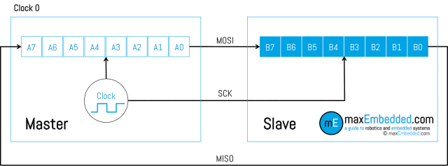

▲ 图1.1 SPI 数据传输(1)

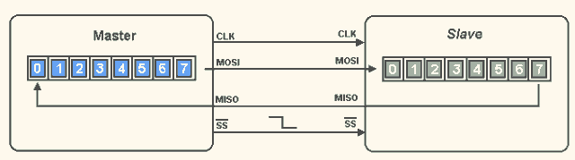

▲ 图1.2 SPI 数据传输(2)

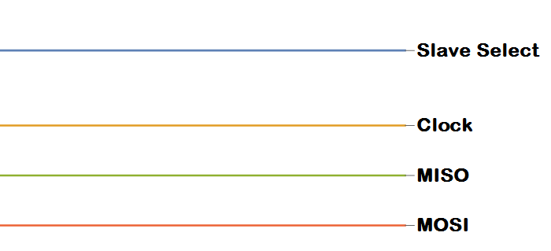

▲ 图1.3 SPI 时序信号

# 02 IIC 传输

▲ 图2.1 IIC 总线以及寻址方式

# 03 UART 传输

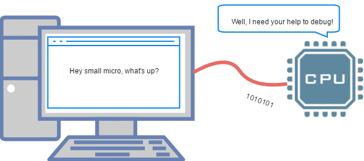

▲ 图3.1 PC 上通过UART来调试MCU  

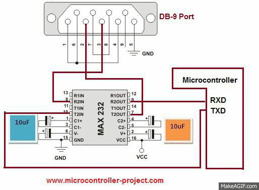

▲ 图3.2 RS-232通过电平转换芯片与MCU通讯

# 04 红外控制

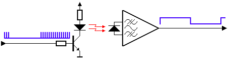

▲ 图4.1 红外控制信号也是一个串行通讯信号

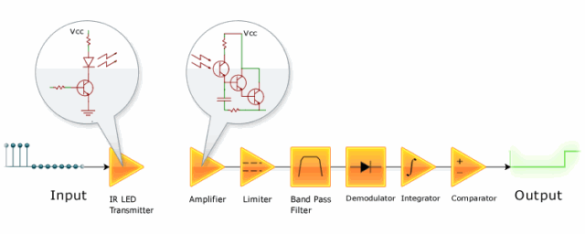

▲ 图4.2 红外信号接收与放大整形电路

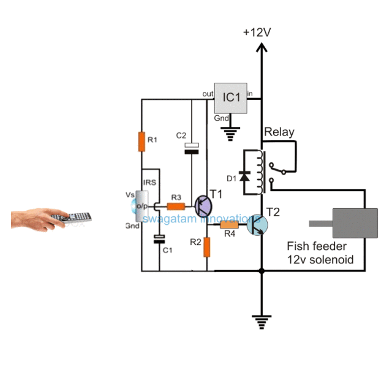

▲ 图4.3 一个使用红外接收光电管控制继电器进行鱼食投喂电路

# 05 串并转换电路

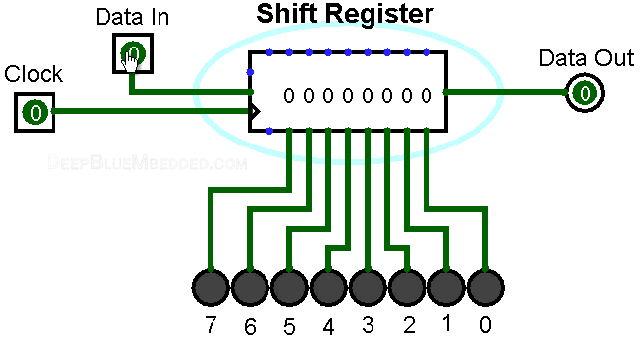  

图5.1 串入、并出移位寄存器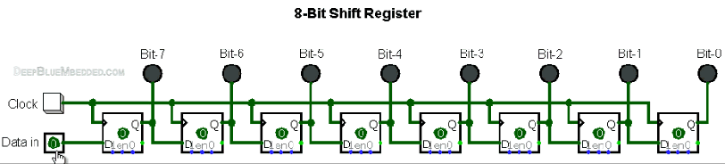

图5.2 由八个D寄存器组成的移位寄存器

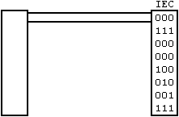

图5.3 串行传输示意图

# 06 其他波形动画

#  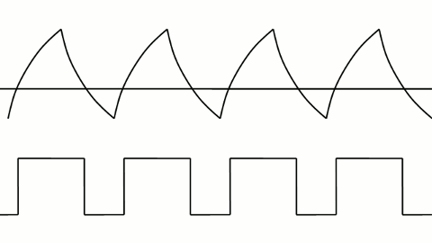

图6.1 PWM控制LED亮度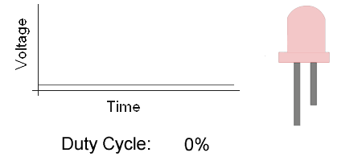

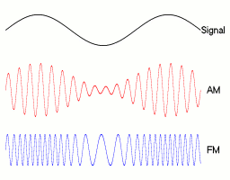

图6.3 调幅与调频信号

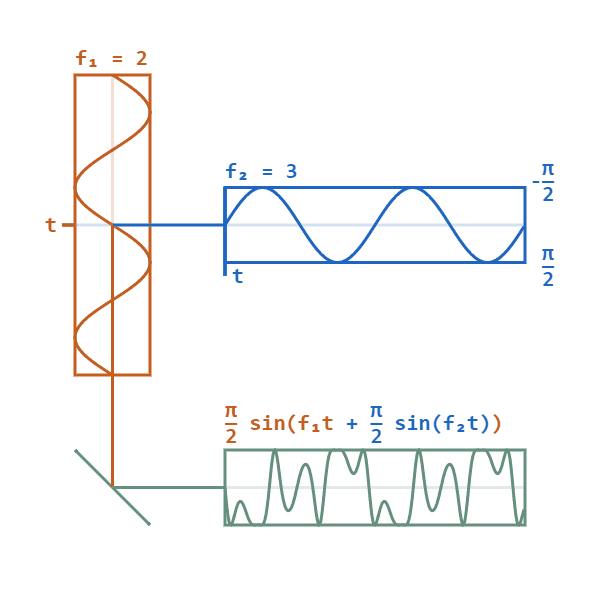

图6.4 相位调制信号

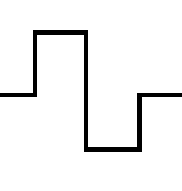

图6.5 方波边沿抖动波形