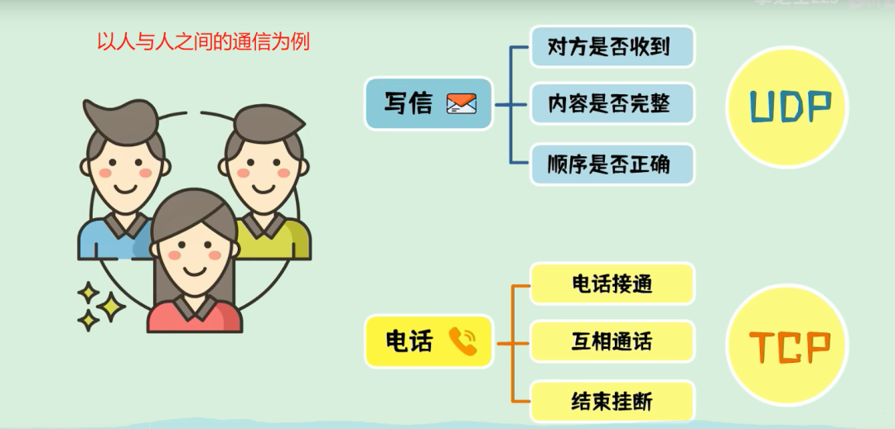
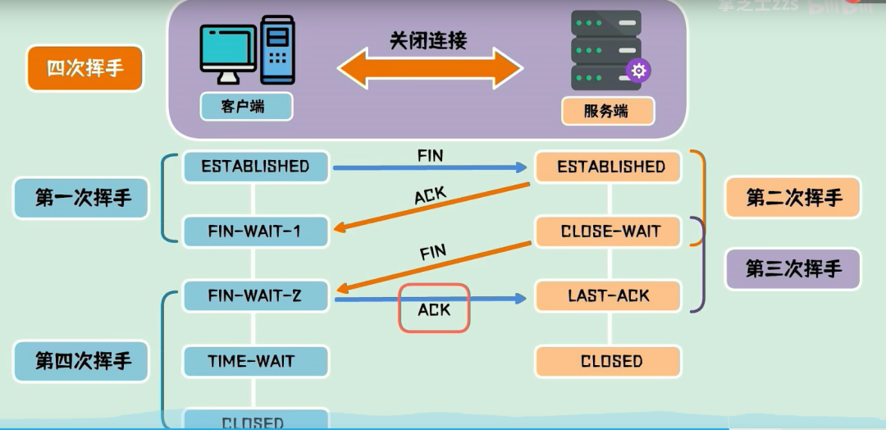
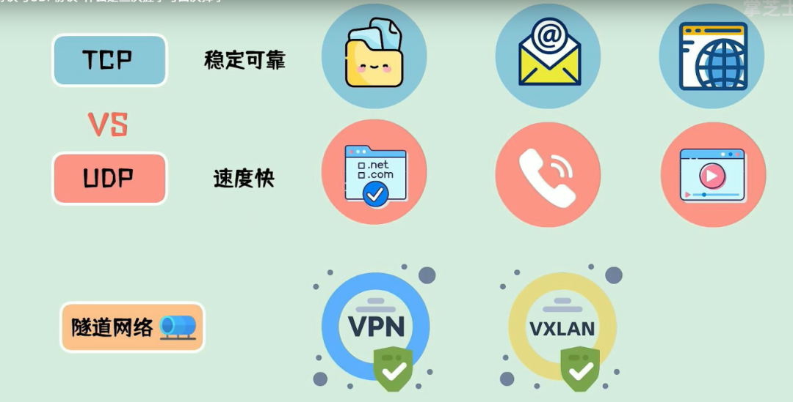

# 图文并茂，详解TCP和UDP协议的原理和区别

最近重新认知了一下TCP和UDP的原理以及区别，做一个简单的总结。

## 一、作用

首先，tcp和udp都是工作再传输层，用于程序之间传输数据的。数一般包含：文件类型，视频类型，jpg图片等。

## 二、区别

TCP是基于连接的，而UDP是基于非连接的。

tcp传输数据稳定可靠，适用于对网络通讯质量要求较高的场景，需要准确无误的传输给对方，比如，传输文件，发送邮件，浏览网页等等。

udp的优点是速度快，但是可能产生丢包，所以适用于对实时性要求较高但是对少量丢包并没有太大要求的场景。比如：域名查询，语音通话，视频直播等。udp还有一个非常重要的应用场景就是隧道网络，比如：vpn，VXLAN。

以人与人之间的通信为例：UDP协议就相当于是写信给对方，寄出去信件之后不能知道对方是否收到信件，信件内容是否完整，也不能得到及时反馈，而TCP协议就像是打电话通信，在这一系列流程都能得到及时反馈，并能确保对方及时接收到。如下图：

## 三、TCP通信的过程

tcp是如何保证以上过程的:分为三个步骤，三次握手，传输确认，四次挥手。三次握手是建立连接的过程。

## 四、三次握手

当客户端向服务端发起连接时，会先发一包连接请求数据，过去询问一下，能否与你建立连接？这包数据称之为SYN包，如果对端同意连接，则回复一包SYN+ACK包，客户端收到之后，发送一包ACK包，连接建立，因为这个过程中互相发送了三包数据，所以称之为三次握手。        

为什么要三次握手而不是两次握手？

**这是为了防止，因为已失效的请求报文，突然又传到服务器，引起错误，**这是什么意思？

假设采用两次握手建立连接，客户端向服务端发送一个syn包请求建立连接，因为某些未知的原因，并没有到达服务器，在中间某个网络节点产生了滞留，为了建立连接，客户端会重发syn包，这次的数据包正常送达，服务端发送syn+ack之后就建立起了连接，但是第一包数据阻塞的网络突然恢复，第一包syn包又送达到服务端，这是服务端会认为客户端又发起了一个新的连接，从而在两次握手之后进入等待数据状态，服务端认为是两个连接，而客户端认为是一个连接，造成了状态不一致，如果在三次握手的情况下，服务端收不到最后的ack包，自然不会认为连接建立成功，所以三次握手本质上来说就是为了解决网络信道不可靠的问题，为了在不可靠的信道上建立起可靠的连接，经过三次握手之后，客户端和服务端都进入了数据传输状态。

## 五、数据传输

数据传输：

一包数据可能会被拆成多包发送,如何处理丢包问题，这些数据包到达的先后顺序不同，如何处理乱序问题？针对这些问题，tcp协议为每一个连接建立了发送缓冲区，从建立链接后的第一个字节的序列号为0，后面每个字节的序列号就会增加1，发送数据时，从数据缓冲区取一部分数据组成发送报文，在tcp协议头中会附带序列号和长度，接收端在收到数据后需要回复确认报文，确认报文中的ack等于接受序列号加长度，也就是下包数据发送的起始序列号，这样一问一答的发送方式，能够使发送端确认发送的数据已经被对方收到，发送端也可以发送一次的连续的多包数据，接受端只需要回复一次ack就可以了如图：

  

## **六、**四次挥手

  

处于连接状态的客户端和服务端，都可以发起关闭连接请求，此时需要四次挥手来进行连接关闭，假设客户端主动发起连接关闭请求，他给服务端发起一包FIN包，标识要关闭连接，自己进入终止等待1装填，服务端收到FIN包，发送一包ACK包，标识自己进入了关闭等待状态，客户端进入终止等待2状态。这是第二次挥手，服务端此时还可以发送未发送的数据，而客户端还可以接受数据，待服务端发送完数据之后，发送一包FIN包，最后进入确认状态，这是第3次挥手，客户端收到之后恢复ACK包，进入超时等待状态，经过超时时间后关闭连接，而服务端收到ACK包后，立即关闭连接，这是第四次挥手。为什么客户端要等待超时时间这是为了保证对方已经收到ACK包，因为假设客户端发送完最后一包ACK包后释放了连接，一旦ACK包在网络中丢失，服务端将一直停留在 最后确认状态，如果等待一段时间，这时服务端会因为没有收到ack包重发FIN包，客户端会响应 这个FIN包进行重发ack包，并刷新超时时间，这个机制跟第三次握手一样。也是为了保证在不可靠的网络链路中进行可靠的连接断开确认。

## 七、UDP协议

udp:首先udp协议是非连接的，发送数据就是把简单的数据包封装一下，然后从网卡发出去就可以了，数据包之间并没有状态上的联系，正因为udp这种简单的处理方式，导致他的性能损耗非常少，对于cpu,内存资源的占用也远小于tcp,但是对于网络传输过程中产生的丢包，udp并不能保证，所以udp在传输稳定性上要弱于tcp，所以，tcp和udp的主要却别：tcp传输数据稳定可靠，适用于对网络通讯质量要求较高的场景，需要准确无误的传输给对方，比如，传输文件，发送邮件，浏览网页等等，udp的优点是速度快，但是可能产生丢包，所以适用于对实时性要求较高但是对少量丢包并没有太大要求的场景。比如：域名查询，语音通话，视频直播等。udp还有一个非常重要的应用场景就是隧道网络，比如：vpn，VXLAN。

    