# 菜鸟也能懂的音视频基础知识

**前言**

说到视频，大家自己脑子里基本都会想起电影、电视剧、在线视频等等，也会想起一些视频格式 AVI、MP4、RMVB、MKV等等。 但是我们如果认真思考这些应该就有很多疑问，比如以下问题：

- mp4 和 mkv有什么区别 ？
- 视频封装格式 和 解码格式 有什么区别？
- 什么是H.264 ？什么是 mpeg ？

等等很多疑问，我们不知道这些问题的答案是因为我们没有去了解他们背后的东西，下面我会给大家分享当初我学习时候的整理的一些知识。

# 一、光与颜色

**1，光和颜色** 光是一种肉眼可以看见（接受）的电磁波（可见光谱）。在科学上的定义，光有时候是指所有的电磁波。光是由一种称为光子的基本粒子组成。具有粒子性与波动性，或称为波粒二象性。 人类肉眼所能看到的可见光只是整个电磁波谱的一部分。电磁波之可见光谱范围大约为390～760nm（1nm=10-9m=0.000000001m）。

在这个世界如果没有光，我们就无法生存。 颜色是视觉系统对可见光的感知结果，研究表明人的视网膜有对红、绿、蓝颜色敏感程度不同的三种锥体细胞。红、绿和蓝三种锥体细胞对不同频率的光的感知程度不同，对不同亮度的感知程度也不同。 自然界中的任何一种颜色都可以由R，G，B 这 3 种颜色值之和来确定，以这三种颜色为基色构成一个RGB 颜色空间。

颜色＝R(红色的百分比)＋G(绿色的百分比)＋B(蓝色的百分比)，只要其中一种不是由其它两种颜色生成，可以选择不同的三基色构造不同的颜色空间。 如图所示，适当的红光和绿光能合成黄光；适当的绿光和蓝光能合成青光；适当的蓝光和红光能合成品红色的光；而适当的红、绿、蓝三色光能合成白光。因此红、绿、蓝三种色光被称为色光的“三原色。”

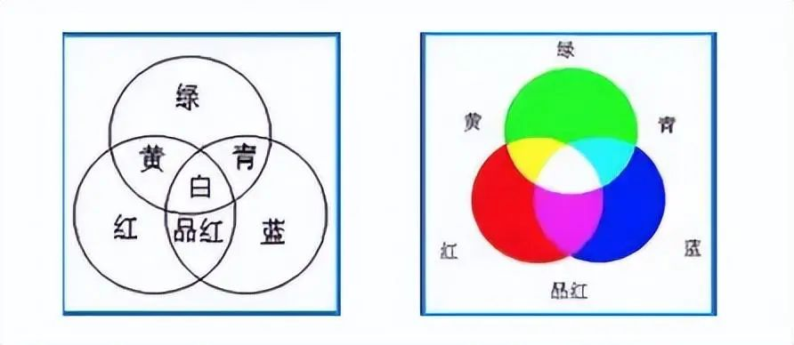

**2，颜色的度量** **饱和度(saturation)**

是相对于明度的一个区域的色彩，是指颜色的纯洁性，它可用来区别颜色明暗的程度。完全饱和的颜色是指没有渗入白光所呈现的颜色，例如仅由单一波长组成的光谱色就是完全饱和的颜色。

**明度(brightness)** 是视觉系统对可见物体辐射或者发光多少的感知属性。它和人的感知有关。由于明度很难度量，因此国际照明委员会定义了一个比较容易度量的物理量，称为亮度(luminance) 来度量明度，亮度(luminance)即辐射的能量。明度的一个极端是黑色(没有光)，另一个极端是白色，在这两个极端之间是灰色。

**光亮度(lightness)** 是人的视觉系统对亮度(luminance)的感知响应值，光亮度可用作颜色空间的一个维，而明度(brightness)则仅限用于发光体,该术语用来描述反射表面或者透射表面。

**3，颜色空间**

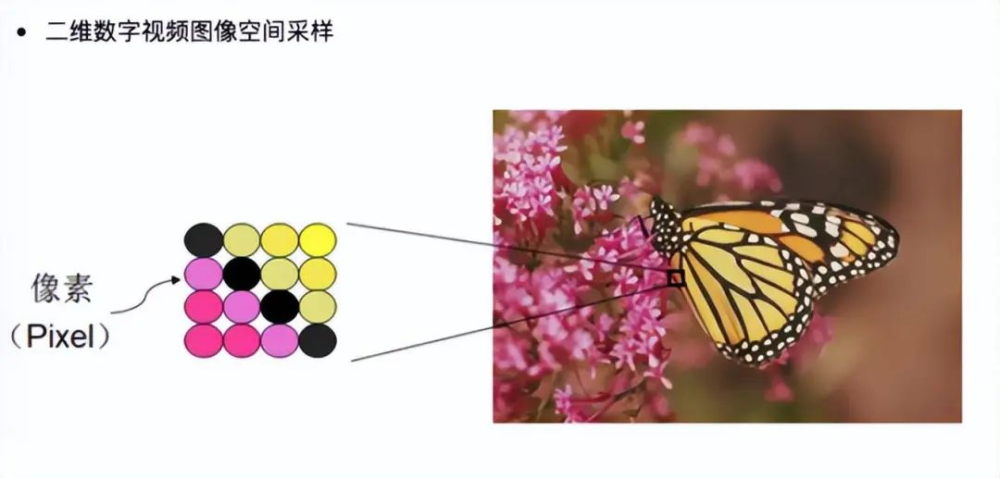


颜色空间是表示颜色的一种数学方法，人们用它来指定和产生颜色，使颜色形象化。颜色空间中的颜色通常使用代表三个参数的三维坐标来指定，这些参数描述的是颜色在颜色空间中的位置，但并没有告诉我们是什么颜色，其颜色要取决于我们使用的坐标。

下面介绍几种常见的颜色空间：

RGB: 用途：主要用来在LCD、CRT显示器上用的。 RGB色彩模式是工业界的一种颜色标准，是通过对红(R)、绿(G)、蓝(B)三个颜色通道的变化以及它们相互之间的叠加来得到各式各样的颜色的，RGB即是代表红、绿、蓝三个通道的颜色。 目前的显示器大都是采用了RGB颜色标准，在显示器上，是通过电子枪打在屏幕的红、绿、蓝三色发光极上来产生色彩的。 电脑屏幕上的所有颜色，都由这红色绿色蓝色三种色光按照不同的比例混合而成的。一组红色，绿色，蓝色就是一个最小的显示单位。屏幕上的任何一个颜色都可以由一组RGB值来记录和表达。 显像管内电子枪射出的三个电子束，它们分别射到屏上显示出红、绿、蓝色的荧光点上，通过分别控制三个电子束的强度，可以改变三色荧光点的亮度。由于这些色点很小又靠得很近，人眼无法分辨开来，看到的是三个色点的复合．即合成的颜色。

以RGB24为例，图像像素数据的存储方式如下:

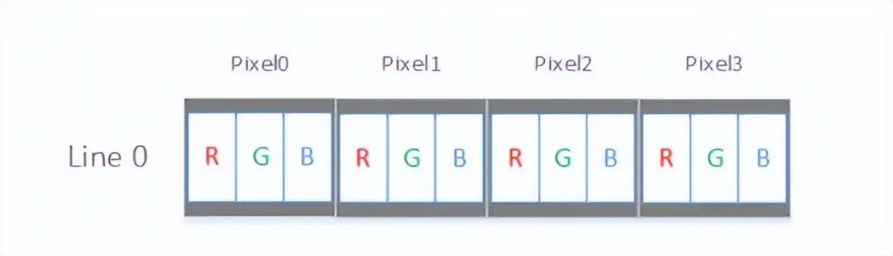

RGB的格式：

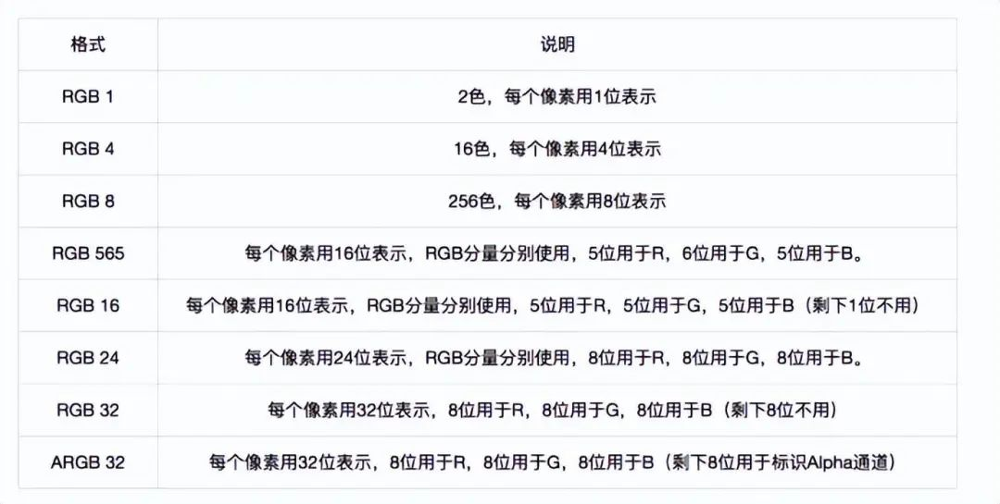


RGB16 RGB24 RGB32 等等这些到底格式有什么区别呢 ？

总的来说区别就是一个像素所使用的位数不同，显示出来的色彩丰富度不同，位数越大，色彩越丰富。 计算机使用的都是二进制，因此所有的数量级都是建立在二进制的基础上的，无论是存储空间，运算速度，文件大小等等。

如果要表示颜色，每一个对应的颜色都需要一个二进制代码来表示， **使用8位的二进制**， 可以表示 2^8 （2的8次方） ， 也就是256种色彩。 **使用16位的二进制**，可以表示 2^16 （2 的16次方），也就是65536种色彩。 **使用24位的二进制**，可以表示 2^24 （2的24次方） ，也就是16,777,216种色彩。 一般称24bit以上的色彩为真彩色，当然还有采用30bit、36bit、42bit的。使用的色彩代码越长，同样像素的文件的文件大小也就相应的成幂次级增长。使用超过16位以上的色彩文件在普通的显示器，尤其是液晶显示器上看不出任何区别，原因是液晶显示器本身不能显示出那么多的色彩。但是对于彩色印刷就非常有用，因为油墨的点非常的细，同时由于印刷尺幅的放大原因， 更大的文件可以在印刷的时候呈现出更细腻的层次和细节。

YUV： 用途：主要用于视频信号的压缩、传输和存储，和向后相容老式黑白电视。 在生理学中，有一条规律，那就是人类视网膜上的视网膜杆细胞要多于视网膜锥细胞，说得通俗一些，视网膜杆细胞的作用就是识别亮度，而视网膜锥细胞的作用就是识别色度。所以，人眼对亮度分辨率的敏感度高于对色彩分辨率的敏感度

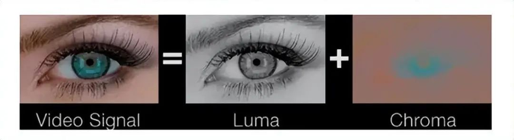

从上图我们可以看出，我们更容易识别去除色彩的图像，而对于单独剥离出的只有色彩的图像，不好识别。 YUV色彩模型就是利用这个原理，把亮度与色度分离，根据人对亮度更敏感些，增加亮度的信号，减少颜色的信号，以这样“欺骗”人的眼睛的手段来节省空间，从而适合于图像处理领域。 YUV三个字母中，其中"Y"表示明亮度（Lumina nce或Luma），也就是灰阶值；而"U"和"V"表示的则是色度（Chrominance或Chroma），作用是描述影像色彩及饱和度，用于指定像素的颜色。 **使用YUV的优点有两个:** 一、彩色YUV图像转黑白YUV图像。 如果只有Y信号分量而没有U、V分量，那么这样表示的图像就是黑白灰度图像。因此可兼容老式黑白电视。 二、YUV是数据总尺寸小于RGB格式。 因为YUV，可以增加亮度的信号，减少颜色的信号，用于减少体积。

YCbCr ： 在技术文档里，YUV经常有另外的名字, YCbCr ,其中Y与YUV 中的Y含义一致，Cb , Cr 同样都指色彩，只是在表示方法上不同而已，Cb Cr 就是本来理论上的“分量/色差”的标识。C代表分量(是component的缩写)Cr、Cb分别对应r(红)、b(蓝)分量信号，Y除了g(绿)分量信号，还叠加了亮度信号。

YCbCr模型来源于YUV模型，算是YUV的压缩版本，不同之处在于Y'CbCr用于数字图像领域，YUV用于模拟信号领域，MPEG、DVD、摄像机中常说的YUV其实是Y'CbCr。

其中Y与YUV 中的Y含义一致，Cb , Cr 同样都指色彩,，只是在表示方法上不同而已，Cb Cr 就是本来理论上的“分量/色差”的标识。C代表分量(是component的缩写)Cr、Cb分别对应r(红)、b(蓝)分量信号，Y除了g(绿)分量信号，还叠加了亮度信号。

再YUV 家族中, YCbCr 是在计算机系统中应用最多的成员, 其应用领域很广泛,JPEG、MPEG均采用此格式。一般人们所讲的YUV大多是指YCbCr。

YCbCr 有许多取样格式, 如4∶4∶4 , 4∶2∶2 , 4∶1∶1 和4∶2∶0：

- **4:4:4**

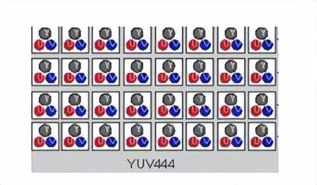


YUV三个信道的抽样率相同，因此在生成的

- **4:2:0**


4:2:0并不意味着只有Y，Cb而没有Cr分量。它指得是对每行扫描线来说，只有一种色度分量以2:1的抽样率存储。相邻的扫描行存储不同的色度分量，也就是说，如果一行是4:2:0的话，下一行就是4:0:2，再下一行是4:2:0...以此类推。对每个色度分量来说，水平方向和竖直方向的抽样率都是2:1，所以可以说色度的抽样率是4:1。对非压缩的8比特量化的视频来说，每个由2x2个2行2列相邻的像素组成的宏像素需要占用6字节内存。

**4，颜色空间的转换：** 不同颜色可以通过一定的数学关系相互转换：

**RGB转YUV：** Y = (0.257 * R) + (0.504 * G) + (0.098 * B) + 16 Cr = V = (0.439 * R) - (0.368 * G) - (0.071 * B) + 128 Cb = U = -( 0.148 * R) - (0.291 * G) + (0.439 * B) + 128

**YUV转RGB：** B = 1.164(Y - 16) + 2.018(U - 128) G = 1.164(Y - 16) - 0.813(V - 128) - 0.391(U - 128) R = 1.164(Y - 16) + 1.596(V - 128)

# 二、电视制式

1，介绍 电视信号的标准简称制式，可以简单地理解为用来实现电视图像或声音信号所采用的一种技术标准，就是用来实现电视图像信号和伴音信号，或其它信号传输的方法，和电视图像的显示格式，以及这种方法和电视图像显示格式所采用的技术标准。 只有遵循一样的技术标准，才能够实现电视机正常接收电视信号、播放电视节目。就像电源插座和插头，规格一样才能插在一起，中国的插头就不能插在英国规格的电源插座里，只有制式一样，才能顺利对接。 严格来说，电视制式有很多种，对于模拟电视，有黑白电视制式，彩色电视制式，以及伴音制式等。 目前世界上现行的彩色电视制式有三种：NTSC 制、PAL 制和SECAM 制。 中国大部分地区使用PAL制式，日本、韩国及东南亚地区与美国等欧美国家使用NTSC制式，俄罗斯则使用SECAM制式。

2，制式说明

**NTSC电视标准：** NTSC电视标准主要用于美、日等国家和地区。 NTSC电视标准的特性： （1） 525 行/帧，每秒29.97帧（简化为30帧） （2）电视扫描线为525线。 （3）隔行扫描，一帧分成2 场(field)，262.5 线/场 （4）24比特的色彩位深。 （5）高宽比：电视画面的长宽比(电视为4:3；电影为3:2；高清晰度电视为16:9) （6）场频为每秒60场( 帧数30 * 2 = 60 ) 它是1952年由美国国家电视标准委员会指定的彩色电视广播标准，它采用正交平衡调幅的技术方式，故也称为正交平衡调幅制。 优点是电视接收机电路简单，缺点是容易产生偏色，因此NTSC制电视机都有一个色调手动控制电路，供用户选择使用；

**PAL电视标准：** PAL电视标准主要用于中国、欧洲等国家和地区。 PAL电视标准的特性 （1）625 行(扫描线)/帧，每秒25帧. （2）电视扫描线为625线 （3）隔行扫描，2 场/帧，312.5 行/场 （4）24比特的色彩位深 （5）画面的宽高比为4：3。 （6）场频为每秒50场( 帧数25 * 2 = 50 ) 它是西德在1962年指定的彩色电视广播标准，它采用逐行倒相正交平衡调幅的技术方法，克服了NTSC制相位敏感造成色彩失真的缺点。

**SECAM电视标准：** SECAM是法文的缩写，意为顺序传送彩色信号与存储恢复彩色信号制，是由法国在1956年提出，1966年制定的一种新的彩色电视制式。它也克服了NTSC制式相位失真的缺点，但采用时间分隔法来传送两个色差信号。 PAL制式和SECAM制式可以克服NTSC制容易偏色的缺点，但电视接收机电路复杂，要比NTSC制电视接收机多一个一行延时线电路，并且图像容易产生彩色闪烁。 因此三种彩色电视制式各有优缺点，互相比较结果，谁也不能战胜谁，所以，三种彩色电视制式互相共存已经五十多年。

# 三、照相机与摄像机

视频最早是由摄像机拍摄的制作而成的，摄像机的发明又是在照相机的基础之上的，所以说在这里，就不得简单说明下照相机与摄像机。

**1，照相机基本原理** 现实中照相机和摄像机的成像原理都是基于**小孔成像**为基础的。 我们知道，光在同一均匀介质中、不受引力作用干扰的情况下，沿直线传播；因此它在遇到阻隔物上的孔洞时会穿过它，并能在孔后一定距离内的对应平面上投射出一个倒立的实影；只要投影面周围的环境足够暗，影像就能被人眼所观看到。相信学生时代，大家都曾在自然常识课上做过“小孔成像”的试验，老师也肯定提到过这一原理与相机之间密不可分的关联；图像里，每个象素的三个分量信息完整。

- **4:2:2**

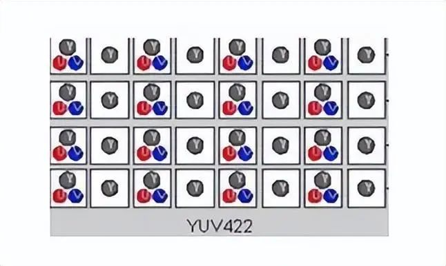


每个色差信道的抽样率是亮度信道的一半，所以水平方向的色度抽样率只是4:4:4的一半

- **4:1:1**

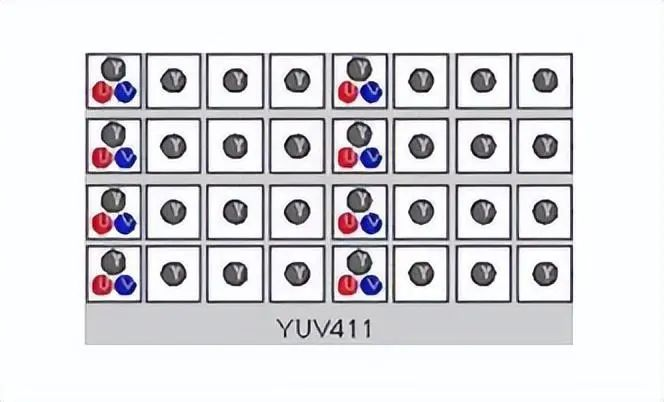


4:1:1的色度抽样，是在水平方向上对色度进行4:1抽样。对于低端用户和消费类产品这仍然是可以接受的。

- **4:2:0**

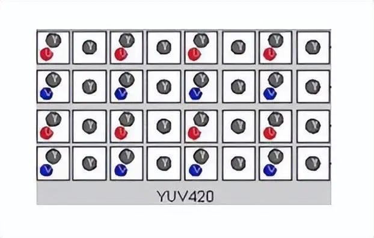


4:2:0并不意味着只有Y，Cb而没有Cr分量。它指得是对每行扫描线来说，只有一种色度分量以2:1的抽样率存储。相邻的扫描行存储不同的色度分量，也就是说，如果一行是4:2:0的话，下一行就是4:0:2，再下一行是4:2:0...以此类推。对每个色度分量来说，水平方向和竖直方向的抽样率都是2:1，所以可以说色度的抽样率是4:1。对非压缩的8比特量化的视频来说，每个由2x2个2行2列相邻的像素组成的宏像素需要占用6字节内存。

**4，颜色空间的转换：** 不同颜色可以通过一定的数学关系相互转换：

**RGB转YUV：** Y = (0.257 * R) + (0.504 * G) + (0.098 * B) + 16 Cr = V = (0.439 * R) - (0.368 * G) - (0.071 * B) + 128 Cb = U = -( 0.148 * R) - (0.291 * G) + (0.439 * B) + 128

**YUV转RGB：** B = 1.164(Y - 16) + 2.018(U - 128) G = 1.164(Y - 16) - 0.813(V - 128) - 0.391(U - 128) R = 1.164(Y - 16) + 1.596(V - 128)

# 二、电视制式

1，介绍 电视信号的标准简称制式，可以简单地理解为用来实现电视图像或声音信号所采用的一种技术标准，就是用来实现电视图像信号和伴音信号，或其它信号传输的方法，和电视图像的显示格式，以及这种方法和电视图像显示格式所采用的技术标准。 只有遵循一样的技术标准，才能够实现电视机正常接收电视信号、播放电视节目。就像电源插座和插头，规格一样才能插在一起，中国的插头就不能插在英国规格的电源插座里，只有制式一样，才能顺利对接。 严格来说，电视制式有很多种，对于模拟电视，有黑白电视制式，彩色电视制式，以及伴音制式等。 目前世界上现行的彩色电视制式有三种：NTSC 制、PAL 制和SECAM 制。 中国大部分地区使用PAL制式，日本、韩国及东南亚地区与美国等欧美国家使用NTSC制式，俄罗斯则使用SECAM制式。

2，制式说明

**NTSC电视标准：** NTSC电视标准主要用于美、日等国家和地区。 NTSC电视标准的特性： （1） 525 行/帧，每秒29.97帧（简化为30帧） （2）电视扫描线为525线。 （3）隔行扫描，一帧分成2 场(field)，262.5 线/场 （4）24比特的色彩位深。 （5）高宽比：电视画面的长宽比(电视为4:3；电影为3:2；高清晰度电视为16:9) （6）场频为每秒60场( 帧数30 * 2 = 60 ) 它是1952年由美国国家电视标准委员会指定的彩色电视广播标准，它采用正交平衡调幅的技术方式，故也称为正交平衡调幅制。 优点是电视接收机电路简单，缺点是容易产生偏色，因此NTSC制电视机都有一个色调手动控制电路，供用户选择使用；

**PAL电视标准：** PAL电视标准主要用于中国、欧洲等国家和地区。 PAL电视标准的特性 （1）625 行(扫描线)/帧，每秒25帧. （2）电视扫描线为625线 （3）隔行扫描，2 场/帧，312.5 行/场 （4）24比特的色彩位深 （5）画面的宽高比为4：3。 （6）场频为每秒50场( 帧数25 * 2 = 50 ) 它是西德在1962年指定的彩色电视广播标准，它采用逐行倒相正交平衡调幅的技术方法，克服了NTSC制相位敏感造成色彩失真的缺点。

**SECAM电视标准：** SECAM是法文的缩写，意为顺序传送彩色信号与存储恢复彩色信号制，是由法国在1956年提出，1966年制定的一种新的彩色电视制式。它也克服了NTSC制式相位失真的缺点，但采用时间分隔法来传送两个色差信号。 PAL制式和SECAM制式可以克服NTSC制容易偏色的缺点，但电视接收机电路复杂，要比NTSC制电视接收机多一个一行延时线电路，并且图像容易产生彩色闪烁。 因此三种彩色电视制式各有优缺点，互相比较结果，谁也不能战胜谁，所以，三种彩色电视制式互相共存已经五十多年。

# 三、照相机与摄像机

视频最早是由摄像机拍摄的制作而成的，摄像机的发明又是在照相机的基础之上的，所以说在这里，就不得简单说明下照相机与摄像机。

**1，照相机基本原理** 现实中照相机和摄像机的成像原理都是基于**小孔成像**为基础的。 我们知道，光在同一均匀介质中、不受引力作用干扰的情况下，沿直线传播；因此它在遇到阻隔物上的孔洞时会穿过它，并能在孔后一定距离内的对应平面上投射出一个倒立的实影；只要投影面周围的环境足够暗，影像就能被人眼所观看到。相信学生时代，大家都曾在自然常识课上做过“小孔成像”的试验，老师也肯定提到过这一原理与相机之间密不可分的关联；

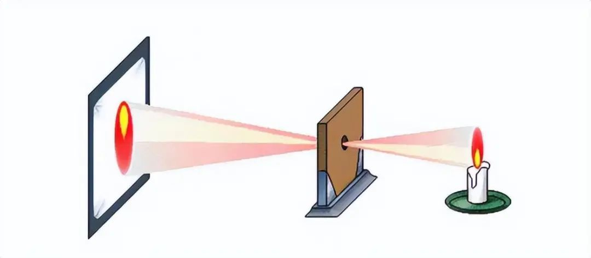


照相技术的发明者正是利用光的这一的特性与传递原理，以光子为载体，把某一瞬间被摄景物的光信息以能量方式通过设在相机上“孔洞”传递给后方的感光材料。

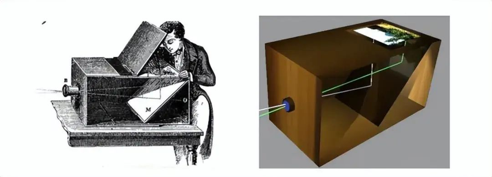


照相机的基本工作原理就是——将景物影像通过光线的各种传播特性准确地聚焦在具有感光能力的成像平面上，通过各种辅助手段控制光线的流量，从而获得符合用户要求的影像画面，最后通过不同的手段保存下来。 最早的照相机结构十分简单，仅包括暗箱、镜头和感光材料。 现代照相机比较复杂，具有镜头、光圈、快门、测距、取景、测光、输片、计数、自拍等系统，是一种结合光学、精密机械、电子技术和化学等技术的复杂产品。

**2，摄像机的发明过程** 摄像机的发明，起源于一个有趣的故事。 1872年的一天，在美国加利福尼亚州一个酒店里，斯坦福与科恩发生了激烈的争执：马奔跑时蹄子是否都着地？斯坦福认为奔跑的马在跃起的瞬间四蹄是腾空的；科恩却认为，马奔跑时始终有一蹄着地。争执的结果谁也说服不了谁，于是就采取了美国人惯用的方式打赌来解决。他们请来一位驯马好手来做裁决，然而，这位裁判员也难以断定谁是谁非。这很正常，因为单凭人的眼睛确实难以看清快速奔跑的马蹄是如何运动的。 于是富翁请来了英国摄影师爱德华.麦布里奇来作实验。

麦布里奇把24架照相机的快门连上24根线，在极短的时间里，使照相机依次拍下24张照片，再将这些照片一张一张地依次按次序看下去，以便观察马儿是怎么样跃进的，又是怎么样着地的。为了这一实验，麦布里奇和助手们吃尽了苦头，付出了大量的劳动，历时六年的工夫，终于拍出了一套宝贵的"马跑小道"的珍贵资料，同时也证实了这个美国富翁的预言是正确的。然而，麦布里奇的成功又向人们提出了一个新的问题：如何解决连续摄影的问题，因为他用24架照相机仅仅只能拍摄奔马的一段动作，如果奔马跑一公里的长距离，就得用成千上万架照相机，胶卷的长度将会绕地球一周了。所以，如何运用一架单镜头的摄影机来代替多镜头的摄影机或者一组摄影机，就成了解决连续摄影的关键问题。

1874年，法国的朱尔·让桑发明了一种摄影机。他将感光胶片卷绕在带齿的供片盘上，在一个钟摆机构的控制下，供片盘在圆形供片盒内做间歇供片运动，同时钟摆机构带动快门旋转，每当胶片停下时，快门开启曝光。让桑将这种相机与一架望远镜相接，能以每秒一张的速度拍下行星运动的一组照片。让桑将其命名为摄影枪， 这就是现代摄影机的始祖。

**3，视频经过哪些步骤，存储到计算机中？**

（1）成像 主要靠镜头来完成，拍摄主体反射的光线通过镜头进入相机后聚焦，形成清晰图像。

（2）光电转换 图像落在CCD/CMOS光电器材上，通过光电转换形成电信号。

（3）记录

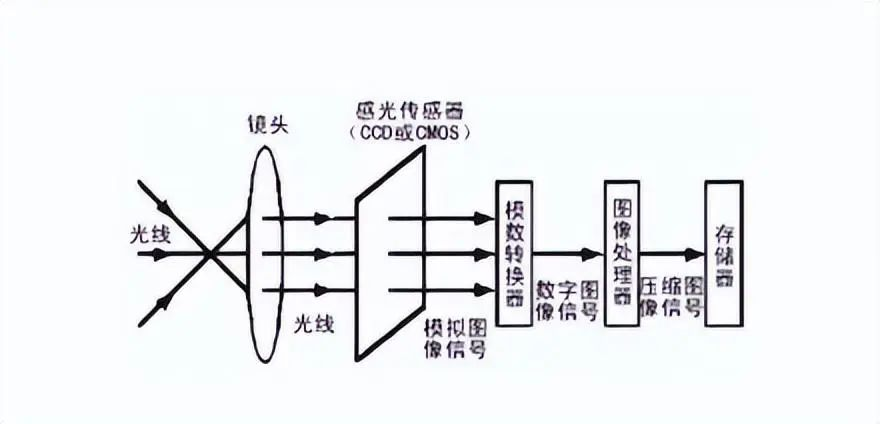


经处理器加工，进行编码压缩，然后把信号记录在磁带或存储卡上。

# 四、声音

**1，声音介绍**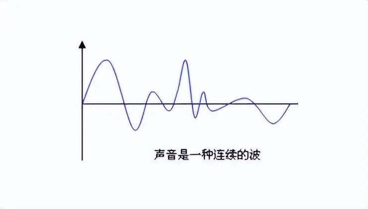

**声音：** 声音是一种物理现象。物体振动时产生声波通过空气传到人们的耳膜经过大脑的反射被感知为声音。 声音有频率和振幅的特征，频率对应于时间轴线，振幅对应于电平轴线。 声音以波的形式振动（震动）传播，声音作为一种波，频率在20 Hz~20 kHz之间的声音是可以被人耳识别的。

**音的高低：**是由于物体在一定时间内的振动次数频率而决定的。振动次数多音则高，振动次数少音则低。

**音的长短：**是由于音的延续时间的不同而决定的，音的延续时间长音则长，音的延续时间短音则短。

**音的强弱：**是由于振幅音的振动的幅度的大小决定的。振幅大音则强振幅小音则弱。

**音色：**即声音的特色是由发声体的材料、结构以及泛音的多少决定的。

**种类：** 按照频率分类： 频率低于20Hz的声波称为次声波； 频率在 20Hz~20kHz的声波称为可闻声； 频率在 20kHz~1GHz的声波称为超声波； 频率大于1GHz的声波称为特超声或微波超声。

**2，声音存储的发展，从 “模拟录音” 到 “数字录音”**

谈到录音，不得不谈到爱迪生发明的现代录音设备的鼻祖：留声机。 留音机 最初是1877年伟大的世界发明大王爱迪生发明的，在一次调试话筒时因为听力不好，爱迪生用一根针来检验传话膜的震动，不料针接触到话膜后随着声音的强弱变化产生一种有规律的颤动，而这一现象就成了他发明的灵感。

因为我们都知道，发送和接受是两个相对应的过程。说话的快慢高低能使短针发生相应的不同颤动，那么反过来，这种颤动也能发出原来的说话声音，可以将声波变换成金属针的震动，然后将波形刻录在圆筒形腊管的锡箔上。当针再一次沿着刻录的轨迹行进时，便可以重新发出留下的声音。于是他就用这一原理制作出了他的第一台留音机。 随着历史的发展慢慢经过了 ： 机械录音（以留声机、机械唱片为代表）----- 光学录影（以电影胶片为代表）----- 磁性录音（以磁带录音为代表）等模拟录音方式，直到二十世纪七、八十年代逐渐开始进入了数字录音（数字音频）的时代。

**3，数字音频** **什么是音频？** 音频（Audio）指人能听到的声音包括语音、音乐和其它声音如环境声、音效声、自然声等。

**为什么要存在数字音频 ？** 由物理学可知，复杂的声波由许许多多具有不同振幅和频率的正弦波组成。代表声音的模拟信息是个连续的量，不能由计算机直接处理，必须将其数字化。 经过数字化处理之后的数字声音信息能够像文字和图形信息一样进行存储、检索、编辑和其它处理。

**什么是数字音频？** 数字音频是指使用数字编码的方式也就是使用0和1来记录音频信息，它是相对于模拟音频来说的。 在CD光盘和计算机技术未出现之前都是模拟音频（如录音带），其中数字/模拟转换器简称：DAC、模拟/数字转换器简称：ADC. 我们知道声音可以表达成一种随着时间的推移形成的一种波形：

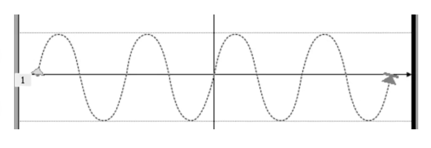


但是如果想要直接描述这样的一个曲线存储到计算机中，是没有办法描述的。 假如描述也只能是这样表达：曲线下去了，上去了，又下去了，又上去了，显然这样是很不合理的。 人们想到了一个办法：

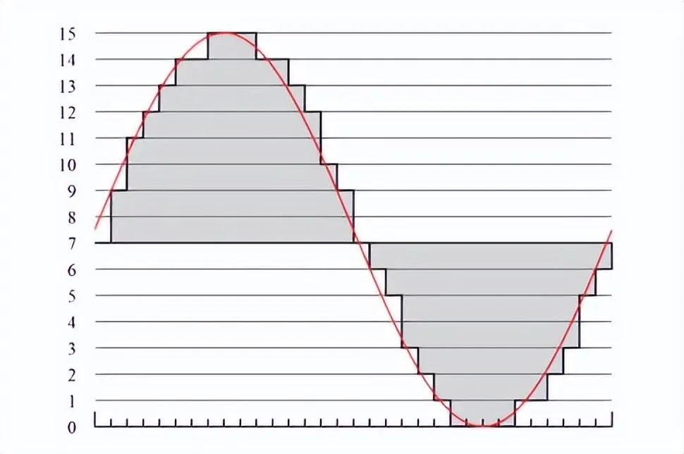

每隔一个小小的时间间隔，去用尺子量一下这个点的位置在哪里。 那么只要这个间隔是一定的,我们就可以把这个曲线描述成：{9,11,12,13,14,14,15,15,15,14,14,13,12,10,9,7...} 这样描述是不是比刚才的方法要精确多了？

如果我们把这个时间间隔取得更小，拿的尺子越精确，那么测量得到的，用来描述这个曲线的数字也可以做到更加地精确。 然后我们可以把这些电平信号转化成二进制数据保存，播放的时候就把这些数据转换为模拟的电平信号再送到喇叭播出，就可以了。 用专业的术语来说，我们每两次测一下位置的时间间隔，就是所谓的**采样率**。采样率等于多少，就意味着我们每秒钟进行了多少次这样的测量。所谓音质，就是指最后我们描述这个曲线的数字，到底和真实的曲线误差有多大。 数字声音和一般磁带、广播、电视中的声音就存储播放方式而言有着本质区别。相比而言，它具有存储方便、存储成本低廉、存储和传输的过程中没有声音的失真、编辑和处理非常方便等特点。

4，从“模拟信号”到“数字化”的过程： 模拟信号到数字化的过程需要三个步骤：  

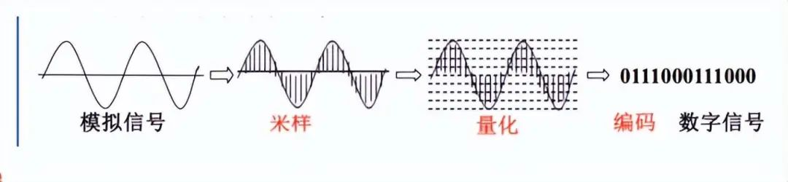


**（1）采样：** 所谓采样，即以适当的时间间隔观测模拟信号波形不连续的样本值替换原来的连续信号波形的操作，又称为取样。 采样的过程就是抽取某点的频率值，很显然，在一秒中内抽取的点越多，获取得频率信息更丰富。 采样的基本定理：为了复原波形，一次振动中，必须有2个点的采样，人耳能够感觉到的最高频率为20kHz，因此要满足人耳的听觉要求，则需要至少每秒进行40k次采样。

**（2）量化：** 在数字音频技术中，把表示声音强弱的模拟电压用数字表示，如0.5V电压用数字20表示，2V电压是80表示。模拟电压的幅度，即使在某电平范围内，仍然可以有无穷多个，如1.2V,1.21V,1.215V…。而用数字来表示音频幅度时，只能把无穷多个电压幅度用有限个数字表示。即把某一幅度范围内的电压用一个数字表示，这称之为量化。

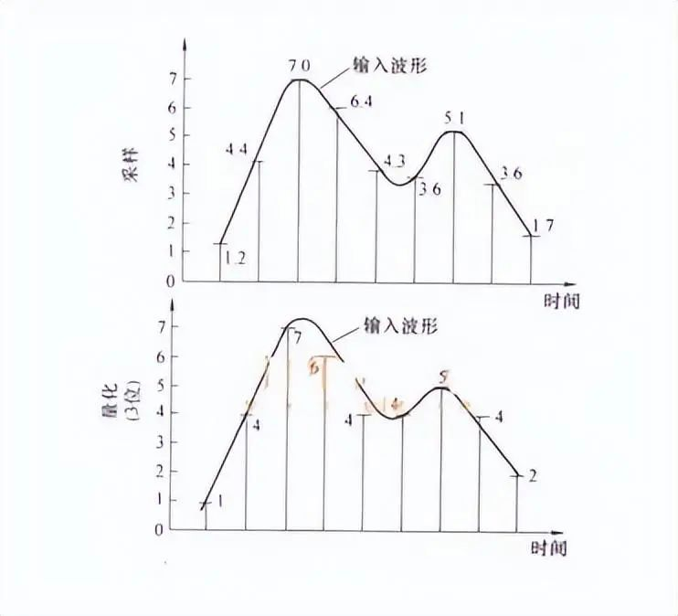


**（3）编码：**

计算机内的基本数制是二进制，为此我们也要把声音数据写成计算机的数据格式，这称之为编码。

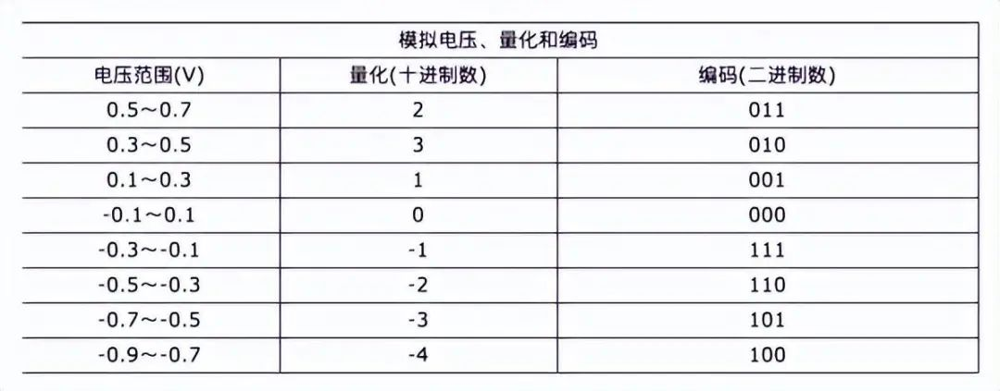


5，数字音频的分类： **数字音频主要包括两类：波形音频 和 MIDI音频：** ** 波形音频：** 波形音频文件是通过声音录入设备录制的原始声音，直接记录了原始真实声音信息的数据文件，通常文件较大。 **MIDI音频：** 译作乐器数字化接口，是为了把电子乐器与计算机相连而制定的一个规范，是数字音乐的国际标准。 数字式电子乐器的出现，为计算机处理音乐创造了极为有利的条件。MIDI声音与数字化波形声音完全不同，它不是对声波进行采样、量化和编码，而是将电子乐器键盘的弹奏信息记录下来，包括键名、力度、时值长短等，这些信息称之为MIDI消息，是乐谱的一种数字式描述。当需要播放时，只需从相应的MIDI文件中读出MIDI消息，生成所需要的乐器声音波形，经放大后由扬声器输出。

# 五、视频相关专业术语

**（1）视频**： 连续的图象变化每秒超过24帧（Frame）画面以上时，根据视觉暂留原理，人眼无法辨别单幅的静态画面，看上去是平滑连续的视觉效果，这样连续的画面叫做视频。

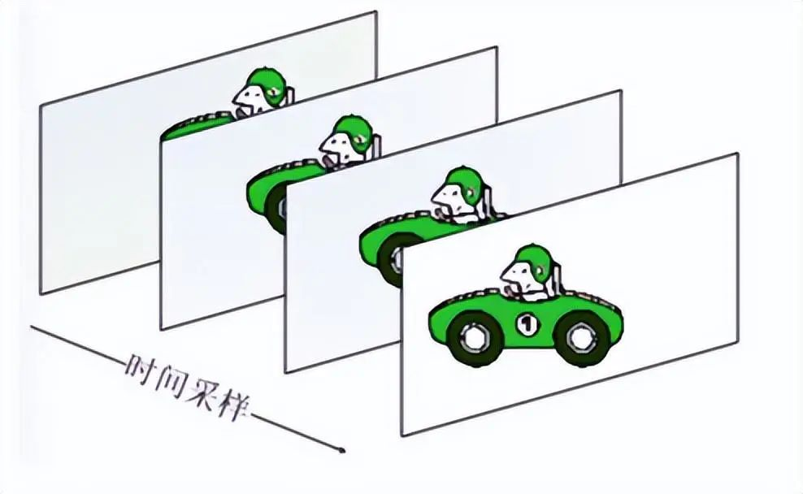


**（2）帧(Frame)：** 是影像中常用的最小单位，相当于电影中胶片的每一格镜头，一帧就是一副静止的画面，连续的帧就形成了视频。

**（3）帧速率（FPS）：** 每秒钟所传输图片的个数，也可以理解为处理器每秒刷新的次数，通常用FPS标识，当然帧数越高，画面也就越流畅。

**（4）转码 ：** **指将一段多媒体包括音频、视频或者其他的内容从一种编码格式转换成为另外一种编码格式。** **（原视频 -- 解码 -- 像素数据 -- 编码 -- 目标视频）** （原音频 -- 解码 -- 音频数据 -- 编码 -- 目标音频）

**（5）视频编码**： 讲到视频编码，大家可能都会问为什么视频要编码？ --- 要知道，采集的原始音视频信号体积都非常大，里面有很多相同的、眼看不到的、耳听不到的内容，比如，如果视频不经过压缩编码的话，体积通常是非常大的，一部电影可能就要上百G的空间。 --- 专业的来说，视频编码也就是文件当中的视频所采用的压缩算法，视频编码的主要作用是将视频像素数据（RGB，YUV等）压缩成为视频码流，从而降低视频的数据量。

**（6）视频解码：** 有了编码，当然也需要有解码。 因为压缩（编码）过的内容无法直接使用，使用（观看）时必须解压缩，还原为原始的信号（比如视频中某个点的颜色等），这就是“解码“或者”解压缩“。

**（7）采样频率：** 指录音设备在一秒钟内对声音信号的采样次数，它用赫兹（Hz）来表示，比如44.1KHz采样率的声音就是要花费44000个数据点来描述1秒钟的声音波形。原则上采样率越高，声音质量越好。

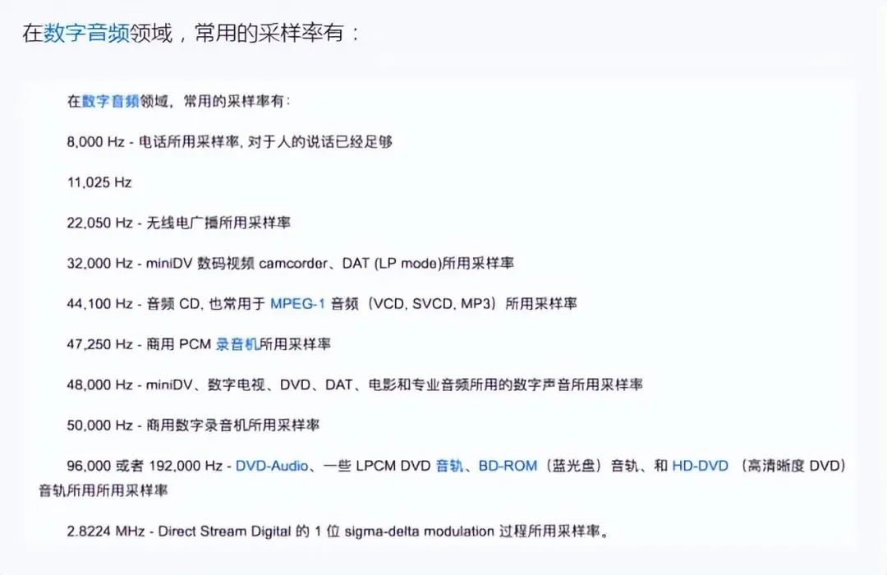


**（8）采样位数:** 表示了计算机度量声音波形幅度（音量）的精度，就是通常所说的声卡的位数。 就像表示颜色的位数一样（8位表示256种颜色，16位表示65536种颜色），有8位，16位，24位等。这个数值越大，解析度就越高，录制和回放的声音就越真实。 每一个采样点都需要用一个数值来表示大小，这个数值的数据类型大小可以是：8bit、16bit、32bit 等等，位数越多，表示得就越精细，声音质量自然就越好，而数据量也会成倍增大。我们在音频采样过程中常用的位宽是 8bit 或者 16bit。

**（9）比特率（码率）：** 表示单位时间（1秒）内传送的比特数，一般我们用的单位是kbps，其英文是 Kilobits per second，意即“千位每秒”（根据发音亦译作“千比特每秒”），意思是说每过一秒钟，有多少千比特的数据流过，因此码率也经常被称为“比特率”。 --- **音频中** 码率：就是音频文件或者音频流中1秒中的数据量，如1.44Mbps，就是1秒钟内的数据量1.44Mbits 。

码率越高，传送的数据越大，音质越好， **声音比特率 = 采样率（Hz） x 采样位数（bit） x 声道数.** --- **视频中** 码率：原理与声音中的相同，都是指由模拟信号转换为数字信号后，单位时间内的二进制数据量，通俗来讲就是把每秒显示的图片进行压缩后的数据量。 视频比特率（位/秒）= (画面尺寸彩色位数（bit）帧数)** 假设有一张标准音乐CD光盘容量是746.93MB（注意大B是字节，小b是位。一字节（B）等于8位（b）。） CD音频是以采样率为44.1KHZ，采样位数为16位，左右双声道（立体声）进行采样的。而一张标准CD光盘的时长是74分钟。 那么容量计算公式为：(44100 x 16 x 2)/8 x (74 x 60)=783216000字节 转为MB为 783216000/1024/1024=746.93MB(兆字节) *

***（9）场频：** **场频**又称为刷新频率，即显示器的垂直扫描频率，指显示器每秒所能显示的图象次数，单位为赫兹(Hz)。 一般在60-100Hz左右 场频也叫屏幕刷新频率，指屏幕在每秒钟内更新的次数。 人眼睛的视觉暂留约为每秒16-24次左右，因此只要以每秒30次或更短的时间间隔来更新屏幕画面，就可以骗过人的眼睛，让我们以为画面没有变过。 实际上每秒30次的屏幕刷新率所产生的闪烁现象我们的眼睛仍然能够察觉从而产生疲劳的感觉。所以屏幕的场频越高，画面越稳定，使用者越感觉舒适。 另外：荧光屏上涂的是中短余辉荧光材料，如果电子枪不进行不断的反复“点亮”、“熄灭”荧光点 的话，就会导致图像变化时前面图像的残影滞留在屏幕上。

一般屏幕刷新率场频在每秒75次以上人眼就完全觉察不到了，所以建议场频设定在75Hz-85Hz之间，这足以满足一般使用者的需求了。 场频越大，图象刷新的次数越多，图象显示的闪烁就越小，画面质量越高。注意，这里的所谓“刷新次数”和我们通常在描述游戏速度时常说的“画面帧数”是两个截然不同的概念。后者指经电脑处理的动态图像每秒钟显示显像管电子枪的扫描频率。 场频与图像内容的变化没有任何关系，即便屏幕上显示的是静止图像，电子枪也照常更新。扫描频率过低会导致屏幕有明显的闪烁感，即稳定性差，容易造成眼睛疲劳。早期显示器通常支持60Hz的扫描频率，但是不久以后的调查表明，仍然有5%的人在这种模式下感到闪烁，因此VESA组织于1997年对其进行修正，规定85Hz逐行扫描为无闪烁的标准场频。

常见疑问：

**（1）为什么视频需要压缩？** 未经压缩的数字视频的数据量巨大，存储困难，一张DVD只能存储几秒钟的未压缩数字视频。 如果不进行压缩，1兆的带宽传输一秒的数字电视视频需要大约4分钟。

**（2）为什么常见的CD，都是为44.1kHz ？** 人耳能够感觉到的最高频率为20kHz，因此要满足人耳的听觉要求，则需要至少每秒进行40k次采样，用40kHz表达，但是为什么大部分都是44.kHz 呢. 最开始，人们采用录像带当做数码设备当时世界上录像机主要有两大制式：欧洲的PAL制式和美国日本的NTSC制式。适用于PAL制式录像机的编码器，其采样频率就是44.1kHz。适用于NTSC制式录像机的编码器，其采样频率就是44.056 ，后来统一到44.1kHz了。 当时PAL 制式的录像机 ：3个采样点 x 245条扫描线 x 60Hz场频 （ 3 x 245 x 60 = 44100） ** --- 总的来说就是历史原因 --- **

**（2）奈魁斯特（NYQUIST）采样定理是**？ 用2倍于一个正弦波的频率进行采样就能完全真实地还原该波形，因此一个数码录音波的采样频率的取值直接关系到它的最高还原频率指标。 例如用44.1KHZ的采样频率进行采样，则可还原为最高22.05KHZ的频率——这个数值略高于人耳的听觉极限。

**（3）无损压缩和有损压缩的区别是什么？**

**有损压缩：**相当于一本书页数特别多，文字特别多，加入我们把书中修饰词去掉，啰嗦的情节去掉，虽然去掉这些，但是核心思想还没变，这就是类似于有损压缩。

**无损压缩：**相当于一本书特别长，我们把里面重复出现的人名，地名，用符号代替，然后书中标注上所有这些符号所代表的人名或地名，这样就短了些，这种就类似于无损压缩 。

# 六、视频的构成

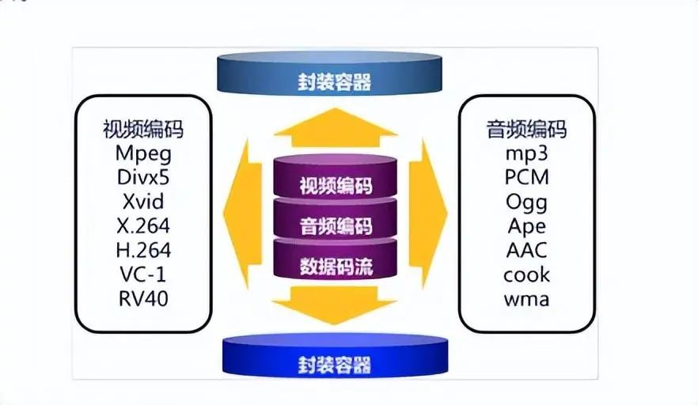


一个完整的视频文件是由**音频和视频2部分组成**的，而视音频又是由**封装格式和编码格式**构成，我们在表面看到的如AVI、RMVB、MKV、WMV、MP4、3GP、FLV等文件其实只能算是一种封装标准，一个外壳。 外壳里面核心还有一层是编码文件，编码文件经过封装后，才成为我们现在看到的.mp4 .avi等视频。如H.264、mpeg-4等就是视频编码格式, MP3、AAC等就是音频编码格式。

**例如：**将一个H.264视频编码文件和一个MP3视频编码文件按AVI封装标准封装以后，就得到一个AVI后缀的视频文件，这个就是我们常见的AVI视频文件了。 部分技术先进的容器还可以同时封装多个视频、音频编码文件，甚至同时封装进字幕，如MKV封装格式。MKV文件可以做到一个文件包括多语种发音、多语种字幕，适合不同人的需要。 1，封装格式


```
 （1）封装格式（也叫容器）就是将已经编码压缩好的视频轨和音频轨按照一定的格式放到一个文件中，也就是说仅仅是一个外壳，可以把它当成一个放视频轨和音频轨的文件夹也可以。
 （2）通俗点说视频轨相当于饭，而音频轨相当于菜，封装格式就是一个碗，或者一个锅，用来盛放饭菜的容器。
 （3）封装格式和专利是有关系的，关系到推出封装格式的公司的盈利。
 （4）有了封装格式，才能把字幕，配音，音频和视频组合起来。
 （5）常见的AVI、RMVB、MKV、ASF、WMV、MP4、3GP、FLV等文件都指的是一种封装格式。
 
```

举例MKV格式的封装：

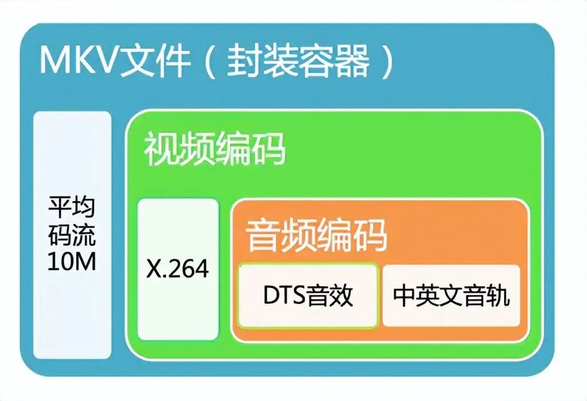


**2，编码格式**

编码格式指的是对封装格式中视频流数据的压缩编码方式的一种描述。 视频不进行压缩的话，体积会非常大。

**视频压缩，主要压缩了哪些东西：** 空间冗余：图像相邻像素之间有较强的相关性 时间冗余：视频序列的相邻图像之间内容相似 编码冗余：不同像素值出现的概率不同 视觉冗余：人的视觉系统对某些细节不敏感 知识冗余：规律性的结构可由先验知识和背景知识得到

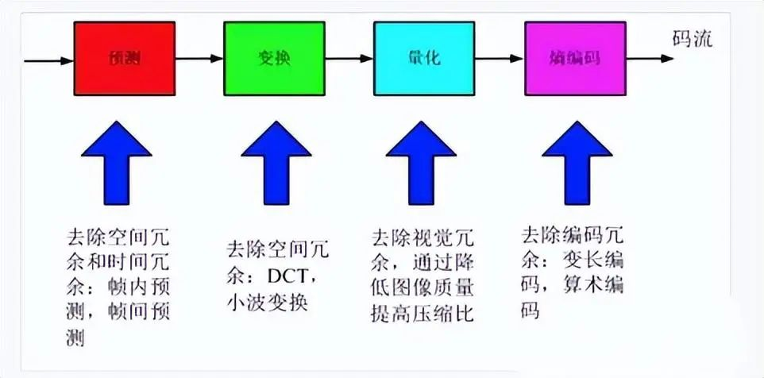

常见的编码格式有以下 **视频编码格式：**

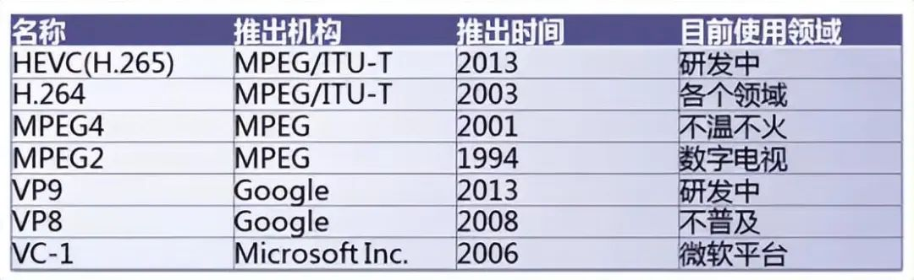


**音频编码格式：**

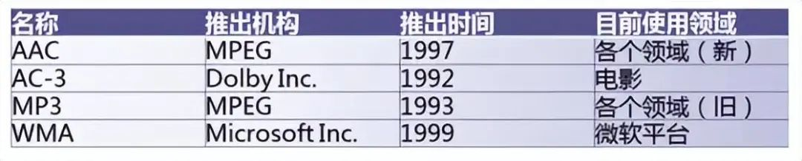


**国际上制定视频编解码技术的组织有两个：** 1，“国际标准化组织（ISO）” 它制定的标准有MPEG-1、MPEG-2、MPEG-4 等。 视频编码： **（1）MPEG-1 :** 制定于1993年，较早的视频编码，质量比较差，它是为CD光盘介质定制的视频和音频压缩格式。 主要用于 CD-ROM 存储视频，国内最为大家熟悉的就是 VCD（Video CD），他的视频编码就是采用 MPEG-1。 MPEG-1的压缩算法可以把一部 120 分钟长的电影（原始视频文件）压缩到1.2 GB左右大小.（*.dat格式的文件） MPEG-1音频分三层，就是MPEG-1 Layer I, II, III，其中第三层协议也就是MPEG- 1 Layer 3，简称MP3。MP3目前已经成为广泛流传的音频压缩技术。 **缺点：**

- 1个音频压缩系统限于两个通道（立体声）
- 没有为隔行扫描视频提供标准化支持，且压缩率差
- 只有一个标准化的“profile” （约束参数比特流），不适应更高分辨率的视频。MPEG - 1可以支持4k的视频，但难以提供更高分辨率的视频编码并且标识硬件的支持能力。
- 支持只有一个颜色空间，4:2:0。

**（2）MPEG-2 :** 制定于1994年，通常用来为广播信号提供视频和音频编码， 包括卫星电视、有线电视等。MPEG-2经过少量修改后，也成为DVD产品的内核技术。 使用MPEG-2的压缩算法制作一部 120 分钟长的电影（原始视频文件）在4GB到8GB大小左右.（*.vob格式的文件） **

（3）MPEG-3 ：**原本目标是为高解析度电视（HDTV）设计，随后发现MPEG-2已足够HDTV应用，故 MPEG-3的研发便中止。**

（4）MPEG-4 : **公布于1998年，为了应对网络传输等环境，传统的 MPEG-1/2 已经不能适应，所以促使了 MPEG-4 的诞生， MPEG-4，主要用途在於網上流媒体、光碟、 語音傳送（視訊電話），以及電視廣播。 MPEG-4 不仅是针对一定比特率下的视频、音频编码，更加注重了多媒体系统的交互性和灵活性。利用很窄的带宽，通过帧重建技术，压缩和传输数据，以求以最少的数据获得最佳的图像质量。 MPEG-4代表了基于模型/对象的第二代压缩编码技术，它充分利用了人眼视觉特性，抓住了图像信息传输的本质，从轮廓、纹理思路出发，支持基于视觉内容的交互功能，这适应了多媒体信息的应用由播放型转向基于内容的访问、检索及操作的发展趋势。**

** 2，“国际电联（ITU-T）” 它制定的标准有H.261、H.263、H.263+ 等。

视频编码：

** （1）H.261 : ** 约1990年制定，是最早的运动图像压缩标准，它详细制定了视频编码的各个部分, 主要在老的视频会议和视频电话产品中使用，它是第一个实用的数字视频编码标准。 H.261的设计相当成功，之后的视频编码国际标准基本上都是基于 H.261相同的设计框架，包括 MPEG-1，MPEG-2／H.262，H.263，甚至 H.264 。

** （2）H.263 : ** 约1996年制定 H.263的编码算法与H.261一样，但做了一些改善和改变，以提高性能和纠错能力。

** （3）H.264:** H.264等同于MPEG-4的第10部. H.264/AVC是两大组织集合H.263+和Mpeg4的优点联合推出的最新标准，更高的数据压缩比。在同等的图像质量条件下，H.264的数据压缩比能比H.263高2倍，比MPEG-4高1.5倍, 举个例子，原始文件的大小如果为88GB，采用MPEG-2压缩标准压缩后变成3.5GB，压缩比为25∶1，而采用H.264压缩标准压缩后变为879MB，从88GB到879MB，H.264的压缩比达到惊人的102∶1。 （ITU-T给这个标准命名为H.264（以前叫做H.26L）, 而ISO/IEC称它为MPEG-4 AVC 高级视频编码（Advanced Video Coding，AVC）,并且它将成为MPEG-4标准的第10部分） 从H.261视频编码建议，到H.262/3、MPEG-1/2/4等都有一个共同的不断追求的目标，即在尽可能低的码率（或存储容量）下获得尽可能好的图像质量。

**3，视频编码的发展历史**

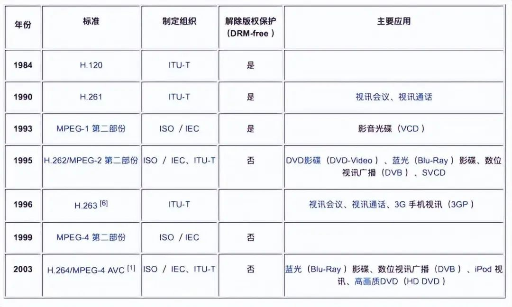


**4，常见视频封装格式介绍**

** (1) AVI：** 即Audio Video Interleaved(音频视频交错格式)，由微软在 1992年11月推出的一种多媒体文件格式，用于对抗苹果Quicktime的技术。现在所说的AVI多是指一种封装格式。 AVI格式上限制比较多，只能有一个视频轨道和一个音频轨道（现在有非标准插件可加入最多两个音频轨道），还可以有一些附加轨道，如文字等。AVI格式不提供任何控制功能。

**特点：兼容性好、跨平台支持、恒定帧率，体积大、容错性差，不是流媒体，已经过时。**

** (2) MKV：** 它是一种新的多媒体封装格式，是一种万能的封装容器，这个封装格式可把多种不同编码的视频及16条或以上不同格式的音频和语言不同的字幕封装到一个Matroska Media档内。

**特点：支持多音轨、软字幕、流式传输、强大的兼容性， 能够在一个文件中容纳无限数量的视频、音频、图片或字幕轨道，任何视频编码文件都可以放入MKV 。**

** (3) MP4：** MP4是比较新的封装格式，但是相对于万能的MKV，功能逊色一些，但是对于目前的非电脑平台，可移植性较好。

**特点：体积最小，清晰度高、流式传输、强大的兼容性，手机平板等众多终端支持。**

** (4) MOV：** MOV是Apple公司开发的QuickTime音频、视频文件封装格式, 默认的播放器是苹果的QuickTime 。 MOV具有较高的压缩比率和较完美的视频清晰度等特点，但是其最大的特点还是跨平台性，即不仅能支持MacOS，同样也能支持Windows系列。 MOV采用了有损压缩方式的MOV格式文件，画面效果较AVI格式要稍微好一些。

**特点：与AVI同期推出，比较老，不流行。**

** (4) RM：** Real Networks公司所制定的音频/视频压缩规范Real Media中的一种，Real Player能做的就是利用Internet资源对这些符合Real Media技术规范的音频/视频进行实况转播。 在Real Media规范中主要包括三类文件：RealAudio、Real Video和Real Flash （Real Networks公司与Macromedia公司合作推出的新一代高压缩比动画格式）。REAL VIDEO （RA、RAM）格式由一开始就是定位就是在视频流应用方面的，也可以说是视频流技术的始创者。

**(5) RMVB** RealMedia可变比特率（RMVB）是RealNetworks公司开发的RealMedia多媒体数字容器格式的可变比特率（VBR）扩展版本，较上一代RM格式画面要清晰很多，原因是降低了静态画面下的比特率。 它的先进之处在于RMVB视频格式打破了原先RM格式那种平均压缩采样的方式，在保证平均压缩比的 基础上合理利用比特率资源，就是说静止和动作场面少的画面场景采用较低的编码速率，这样可以留出更多的带宽空间，而这些带宽会在出现快速运动的画面场景时 被利用。这样在保证了静止画面质量的前提下，大幅地提高了运动图像的画面质量，从而图像质量和文件大小之间就达到了微妙的平衡。

**(6) WMV** .WMV文件其实不是一个封装格式。 WMV（Windows Media Video）是微软公司开发的一组数字视频编解码格式的通称，它是Windows Media架构下的一部分。 具体的这些，大家可以私下去查询下。

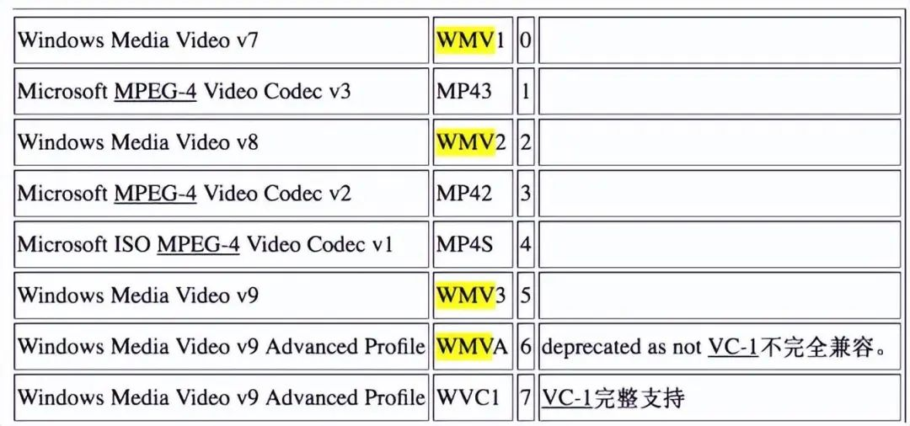


微软也开发了一种称之为ASF（Advanced Systems Format）的数字容器格式，用来保存WMV的视频编码。在同等视频质量下，WMV格式的文件可以边下载边播放，因此很适合在网上播放和传输。 ** (7) ASF：** 用于微软WMA和WMV的标准容器。 ASF (Advanced Streaming format高级流格式), ASF是MICROSOFT 为了和现在的 Real player 竞争而发展出来的一种可以直接在网上观看视频节目的文件压缩格式。 ASF使用了MPEG4的压缩算法，压缩率和图像的质量都很不错。因为ASF是以一个可以在网上即时观赏的视频“流”格式存在的，所以它的图像质量比VCD差一点点并不出奇，但比同是视频“流”格式的RAM格式要好。

**(8) FLV:** Flash Video（简称FLV）是由Macromedia公司开发的属于自己的流式视频格式，FLV也就是随着Flash MX的推出发展而来的视频格式，是在sorenson公司的压缩算法的基础上开发出来的。 FLV格式不仅可以轻松的导入Flash中，速度极快，并且能其到保护版权的作用，并且可以不通过本地的微软或者REAL播放器播放视频。Flash MX 2004对其提供了完美的支持，它的出现有效地解决了视频文件导入Flash后，使导出的SWF文件体积庞大，不能在网络上很好的使用等缺点。 由于它形成的文件极小、加载速度极快，使得网络观看视频文件成为可能，它的出现有效地解决了视频文件导入Flash后，使导出的SWF文件体积庞大，不能在网络上很好的使用等缺点。

** 特点：视频质量良好、体积小、在线播放、非常普及 。

** **(8) 蓝光BD封装:** 大容量光碟格式，容量分为25G-100G，BD的主视频文件为m2ts封装格式，用Remux无损的提取BD文件为TS封装格式可用PC播放。 **特点：体积超大、超高清格式、声道、字幕可选择**

**5，音频编码与封装格式介绍**

**PCM ：**是一种的很基本的编码方式，虽然简单，但是好用，它被称为无损编码，也就是模拟信号转成数字信号不压缩，只转换，就是经过话筒录音后直接得到的未经压缩的数据流，对于音频来说，CD就是采用PCM编码。

**有损压缩格式：** **

MP3（MPEG Audio Layer3）：**一个有损数据压缩格式，它丢弃掉脉冲编码调制（PCM）音频数据中对人类听觉不重要的数据，从而达到了小得多的文件大小。它是目前最为普及的音频压缩格式，常用于互联网上的高质量声音的传输，MP3可以做到12:1的惊人压缩比并保持基本可听的音质。**

AAC (高级音频编码)：**出现于1997年，是基于MPEG-2的音频编码技术，由Fraunhofer IIS、杜比、**苹果**、AT&T、索尼等公司共同开发，是在MP3基础上开发出来，，目的是取代MP3格式。2000年，MPEG-4标准出现后，AAC重新集成了其特性，加入了SBR技术和PS技术，为了区别于传统的MPEG-2 AAC又称为MPEG-4 AAC，AAC可以在对比MP3文件缩小30%的前题下提供更好的音质。**

WMA (Windows Media Audio)：**是微软开发的一种数字音频压缩格式,WMA格式是以减少数据流量但保持音质的方法来达到更高的压缩率目的,其压缩率一般可以达到1:18,生成的文件大小只有相应MP3文件的一半。**

无损压缩格式：

** **WAV ：** 是微软公司开发的一种声音文件格式，是音乐由物理介质（CD碟）转换为数字形式所得到的声音文件，是最早的数字音频格式，被Windows平台及其应用程序广泛支持, WAV是最接近无损的音乐格式，所以文件大小相对也比较大。 （WAV格式对存储空间需求太大不便于交流和传播）

**FLAC ：**无损音频压缩编码，它不会破坏任何原有的音频信息，所以可以还原音乐光盘音质，基本上能节省wav 40%的码率，FLAC相对于同类如APE，在处理遇到爆音处时会静音处理，并且相比APE的解码复杂程度要较低（解码运算量小、只需要整数运算），解码速度奇快，容错高，不容易损坏。

**APE ：**APE这类无损压缩格式，同样不会破坏任何音频信息, 相较同类文件格式FLAC，特色是压缩率约为55%，比FLAC高，体积大概为原CD的一半，但是APE文件的容错性较差，只要在传输过程中出现一点差错，就会让整首APE音乐作废。

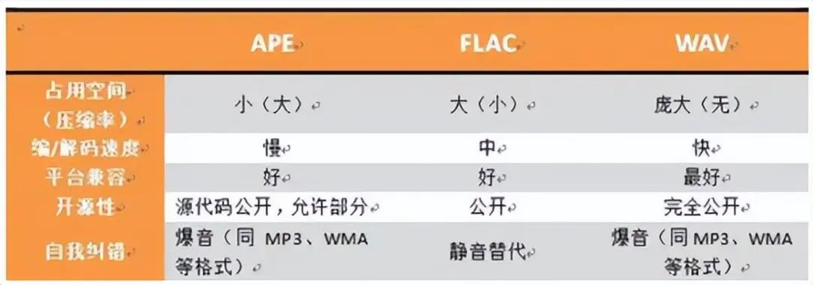


**常见封装格式与编码格式的对应**

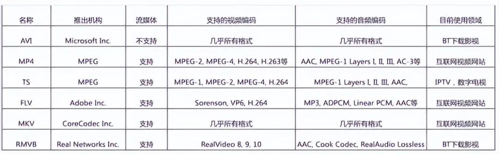


# 七、播放一个网络上视频需要的步骤

**1，解协议：**就是将流媒体协议的数据，解析为标准的相应的封装格式数据，这些协议在传输视音频数据的同时，也会传输一些信令数据，解协议的过程中会去除掉信令数据而只保留视音频数据。

**2，解封装：**就是将输入的封装格式的数据，分离成为音频流压缩编码数据和视频流压缩编码数据。

**3，解码：**就是将视频/音频压缩编码数据，解码成为非压缩的视频/音频原始数据。 把压缩编码的视频数据，输出成为非压缩的颜色数据，例如YUV420P，RGB等等； 把压缩编码的音频数据，输出成为非压缩的音频抽样数据，例如PCM数据。

**4，视音频同步：**就是根据解封装模块处理过程中获取到的参数信息，同步解码出来的视频和音频数据，并将视频音频数据送至系统的显卡和声卡播放出来。

> 作者：ForestSen